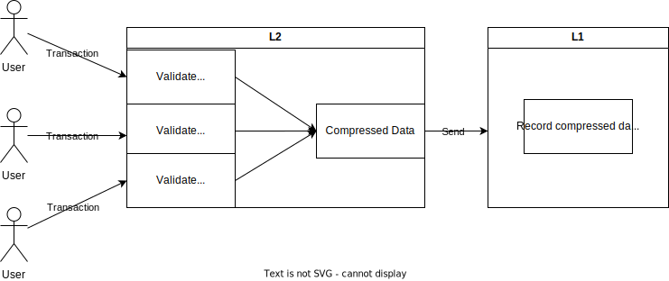
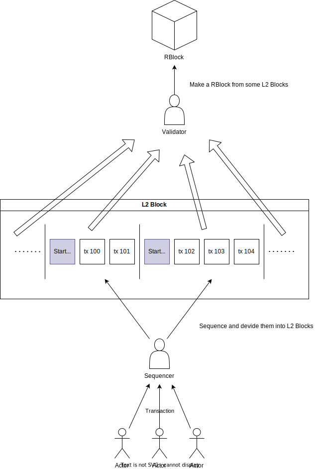
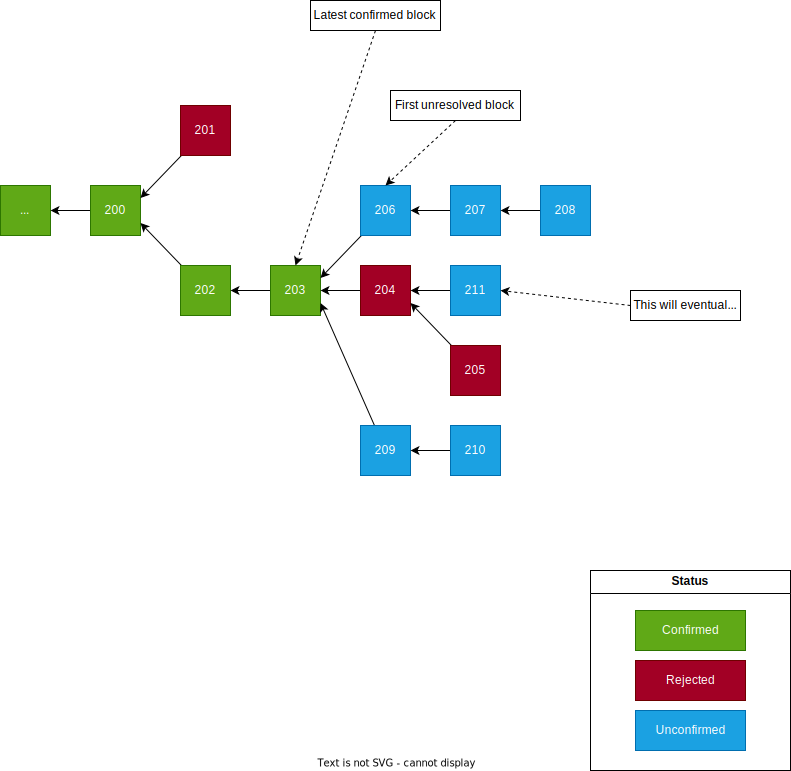

- [Arbitrum について](#arbitrum-について)
- [Rollup の基礎](#rollup-の基礎)
- [L2 のトランザクションと L1 の関係性](#l2-のトランザクションと-l1-の関係性)
- [主要なノード](#主要なノード)
  - [シーケンサー](#シーケンサー)
  - [バリデーター](#バリデーター)
- [L2 ブロック（Arbitrum ブロック）と RBlock について](#l2-ブロックarbitrum-ブロックと-rblock-について)
- [トランザクション処理の流れ](#トランザクション処理の流れ)
  - [ファイナリティ](#ファイナリティ)
- [トランザクションの構造](#トランザクションの構造)
- [L1 に送信されるデータの構造](#l1-に送信されるデータの構造)
  - [シーケンサーからのデータ](#シーケンサーからのデータ)
  - [バリデーターからのデータ](#バリデーターからのデータ)
  - [RBlock の構造](#rblock-の構造)
  - [L2 ブロックの構造](#l2-ブロックの構造)
- [WAVM](#wavm)
- [バリデーターによる検証の流れ](#バリデーターによる検証の流れ)
  - [RBlock の作成](#rblock-の作成)
    - [RBlock の承認ルール](#rblock-の承認ルール)
- [チャレンジシステム](#チャレンジシステム)
  - [インタラクティブな証明](#インタラクティブな証明)
- [クロスチェーンメッセージング](#クロスチェーンメッセージング)
  - [チケット](#チケット)
  - [L1 - L2](#l1---l2)
  - [L2 - L1](#l2---l1)
- [ガス代](#ガス代)
- [Blob を使ったロールアップ](#blob-を使ったロールアップ)

# Arbitrum について

- Arbitrum は Ethereum の L2 チェーンである

  - Ethereum で行うすべての操作を実行でき、トランザクションはより安価で高速になるのが売り
  - Ethereum との比較は[ここ](https://chainspect.app/compare/arbitrum-vs-ethereum)で確認できる

- Arbitrum には数種類のチェーンがある

  - Arbitrum One や Arbitrum Nova、Arbitrum Orbit など
  - それぞれ仕組みが少しずつ違うが、**今回は Arbitrum One を説明する**

- Arbitrum One は「Optimistic Rollup」を採用している

  - Rollup の中でも、L1 に送信されるデータが適切なルールに従っていると「楽観的に想定」したものを「Optimistic Rollup」と呼ぶ

    - つまり L1 に記録するデータがすべて正しいと仮定するということ
    - そのため L1 は L2 で処理された個々のトランザクションを検証しない
    - この性質によって、**L2 は絶対に間違ったトランザクションを L1 に記録しないような仕組みが必要**になる

- 以降「Arbitrum」は「Arbitrum One」を指す

# Rollup の基礎

- Rollup は、L1 で実行するべきトランザクション処理を L1 外で行うこと

  - そのため信頼性などに乏しく、 L2 にはトランザクションの正当性を確保するロジックが必要になる
  - ただし、L1 外で実行するため処理速度やガス代などで L1 よりも優れている

- Rollup における L1 の主な役割はトランザクションを実際に処理するのではなく、いわば台帳の役割となる

  - L1 に記録されることで、トランザクションは信頼できる（書き換え不能な）トランザクションになる
  - L2 は適切にトランザクションを処理したことを L1 に記録・公開することで信頼性を担保している

# L2 のトランザクションと L1 の関係性

- Rollup において L2 のトランザクションはまとめて（バッチ処理で） L1 に送信される

  - 複数のトランザクションを 1 回の L1 トランザクションで済ませるため、ガス代が安い
  - L2 で処理されたトランザクションデータを圧縮し、 L1 に送信・記録する
  - Arbitrum では通常数百個のトランザクションが含まれる

- データをどのように L1 に送るかの仕組みには 2 種類ある

  - calldata を使用するものと [Blob](#blob-を使ったロールアップ) というものを使用するやり方である
  - 前半は calldata を使用した仕組みについて取り上げ、blob を使用したものは最後で取り上げる
  - Blob になっても仕組みにおいての変更点はあまりない

  ```
  補足： calldata とは

  トランザクションの引数として渡されるデータで、ブロックチェーンには記録されるがステートに保存されないデータ。
  ```

- 図にまとめると、Rollup の簡単な流れは以下のようになる

  

# 主要なノード

- 主要なノードの役割・特徴を説明する

- ## シーケンサー

  - 特別に指定されたフルノードで、トランザクションの順序を制御するための限定的な権限が与えられている
  - 主な仕事はトランザクションを順序付け、バッチを作成し L1 コントラクトへ投稿すること

    - ただ後述するように L2 ブロックを作成するのはシーケンサーである
    - シーケンサーはチェーンの使用状況をみて、適宜トランザクションをブロックに区切っている

  - 現在シーケンサーは Offchain Labs によって実行されている

- ## バリデーター

  - プロトコルの進行を監視するノード
  - これも現在は分散化されていない
  - [RBlock](#l2-ブロックarbitrum-ブロックと-rblock-について) を作成したり（ステートを更新）、不正を指摘する役割がある
  - 不正を指摘する（以降「チャレンジ」と呼ぶ）際に L1 に ETH をステークする必要がある
  - バリデーターには 4 種類の戦略がある

    - ### Defensive

      - RBlock に不正が見つかった場合にのみ、ステークを行いチャレンジを作成する

    - ### StakeLatest

      - 常に最新 RBlock に対してステークを行い（盲目的に正しいと賛同し）、見つかった不正にチャレンジを実行する

    - ### ResolveNodes

      - 作成された未検証の RBlock を検証し、見つかった不正にチャレンジを実行する

    - ### MakeNodes

      - 常に新しい RBlock を作成し続け、作成した RBlock が他ノードのものと異なった場合チャレンジに参加する
      - また、RBlock を作成する際は、必ず自身が作成した RBlock に対してステークをする必要がある

  - StakeLatest では「盲目的に正しいと賛同」と書いたが、上記すべてのノードにはデフォルトで、逸脱を検出するモード（Watchtower）が実行されている

- 現在 Arbitrum はシーケンサー・バリデーターが善意を持って行動することを前提として動作している

  - 特にバリデーターに関しては、最低でも 1 人の正しいバリデーターが存在するのが必要条件になっている
  - それゆえ、シーケンサー・バリデーターは[許可されたノード](https://docs.arbitrum.foundation/state-of-progressive-decentralization#allowlisted-validators)しか実行できない（Watchtower ならだれでも実行可能）
  - これはチェーンをリリースするにあたって、ユーザーに安心して利用してもらうための苦肉の策である
  - いづれのノードも分散化が進められている段階である

# L2 ブロック（Arbitrum ブロック）と RBlock について

- Arbitrum では、とてもややこしいのだが、大きく 2 種類のブロックが存在している

  - ### L2 ブロック：シーケンサーが作成する、トランザクションの区切りのようなもの
  - ### RBlock：プロトコルが管理および監視する、最新の状態のフィンガープリントとして機能する固有のブロック

- ちなみに「Arbitrum ブロック」と書いたが「Nitro ブロック」と書いてあるところもある（面倒なので L2 ブロックでいく）

- L2 ブロックはチェーンの状態を保つためのブロック（L1 ブロックと役割は同じ）

  - バリデーターノードが、シーケンスされたトランザクションの状態遷移関数を実行することによって生成される、と書いてある
  - 「バリデーターノードが」というのは、シーケンサーは信頼できないからステートを決められないという意味だと思う
  - しかしブロックを区切っているのはシーケンサーで、[ソフトファイナリティ](#ファイナリティ)の状態でブロックを進めている

- L2 ブロックはシーケンサー（ArbOS）が`ArbitrumInternalTxType`という種類のトランザクションを挟むことで区切られる

  - 見た感じ結構頻繁に区切られており、そのせいで L2 ブロックは 2 億個ほどある
  - [ここ](https://arbiscan.io/txs)を眺めるとちらほらと見える`Start Block`というメソッドのトランザクションがそうである
  - トランザクションで区切ってるだけなので、プロトコルにおいてはあまり意識されていない
  - シーケンサーがトランザクションのバッチを送信するというのは、L2 ブロックのバッチを送信するのと同義
  - ArbOS とシーケンサーがブロックを作成する、とドキュメントには書いてあるが、シーケンサーの仕事として紹介した

- RBlock は L2 ブロックを複数含んだブロックである

  - ただし、1 つの L2 ブロックが複数の RBlock に含まれることはない
  - したがって、任意のトランザクションは、1 つの RBlock ブロックと 1 つの L2 ブロックに関連付けられる

- また RBlock には [Outbox](https://etherscan.io/address/0x0B9857ae2D4A3DBe74ffE1d7DF045bb7F96E4840) （L1 コントラクト）のステートも包含されている

  - Outbox については[トランザクション処理の流れ](#トランザクション処理の流れ)の補足を参照のこと

- L2 ブロックの構造は[ここ](#l2-ブロックの構造)、RBlock の構造は[ここ](#rblock-の構造)で説明する

- 図にすると以下のような関係性である



# トランザクション処理の流れ

1. ユーザーがトランザクションをインボックスに送信
2. シーケンサーがトランザクションを順序付けし（無効なトランザクションは破棄）、ローカルでトランザクションを実行する
3. 十分なトランザクションがたまったら、シーケンサーはデータを圧縮し calldata として [Sequencer Inbox](https://etherscan.io/address/0x1c479675ad559DC151F6Ec7ed3FbF8ceE79582B6) に投稿（L1 コントラクト）
4. バリデーターは 3 で投稿されたトランザクションを実行する
5. バリデーターはローカルでステートを更新（L2 ブロックを作成）する
6. バリデーターは L2 ブロックから「RBlock」を作成し、calldata として [Rollup](https://etherscan.io/address/0x5eF0D09d1E6204141B4d37530808eD19f60FBa35) に投稿（L1 コントラクト）
7. 6 で作成された RBlock は承認されるまでに、約 1 週間のチャレンジ期間が設けられる
8. 異議が唱えられなければ RBlock は承認され、全てのアカウントがそれを L1 で確認できるようになる（[Outbox](https://etherscan.io/address/0x0B9857ae2D4A3DBe74ffE1d7DF045bb7F96E4840)（L1 コントラクト） にコミットされる）
9. 異議があればチャレンジが発生する

```
補足： Outbox コントラクトについて

Outbox システムは、任意の L2 から L1 へのコントラクト呼び出し (つまり、L2 から開始され、最終的に L1 で実行されて解決されるメッセージ)
を可能にするためのもの。Outbox の Merkle Root をハッシュに含めることで、L2 から L1 へのどのメッセージがすでに使用されたかを追跡できる。
また、RBlock が承認された際に confirmData がコミットされるのも Outbox である。（ confirmData は 「RBlock の構造」を参照のこと）
```


- 3 ～ 9 の詳細は後ほど順を追って説明する

  - ここでは一旦豆知識のようなものを紹介する

- 1 で、トランザクションは L1 に存在する [Delayed Inbox](https://etherscan.io/address/0x4Dbd4fc535Ac27206064B68FfCf827b0A60BAB3f) に直接送信することもできる

  - ブリッジ経由で ETH またはトークンを入金する場合に最もよく使用される
  - ここに入れられたトランザクションはシーケンサーによって、「先入れ先出し」方式で Sequencer Inbox に入れられる

- 2、3 それぞれのステップでレシートがひとつずつ返される

  ### ファイナリティ

  |        | 名称                 | 説明                                                                                                        |
  | ------ | -------------------- | ----------------------------------------------------------------------------------------------------------- |
  | １回目 | ソフトファイナリティ | L1 に投稿する前に返される、シーケンサーからの実行結果。シーケンサーに悪意があれば間違っている可能性もある。 |
  | ２回目 | ハードファイナリティ | L1 でバッチデータが確認された後に返される、信頼できる実行結果。                                             |

  - ソフトファイナリティは、実行結果を即座にユーザーに返すために存在する

    - 順序付けされたトランザクションの実行結果は、状態遷移関数によって決定論的に確定する
    - そのため、シーケンサーがそれを即座にチェックし結果を返している
    - しかし、バリデーターからの検証が終わっていないため、ハードファイナリティで返却される結果と乖離する場合がある
    - この段階で最終性を受け入れるかどうかは、シーケンサーを信頼しているかどうかに依存する

  - 逆にハードファイナリティは、正常なトランザクションとして処理が完了したことを表す

    - つまり、トランザクションが L1（Sequencer Inbox） で確認されたことを意味する
    - 完全にロールアップ処理が終わっていないのにもかかわらずこれが言える理由は[ここ](https://docs.arbitrum.io/how-arbitrum-works/tx-lifecycle#---finality-check-ethereum-equivalent-finality---)を参照

- 3 で L1 に投稿する理由はバリデーターが正しいデータを使用することを担保するため

  - Sequencer Inbox にデータを送れるのは基本的にはシーケンサーのみ
  - シーケンサーが 24 時間以上トランザクションを取り込まない場合は例外的に Delayed Inbox から誰でも追加できる
  - これはシーケンサーが機能停止してもチェーンが死なないようにするための策

- 3 で利用されるデータ圧縮アルゴリズムは「[brotli](https://github.com/google/brotli)」である

  - それぞれのトランザクションをバイト配列に圧縮し、それらをつなぎ合わせてバッチを作成している

- また、シーケンサーがトランザクションを順序付けるため、優先手数料のようなものは存在しない

  - 余剰は返却される

- 8 の段階で（L1 で確認されるようになって）ようやく、L1 から L2 への資金移動ができるようになる

# トランザクションの構造

- Arbitrum は EVM 互換であり、EVM で行う基本的な操作をすべて行うことができる

  - 逆に EVM 互換が念頭にあり、その後必要な機能のみを追加した感じである
  - 送信するトランザクションの構造に大きな違いはない
  - しかし RPC メソッドのいくつかの挙動が変更されたり、トランザクションフィールドが追加されている

- 以下に実際のトランザクション例を載せておく

  | 名称             | 値                                                                 |
  | ---------------- | ------------------------------------------------------------------ |
  | blockHash        | 0xdecc8972c07ea0a6bc81e386ebd4a61d98340bb92ad34147cc979e6a85e02820 |
  | blockNumber      | 0xdd97ec5                                                          |
  | from             | 0xe7a038993965c59959647790d3771edda7edf1c9                         |
  | gas              | 0x0                                                                |
  | gasPrice         | 0x0                                                                |
  | hash             | 0xf1252e50cf855c72da6d625bc93c388f520e758be7ef4008d3d27577f9eb2205 |
  | input            | 0x                                                                 |
  | nonce            | 0x0                                                                |
  | to               | 0xd68f38993965c59959647790d3771edda7ede0b8                         |
  | transactionIndex | 0x1                                                                |
  | value            | 0x853a0d2313c0000                                                  |
  | type             | 0x64                                                               |
  | chainId          | 0xa4b1                                                             |
  | v                | 0x0                                                                |
  | r                | 0x0                                                                |
  | s                | 0x0                                                                |
  | requestId        | 0x00000000000000000000000000000000000000000000000000000000001897e0 |

- 追加されたフィールドは`requestId`のみ

  - これは L1 から L2 へのトランザクションでのみ含まれるフィールド
  - このフィールドは Sequencer Inbox 内の位置を示すために追加される

- `from`は、L1 から L2 へのトランザクションでは L1 コントラクトのエイリアスが入る

  - $L2 Alias = L1 Contract Address + 0x1111000000000000000000000000000000001111$
  - これで計算される $L2 Alias$ が`from`に入る

- `type`は Ethereum でサポートされている 3 つのトランザクションタイプ以外に、以下が追加された

  | 取引種別コード | 取引タイプ名                  | 説明                                                                                                       |
  | -------------- | ----------------------------- | ---------------------------------------------------------------------------------------------------------- |
  | 100            | ArbitrumDepositTxType         | Arbitrum ブリッジ経由で L1 から L2 に ETH を入金するために使用される                                       |
  | 101            | ArbitrumUnsignedTxType        | ユーザーがアービトラムブリッジを通じて発信した L1 から L2 コントラクトを呼び出すために使用される           |
  | 102            | ArbitrumContractTxType        | アービトラムブリッジを介した契約によって生成された L1 から L2 契約を呼び出すために使用される               |
  | 104            | ArbitrumRetryTxType           | 自動的に実行できなかった L2 の再試行可能なチケットを手動で引き換えるために使用される(通常はガス不足のため) |
  | 105            | ArbitrumSubmitRetryableTxType | L1 の Arbitrum ブリッジ経由で再試行可能なチケットを送信するために使用される                                |
  | 106            | ArbitrumInternalTxType        | L1 基本料金やブロック番号などの特定の状態更新のために ArbOS 自体によって作成された内部トランザクション     |

# L1 に送信されるデータの構造

- L1 には、シーケンサーからのバッチとバリデーターからの RBlock データがそれぞれのコントラクトに送信される

## シーケンサーからのデータ

- シーケンサーは L1 の Sequencer Inbox に以下のデータを送る

  | 名称                     | 型（内容）   | 詳細                                                   |
  | ------------------------ | ------------ | ------------------------------------------------------ |
  | sequenceNumber           | uint256      | シーケンスの識別子                                     |
  | data                     | bytes        | トランザクションのバッチデータ                         |
  | afterDelayedMessagesRead | uint256      | Delayed Inbox から読み取られたメッセージの数           |
  | gasRefunder              | address など | 余剰ガスの返却先                                       |
  | prevMessageCount         | uint256      | 現在のバッチが処理される前に処理されたメッセージの総数 |
  | newMessageCount          | uint256      | 新しいバッチが追加された後のメッセージの総数           |

- 注目したいのは`data`であり、ここにトランザクションのバッチデータが含まれる

  - 最大サイズは、データから作成されるヘッダーと合わせて`117964`バイトまでである
  - 実際のインプットデータの例は[ここ](https://etherscan.io/tx/0x9061877f26fc4a9e51dc9f281c78d5081e8b1f2b7e250b021260ff67df780ffc)で確認できる
  - bytes は可変長なので、デコードしたほうが見やすい（載せきれないくらい長いデータである）

## バリデーターからのデータ

- バリデータは L1 の Rollup に以下のデータを calldata として送る

  | 名称                  | 型（内容） | 詳細                                               |
  | --------------------- | ---------- | -------------------------------------------------- |
  | assertion             | ステート   | 新たに作成するノードの前後のステートとブロック番号 |
  | prevNodeNum           | uint64     | 親となるノードの番号                               |
  | prevNodeInboxMaxCount | uint256    | 親ノードまでに処理されたメッセージの総数           |
  | expectedNodeHash      | bytes32    | 新しいノードが作成された際に期待されるハッシュ値   |

- L1 上でも整合性やバリデーターの計算結果を確認する

  - 一通りのチェックが終わると、バリデーターからの情報をもとに新たな RBlock が作成される

### RBlock の構造

- 上記の送られてきたデータをもとに作成される RBlock の構造は以下の通り

  | 名称                        | 型      | 詳細                                                               |
  | --------------------------- | ------- | ------------------------------------------------------------------ |
  | stateHash                   | bytes32 | このノード時点のチェーンの状態を表すハッシュ値                     |
  | challengeHash               | bytes32 | チャレンジに必要なデータをハッシュしたもの                         |
  | confirmData                 | bytes32 | このノードが確定された場合にコミットされるデータのハッシュ値       |
  | prevNum                     | uint64  | このノードの親ノードのインデックス                                 |
  | deadlineBlock               | uint64  | このノードを承認することができる期限                               |
  | noChildConfirmedBeforeBlock | uint64  | このノードの子ノードを承認することができる期限                     |
  | stakerCount                 | uint64  | このノードにステークしているステーカーの数                         |
  | childStakerCount            | uint64  | このノードの子ノードにステークしているステーカーの数               |
  | firstChildBlock             | uint64  | 初期値は 0 で、ノードが破壊されるまで一定                          |
  | latestChildNumber           | uint64  | このノードの子ノードの番号                                         |
  | createdAtBlock              | uint64  | このノードが作成されたブロック番号                                 |
  | nodeHash                    | bytes32 | このノードの有効性を判断するために必要なすべてのデータのハッシュ値 |

- バリデーターからの`expectedNodeHash`と計算された`nodeHash`が一致することがチェックされる

- `confirmData`でコミットされるのは次の要素を連結し、`keccak256`でハッシュしたもの

  | 名称      | 型      | 詳細                                     |
  | --------- | ------- | ---------------------------------------- |
  | blockHash | bytes32 | 新たに作成されたノードのブロックハッシュ |
  | sendRoot  | bytes32 | Outbox ツリーステートの Merkle Root      |

  - `sendRoot`はブリッジを使用したトランザクション追跡のために使用されるハッシュ値

- `nodeHash`は次の要素を連結し、`keccak256`でハッシュしたもの

  | 名称              | 型      | 詳細                                                                     |
  | ----------------- | ------- | ------------------------------------------------------------------------ |
  | hasSibling        | boolean | 兄弟関係に当たるノードがあるかのブール値                                 |
  | lastHash          | bytes32 | 親の `nodeHash`                                                          |
  | executionHash     | bytes32 | `assertion` のハッシュ値                                                 |
  | sequencerBatchAcc | bytes32 | Sequencer Inbox に対するリプレイアタック対策のためのハッシュ値           |
  | wasmModuleRoot    | bytes32 | 不正証明の際に正しいリプレイバイナリを決定するために使用されるハッシュ値 |

### L2 ブロックの構造

- Arbitrum の L2 ブロックは Ethereum のブロックとよく似ているが、一部違う部分がある

- 参考までに`eth_getBlockByNumber`で取得したデータを載せておく

  | 名称             | 値                                                                                                                                                                                                                                                                                                                                                                                                                                                                                                                                 |
  | ---------------- | ---------------------------------------------------------------------------------------------------------------------------------------------------------------------------------------------------------------------------------------------------------------------------------------------------------------------------------------------------------------------------------------------------------------------------------------------------------------------------------------------------------------------------------- |
  | baseFeePerGas    | 0x989680                                                                                                                                                                                                                                                                                                                                                                                                                                                                                                                           |
  | difficulty       | 0x1                                                                                                                                                                                                                                                                                                                                                                                                                                                                                                                                |
  | extraData        | 0x728d1816443ee05bfeb854dddf516962a6c748226147a397ad46f715dd95bb8b                                                                                                                                                                                                                                                                                                                                                                                                                                                                 |
  | gasLimit         | 0x4000000000000                                                                                                                                                                                                                                                                                                                                                                                                                                                                                                                    |
  | gasUsed          | 0xbba8e                                                                                                                                                                                                                                                                                                                                                                                                                                                                                                                            |
  | hash             | 0xecdd9eeeafd8836e1c564de7f175353f7d28b6bcbc6828ec800ddd9891413d96                                                                                                                                                                                                                                                                                                                                                                                                                                                                 |
  | l1BlockNumber    | 0x135dfdf                                                                                                                                                                                                                                                                                                                                                                                                                                                                                                                          |
  | logsBloom        | 0x00000012800040008000300082000001000000000000000000000000011000000000000080000001940000000000000000000001000220010240000000200080000000000000008800000008400300000000000002000001400100000000000010400000020000040100100000000800000000000204400000000010000800040100400008000008a00000004200008000008000040000000000000000000000020000000000000020004020a00000006040000000402008020a00004400000404102002000080010100080000010000000000000000000000000000000021000210080000042040010000020000200000009004002000200080000000000000 |
  | miner            | 0xa4b000000000000000000073657175656e636572                                                                                                                                                                                                                                                                                                                                                                                                                                                                                         |
  | mixHash          | 0x000000000001e472000000000135dfdf00000000000000140000000000000000                                                                                                                                                                                                                                                                                                                                                                                                                                                                 |
  | nonce            | 0x00000000001896a1                                                                                                                                                                                                                                                                                                                                                                                                                                                                                                                 |
  | number           | 0xdd82956                                                                                                                                                                                                                                                                                                                                                                                                                                                                                                                          |
  | parentHash       | 0x4f50424dc2af6edc011299531504fb56ba9a9242fbc2064d296eaa4d4a0254c7                                                                                                                                                                                                                                                                                                                                                                                                                                                                 |
  | receiptsRoot     | 0xd662c4ee982a5cac8910fb0629ca53a3cb9123de68e97173066ecee67e47eecd                                                                                                                                                                                                                                                                                                                                                                                                                                                                 |
  | sendCount        | 0x1e472                                                                                                                                                                                                                                                                                                                                                                                                                                                                                                                            |
  | sendRoot         | 0x728d1816443ee05bfeb854dddf516962a6c748226147a397ad46f715dd95bb8b                                                                                                                                                                                                                                                                                                                                                                                                                                                                 |
  | sha3Uncles       | 0x1dcc4de8dec75d7aab85b567b6ccd41ad312451b948a7413f0a142fd40d49347                                                                                                                                                                                                                                                                                                                                                                                                                                                                 |
  | size             | 0x8b2                                                                                                                                                                                                                                                                                                                                                                                                                                                                                                                              |
  | stateRoot        | 0xd473ccac400000ec69c6fea9ecb3e1fe50f648d6322259d8755cb0a2fd199323                                                                                                                                                                                                                                                                                                                                                                                                                                                                 |
  | timestamp        | 0x66945ace                                                                                                                                                                                                                                                                                                                                                                                                                                                                                                                         |
  | totalDifficulty  | 0xc854c0e                                                                                                                                                                                                                                                                                                                                                                                                                                                                                                                          |
  | transactions     | ["0x131b9953df0dfe43e3445beb0b6a61bdb1e1ffed18c4ee25617c3b888db14e8b", "0x18d8a9c47923e169522df5c115dfa3976925c003cd1d8dc3a68de400475ed326"]                                                                                                                                                                                                                                                                                                                                                                                       |
  | transactionsRoot | 0x6554f759a2d201910ff85092be4432b2b3ad49fde7fc7d4d52768b2cdd5278d5                                                                                                                                                                                                                                                                                                                                                                                                                                                                 |
  | uncles           | []                                                                                                                                                                                                                                                                                                                                                                                                                                                                                                                                 |

- 追加されたフィールドは以下の通り

  | 名称          | 説明                                                     |
  | ------------- | -------------------------------------------------------- |
  | l1BlockNumber | この L2 ブロックの前に発生したおおよその L1 ブロック番号 |
  | sendCount     | L2 ジェネシス以降の L2 から L1 へのメッセージの数        |
  | sendRoot      | Outbox ツリーステートの Merkle Root                      |

- また、以下のフィールドが通常のものと意味が異なる

  | 名称       | 説明                                                     |
  | ---------- | -------------------------------------------------------- |
  | extraData  | このフィールドは`sendRoot`が入る                         |
  | mixHash    | 最初の 8 バイトは`sendCount`、 次の 8 バイトは`sendRoot` |
  | difficulty | `0x1` で固定                                             |
  | gasLimit   | `0x4000000000000` で固定                                 |

# WAVM

- WAVM は wasm（WebAssembly） 形式にコンパイルされたコードを、L2 機能のためにわずかに変更したものである

  - 変更点については[ここ](https://docs.arbitrum.io/how-arbitrum-works/fraud-proofs/wasm-wavm)を参照のこと

- Arbitrum は処理の速さと証明の信頼性を確保するために、ノードソフトウェアを 2 つのターゲットにコンパイルする

  - 実行用：ターゲットのアーキテクチャのネイティブコードにコンパイル（実行速度を速くするため）
  - 証明用：移植性の高い wasm に一旦コンパイルし、その後 WAVM に変換する

- Arbitrum では、証明として提出されるのが WAVM である

  - ノードソフトウェアの、Geth（go-ethereum）と ArbOS（L2 用のソフトウェア）から WAVM や状態遷移関数が作成される
  - アーキテクチャなどを詳しく知りたい人は[ここ](https://docs.arbitrum.io/how-arbitrum-works/inside-arbitrum-nitro#geth-at-the-core)を参照のこと
  - 要するに、 **Arbitrum における状態遷移を証明するのが WAVM コード** である

# バリデーターによる検証の流れ

- 上記でも説明したが、バリデーターによる検証をもう一度簡単にまとめる

  - Sequencer Inbox からトランザクションデータを取得（実行も行う）
  - そのデータをもとにローカルのステートを更新
  - 新たなローカルのステートをもとに RBlock を作成・L1 に投稿
  - 検証を待つ（チャレンジ期間終了を待つ）
  - 何もなければ承認し、Outbox コントラクトへデータをコミット
  - 異議があればチャレンジを行う

## RBlock の作成

- RBlock 番号を除き、RBlock の内容はすべて作成者による主張に過ぎないので他のバリデーターがチェックを行う

  - フィールドがすべて正しい場合、プロトコルは最終的に RBlock を承認する

- 新たに作成される RBlock は、その親となる RBlock が正しいことを前提として作成される

  - RBlock が承認されるにはチャレンジ期間が終了していないといけないので時間がかかる
  - そんな時間を何もせずに待っているわけにはいかない
  - また、言い換えれば、間違った親から作成された RBlock はすべて間違っているものとして扱われる

- 図にすると以下のように RBlock が作成されていく

  - 下の図では、`206`と`209`の正当性をめぐってチャレンジが起きるだろう



### RBlock の承認ルール

- RBlock は以下の条件がすべて満たされている場合承認され、L1 で永続的に受け入れられる

  - 親が、最新の承認された RBlock である
  - ブロック作成から 7 日間が経過した（チャレンジ期間が終了）
  - 最低でも 1 人のステーカーがいる
  - 競合するブロックにステークしているバリデーターがいない

- 逆に以下の条件下では拒否される

  - 親の RBlock が拒否された
  - 下記すべての条件が当てはまる

    - RBlock の承認期限が過ぎている
    - ステーカーは競合するブロックにステークしている（作成されたその RBlock にステーカーがいない）

- これらのルールを見ればわかる通り、正直なバリデーターがいないと成り立たないわけである

  - 現在は BoLD（Bounded Liquidity Delay）というプロトコルが計画されている
  - このプロトコルによって、Arbitrum の許可なしにだれでも検証ができるようになる

# チャレンジシステム

- Arbitrum Rollup の正当性を保つのがこのチャレンジシステムである

  - Arbitrum は効率の良いチャレンジシステムを売りにしている
  - だが 2024 年 7 月現在まで一回も利用されていない

- 同じ親から作成されたにもかかわらず、子が異なるステートを持つ場合、バリデーターが異議を申し立てる

  - 全てのバリデーターが、L1 に投稿されたものを自身のローカルのものとアサートしている

- チャレンジを行う場合、自身が正しいと思う RBlock にステーキングを行いチャレンジを開始する

  - 間違った RBlock にステークしたバリデーターはステークした ETH を失う
  - 一度ステークした ETH はそのブロックが承認されるまで外すことができない

- チャレンジには時間制限がついている（制限時間を過ぎると負け）

- また、不正が指摘された場合でもトランザクションの再編成（ブロックの再編成）が行われることはない

  - バッチが L1 に取り込まれた時点で（シーケンスが確定した時点で）、L2 ブロックの再編成は起きえない（L1 自体が再編成されない限り）
  - これは状態遷移関数の実行結果のみがステートを決定するからである（入力が確定すればステートも確定）
  - 拒否された RBlock の子ブロックはすべて拒否されるため、正しいステートから RBlock を作成しなおす必要がある
  - Sequencer Inbox のデータを使用して正しい RBlock が新たに作り直されるものと考えられる

- Arbitrum のチャレンジは「インタラクティブに」行われる

## インタラクティブな証明

- 証明そのものは透明性のために L1 上で行われるべきだが、可能な限りコストを削減したい

  - そのため、できる限りの作業をオフチェーンで行おう、というのがインタラクティブな証明の考えである
  - 全てのトランザクションをエミュレートするのではなく、ある一点でのステートを争う

- 異議を申し立てられた RBlock が実際に間違っている場合、二つの可能性が考えられる

  - 親ブロックがそもそも間違っている
  - 指摘された RBlock 内のデータが間違っている

- よってまずバリデーターはどのブロックが間違っているかを絞り込み、その後ブロック内の 1 つの命令にまで絞り込む

  - 1 つのブロックにまで絞り込むと、そこからは WAVM 命令のシーケンスの実行結果（状態遷移）について争えばよい
  - そしてその１つの命令に対し、提供された証明を使用して、計算後に前の状態から要求された後の状態に移動するかを確かめる

- 絞り込みには、二分法のような手段が使われる

  - 状態を 2 分し、挑戦者は正しくないと思う方を指摘し、防衛側は指摘されたものをさらに二分する、といった感じ
  - 最終的には二分できない（1 つしか残っていない）状態になるので、その命令を L1 上で検証する
  - とは言ったものの、実際は $\frac{N}{K}$ に分割し効率を上げている
  - 細かいルールは[ここ](https://docs.arbitrum.io/how-arbitrum-works/inside-arbitrum-nitro#challenges)を参照のこと

- このように挑戦者と防衛者が交互に作業するので「インタラクティブ」と呼ばれている

# クロスチェーンメッセージング

- 以下、L1 から L2 を呼び出す操作を L1 - L2 と記す（逆は L2 - L1）

- Arbitrum は、L1 - L2、L2 - L1 双方のトランザクションをサポートしている

  - これをクロスチェーンメッセージングと呼んでいる
  - これを使用することで、L1 の ERC20 を Arbitrum にもってくることもできる
  - トークンのブリッジングの仕組みは[ここ](https://docs.arbitrum.io/build-decentralized-apps/token-bridging/token-bridge-erc20)を参照のこと

- クロスチェーン呼び出しは非同期である

  - 例えば、L1 - L2 のメッセージは、L1 が処理されてから、後で L2 の処理が実行される
  - L1 チェーンと L2 チェーンは互いに非同期で実行されるため
  - 結果として、クロスチェーン間呼び出しでは、呼び出し元のコントラクトで呼び出し先の結果を生成することはできない
  - 「呼び出しが正常に送信されたか」の確認しか行えないということである

## チケット

- L1 - L2、L2 - L1 で多少仕組みが違うが、双方「チケット」を使用した処理が行われる

- ここでいう「チケット」とは、送信先のトランザクションが実行されたかどうかを示すものである

  - 正常に処理が終了した場合は、チケットは引き換え済みとしてマークされ再度実行不可になる

## L1 - L2

- 単純な ETH 入金 （L1 から L2 への ETH の送信） には、Inbox の`depositEth`を使用する

  - 一番シンプルなメッセージングになっている（使用するのも簡単）

- それ以外は Delayed Inbox の `createRetryableTicket`を呼び出すことで L1 - L2 のトランザクションを作成できる

- 送信するデータは以下の通り

  | 名称                   | 説明                                                                                    |
  | ---------------------- | --------------------------------------------------------------------------------------- |
  | l1CallValue (deposit)  | 実際の関数パラメータではなく、トランザクションとともに送信される callValue              |
  | to                     | 宛先の L2 アドレス                                                                      |
  | l2CallValue            | l1CallValue 内で提供される L2 メッセージの callvalue                                    |
  | maxSubmissionCost      | チケットの送信に支払われる ETH の最大額                                                 |
  | excessFeeRefundAddress | 未使用のガスの返却先アドレス                                                            |
  | callValueRefundAddress | チケットがタイムアウトまたはキャンセルされた場合に l2CallValue が返却される L2 アドレス |
  | gasLimit               | チケットの L2 実行をカバーするために使用されるガスの最大量                              |
  | maxFeePerGas           | l1CallValue 内で提供されるチケットの L2 実行に対するガス価格                            |
  | data                   | L2 へのコールデータ                                                                     |

- この呼び出しが成功すると、チケットが作成され、必要な資金が送信者から差し引かれる

  - チケット作成前に以下で計算される量の資金を持っているかがチェックされる
  - $maxSubmissionCost + l2CallValue + gasLimit * maxFeePerGas$

- チケットが作成されると、L2 で実行するための資金が十分か確認し、自動的に L2 での実行が試みられる

  - L1 - L2 は非同期なため、事前にチェックしたからと言って成功するとは限らない（L2 ガス価格が上昇したりなど）
  - 資金のチェックポイントは以下の通り

    - L2 残高が $maxFeePerGas * gasLimit$ 以上か
    - maxFeePerGas が l2Basefee 以上か

- L2 トランザクションは、すぐに成功するか、または失敗する

  - チケットの自動引き換えが正常に完了すると、送信したデータを使用して L2 トランザクションが実行される
  - 失敗した場合、チケットは一定期間（1 週間）L2 で保持され、手動で実行されるのを待つ

- L2 トランザクションが失敗した場合、[この](https://arbiscan.io/address/0x000000000000000000000000000000000000006E)コントラクト（L2 コントラクト）から手動で再実行する必要がある（`redeem`関数を使用する）

  - 定められた期間（1 週間）が経過しても引き換えが成功しない場合、チケットは破棄される（送信資金は回復不能になる可能性あり）
  - また、期限前であれば何度でもチケットの保管期限を延長することができる

## L2 - L1

- [ArbSys](https://arbiscan.io/address/0x0000000000000000000000000000000000000064) （L2 コントラクト）の`sendTxToL1`を呼び出すことで L2 - L1 のトランザクションを作成できる

- 送信するデータは以下の通り

  | 名称          | 説明                                         |
  | ------------- | -------------------------------------------- |
  | payableAmount | トランザクションとともに送信される callValue |
  | destination   | 宛先の L1 アドレス                           |
  | data          | L1 へのコールデータ                          |

- この呼び出しが成功し、L1 で確認されると（RBlock に取り込まれ、承認されると）誰でもメッセージを実行できるようになる

  - チャレンジ期間が終了するまで待つということなので、およそ一週間後
  - ただ、L1 - L2 と違い L1 への呼び出しは手動で行わないといけない
  - これは Ethereum 自体がスケジュールされた実行機能を提供していないから

- L1 へのトランザクション実行の前に、証明データを取得する必要がある

  - [NodeInterface](https://arbiscan.io/address/0x00000000000000000000000000000000000000C8)の`constructOutboxProof`を呼び出して取得する

  ```
  NodeInterface は少し特殊な「仮想コントラクト」と呼ばれるものらしい。
  メソッドを呼び出すことはできるが、実際にはチェーン上に存在しないというものである。
  他のコントラクトからの呼び出しを受け取ることができないプリコンパイルのように動作する。
  ```

- 取得した証明を使用して、Outbox の`executeTransaction`で L1 へのトランザクションを実行する

  - 実行には期限がなく、いつ実行してもよい
  - これは、新規にメッセージが作成されたことが RBlock によって L1 に記録されるからである（RBlock はメッセージ数も追跡している）

# ガス代

- Arbitrum ではガス代は ETH で支払う

  - ARB トークンはガバナンストークンとして存在しており、支払いには使えない

- トランザクション手数料の残りは直接 Arbitrum DAO に支払われ、DAO が分配を行っている

  - [ガバナンスの独自のロジック](https://github.com/OffchainLabs/fund-distribution-contracts)がある

- Arbitrum ではガス代は以下に対してかかる

  - L2 ガス：L2 チェーン上でトランザクションを実行するために必要なガス量
  - L1 ガス：シーケンサーのコストをカバーするためのガス代

- L2 ガス代は Arbitrum 独自の計算方法で決定される

  - Ethereum の EIP-1559 ガス価格設定メカニズムと同等であることが証明されている「指数メカニズム」を使用する
  - Arbitrum の速度制限を計算式に組み込んだメカニズムである
  - 価格の上昇・降下の考え方は EIP-1559 とほぼ同じである

- L1 ガス代はシーケンサーの投稿コストと報酬のコストに割かれる

  - ガス代はトランザクションが、圧縮されたバッチに追加するバイト数の見積もりよって決定される
  - 徴収されたガス代は特別な口座へ送金され、支払いに充てられる

- ちなみに現状バリデーターへの報酬はない（なぜ）

- 最終的にトランザクションに課される料金は、L2 基本料金に、使用された L2 ガスの合計と L1 コールデータ料金を掛けたもの

  - チップ（処理優先のため）は徴収しておらず、含めても無視され返還される

# Blob を使ったロールアップ

- Arbitrum では Blob トランザクションでバッチ投稿を行えるようになっている

- ただ、L2 が Blob トランザクションをサポートしたわけではない

  - L1 に Blob トランザクションを送信する機能が追加されただけ
  - L2 が Blob トランザクションを受け取れるようになったわけではない

- 基本的には、calldata を使用していたところが Blob に置き換わっただけ

  - それに伴って、シーケンサーは calldata を Sequencer Inbox に送信しなくてよくなった
  - Blob にバッチを仕込んでいる

- コントラクトでは、主には Sequencer Inbox コントラクトが更新された

  - Blob のハッシュを取得するコードも追加されている（[Yul](https://docs.soliditylang.org/en/latest/yul.html) で書かれている）
  - だがそのハッシュも bytes32 サイズなので、最終的には既存のメソッドにデータを投げている

- Arbitrum は Blob を３つずつ投稿している

  - L2 の TPS を向上させるため、こまめに投稿しているものと思われる
  - [Arbitrum の Blob トランザクション（エクスプローラー）](https://blobscan.com/address/0x1c479675ad559DC151F6Ec7ed3FbF8ceE79582B6)

- バリデーターは検証のためのデータの取得先が変更された

  - 当然 Blob を取得する必要があるので、L1 のビーコンチェーンから RPC 経由で取得している
  - 以前は Sequencer Inbox のコールデータを読み取っていた

- ガス代の比較は以下の通り

  | method   | transaction fee          |
  | -------- | ------------------------ |
  | calldata | 0.108396966833358456 ETH |
  | blob     | 0.008601202093401813 ETH |
  | GAP      | 0.099795764739956643 ETH |

  - calldata の価格は[最後に calldata を使用した投稿を行ったトランザクション](https://etherscan.io/tx/0x9061877f26fc4a9e51dc9f281c78d5081e8b1f2b7e250b021260ff67df780ffc)のもの
  - 安くなりすぎである
