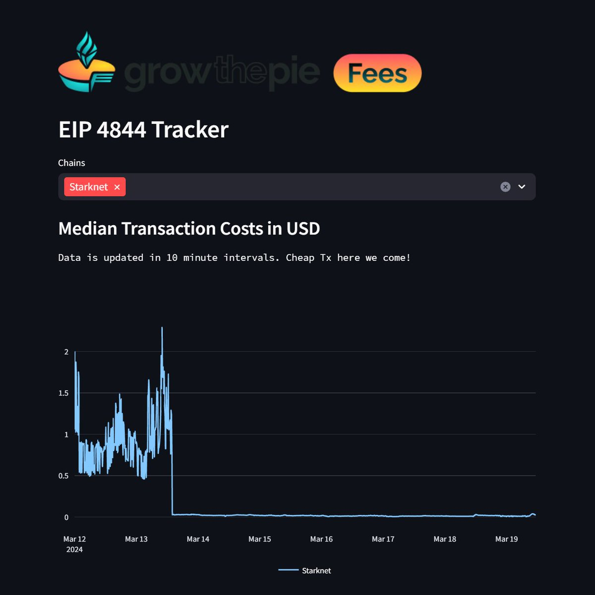
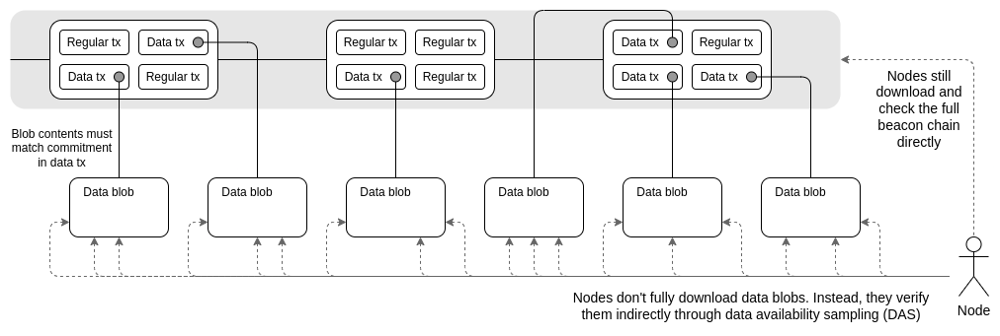
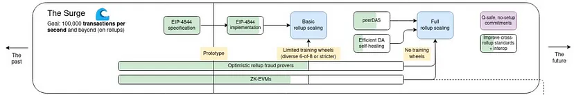
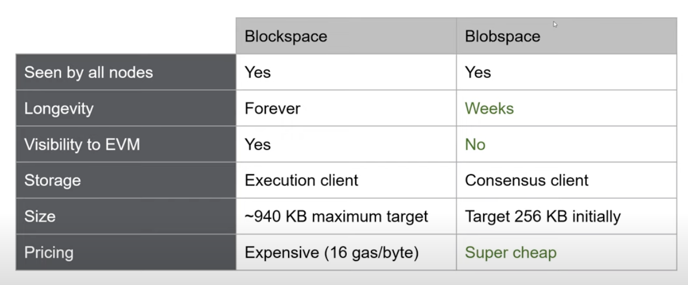
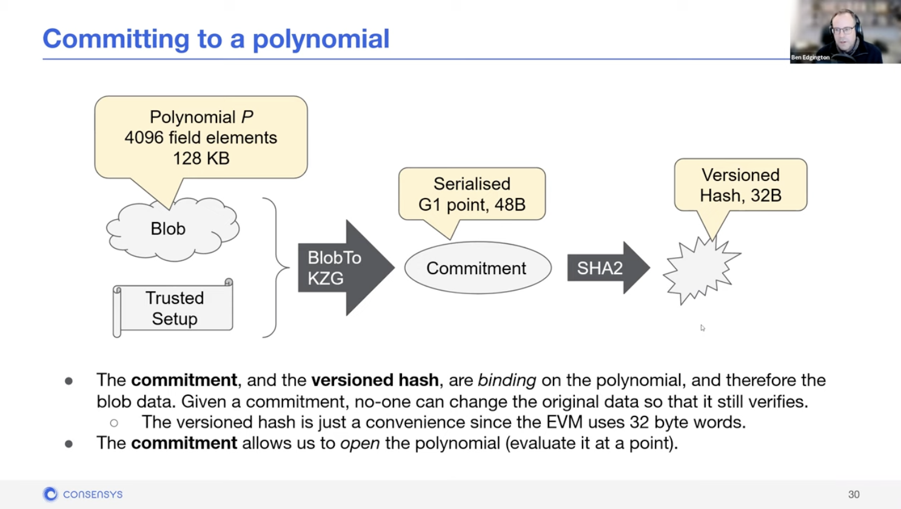
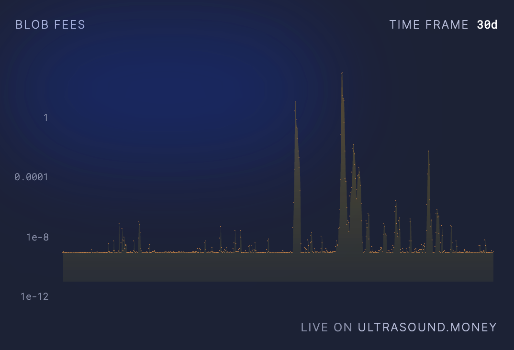
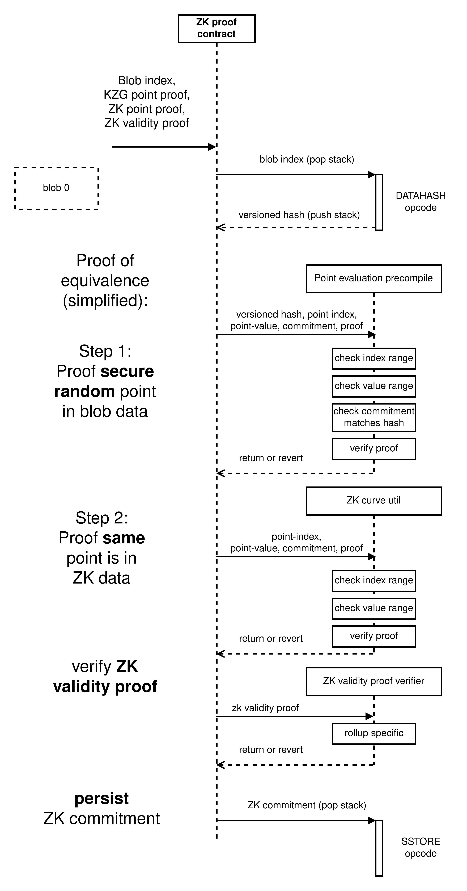

# Proto-Dankshardingについて

`Writer: @yugocabrio`

# Proto-Dankshardingへの道のり
Proto-Danksharding（EIP-4844）は、Rollupに安価なストレージスペースを提供することで、Rollupのコストを抑え、TPSを向上させるための提案です。これは、将来的なDankshardingの実現を見据えたアップデートになります。2024年の3月に行われたEthereum Dencunアップグレードによって、無事にProto-Dankshardingが導入されました。以下の画像は、Dencunアップグレードによって、zkRollupの1つであるstarknetでは、ガス代を98%も削減できたことを表しています。

出典: https://x.com/argentHQ/status/1770090213819187277

## Ethereumのスケーラビリティの課題

Ethereumは、これまで高いガス代と低いTPSによってスケーラビリティの問題に直面していました。この問題を解決するために、初期からShardingが提案されてきました。Shardingとは、Proof of Stakeの切り替えによってビーコンチェーンと並列して、複数の独自のブロックチェーンのようなシャードに分割したチェーンを作り、それぞれが独自にトランザクションを処理することでスケーラビリティを向上させる手法です。しかし、Shardingの実現には技術的な課題が多く存在しました。

## Danksharding
そこで、Optimistic RollupやzkRollupといったLayer 2ソリューションが登場し、Ethereumとしては、Rollup-centricなロードマップが採用されることになりました。これにより、従来のシャードチェーンのアイデアはロードマップから消え、代わりにDankrad Feist氏が提案したDankshardingが注目されるようになりました。Dankshardingは、トランザクションのスペースを増やすのではなく、Blob（Binary Large Object）と呼ばれる新たなデータタイプを作り、そのスペースを増やすというものです。Ethereum、EVMはBlobを解釈しようとせず、Blobを検証するには、Blobが利用可能であること、つまりネットワークからダウンロードできることを確認するだけで済む仕組みです。

出典: https://notes.ethereum.org/@vbuterin/proto_danksharding_faq#What-is-Danksharding

Proto-Dankshardingでは1ブロックあたりに最大6個のBlobを、Dankshardingでは最大256個のBlobを含める予定です。これまでのEthereumのメインネットは約10 TPS（トランザクション毎秒）の処理能力を持っていました。しかし、Proto-Dankshardingが導入されることで、Blobを利用したRollupを約1000 TPSにまで向上することが期待されています。さらに、最終目標であるFull Dank Sharding、すなわちThe Surgeが実現されれば、最大で10万 TPSにすることを目標となっています。

1 Blobは125KBほどで、256個のBlobは32MBのブロックサイズが必要ですが、これは現状のEthereumで扱うことができません。なぜなら、ブロックサイズが大きくなると、高性能なハードウェアでしかノードの運用ができず、分散化の妨げになるからです。しかしながら、ブロックの生成が中央集権的でも、検証過程が分散されていれば、検閲耐性の観点から分散化されている方向を示しています。

Dankshardingの主な革新の一つは、merged fee marketです。これは、固定数のシャードがそれぞれ異なるブロックとブロックProposerを持つ代わりに、Dankshardingではすべてのトランザクションとデータを選択する一人のProposerのみが存在します。

さらに、高いスペック要件がバリデータに強制されないように、Proposer/Builder Separation (PBS)は、ブロックの内容を選択する権利を競う特殊なクラスのアクター、Block Builderを導入しました。Proposerは最も高い入札額を持つ有効なヘッダーを選択するだけでよく、Block builderのみがブロック全体の処理を必要とします。他のバリデータやユーザーは、Data Availability Sampling(DAS)と呼ばれる技術を使用することによって、非常に効率的なデータ検証を実施することができます。

Dankshardingでも技術的な課題が多く、先立ってProto-Dankshardingが実装されることになりました。

## EIP 4844以前のRollupの課題
EIP 4844以前、Rollupのコストはどこに集中していたのでしょうか？ Rollupの約90%のコストは、Ethereum上のコントラクトにcalldataとしてトランザクションデータを送信するために消費されていました。Ethereumのノードは、Layer 2の全てのトランザクションを計算する必要はありませんが、Layer 2のトランザクションに関わるデータを保持する必要があります。

これは、Data Availabilityと呼ばれ、zkRollupにおいては悪意のあるシーケンサーがデータを隠蔽し、ユーザーの資産を不当に凍結することを防ぐために不可欠です。一方で、Optimistic Rollupでは、シーケンサーが不正行為の可能性があるトランザクションをブロックチェーンに含めた場合、他の参加者がそのトランザクションに対して有効なChallengeとなるFraud Proofを提出できるように、関連データが公開されていることが必要です。これにより、不正なトランザクションによる資金の盗難が阻止されます。

そして、Data Availabilityを確保するために、Proto-Dankshardingの導入以前は、Rollupのトランザクションデータは、当時最も安価なCalldataを利用してEthereum L1にアップロードされていましたが、それでもコストは高いものでした。

## Proto-Dankshardingの目標

この課題を解決するために、Calldataの代わりにBlob（Binary Large Object）という新しい主にRollupのためのデータ形式が導入されることが決定されました。Blobを使用することで、Rollupのコストを大幅に削減し、より効率的なL2のデータ管理が可能になります。

なお、Proto-danksharding 実装では、Dankshardingと違って、すべてのバリデータとユーザーが完全なデータの可用性を直接検証する必要があります。

# Proto-Dankshardingの概要
## Blobの導入
Proto-Dankshardingには大きく2つの要素があります：
1. 短期間だけビーコンノードに保持されるBlob（Binary Large Object）という新しいデータ形式の導入
2. BlobのハッシュをEthereumに送信する新しいトランザクションタイプであるBlob Carrying Transaction(Shared Blob Transaction)の導入

## Blobの特徴

出典: https://youtu.be/JQDUvqv60qw?si=92l7WQojZNf1rKKH&t=946

BlobでもData Availabilityを確保するため、全てのノードが確認できるようにする必要があります。従来のブロックではトランザクションデータを永久に保存する必要がありましたが、Blobのハッシュ値が数週間（約18日）のみ保存され、その後は削除されます。
<!-- Blobデータのハッシュ値だけが保存されているのでしょうか？データそのものが保持されていると思っていました．
ていうかそうしないとRollupで検証する際Txのローデータを取り出すことができないような・・．

 -->
この短期間の保存期間は、Optimistic Rollupにおけるfraud proofの提出期限が終了した後、またはzkRollupでゼロ知識証明によってトランザクションの正当性が確認された後に、永久保存の必要性がなくなるためです。また、Blob自体はEVMから直接アクセスできず、コンセンサスクライアントに保持されるため、エクセキューションノードに計算コストがかかりません。

## Blobのデータ構造について

出典: https://youtu.be/JQDUvqv60qw?si=i2lg8on_bAhtaiPa&t=1825

BlobはBLS12-381と呼ばれる楕円曲線を使用し、法 p = 52435875175126190479447740508185965837690552500527637822603658699938581184512の下で4096個のフィールド要素から成り立っています。各要素は32バイトで、全体としては約128kbのデータをBlob一つに格納できます。
<!-- 4096 * 32 Byte = 131,072 Byte
一つのデータをこの領域に入れる．

この，BLS12-381の4096個のフィールドってなんだろう？
KZGコミットメントを使う関係で，多項式の係数は有限体F_pの元．
で，ペアリング処理が必要なためペアリングフレンドリーな楕円曲線であるBLS12-381が選ばれている．

ということは4096個のフィールドとは，pが上記の大きい値のF_qの要素という単なる整数と考えて良い？
32バイトの正の整数値はpより小さい値なのでF_p上の点となりOK．
というかpがでかすぎるので64バイトでも全然行けるがあえて32バイトにしている意味はあるのか？
→ 1サイズ32バイト（256bit）ってのが暗号的にもよく使われているデータ単位だし扱いやすいって単純な理由なのかも．

もし上記の理解が正しければ「フィールド要素」と書くより有限体F_p上の元(0, ..., p-1という整数値)と記述したほうがわかりやすいと思います．

また，ここでBlobの各データの代表値としてKZGコミットメントの値（のハッシュ）を使っている理由を記述してください．
そうしないとなんでわざわざ謎のKZGコミットメントなんて使っているんだろう？という疑問が解消されません．単にハッシュ値でいいのでは？とも思ったり．

あと，各フルノードがBlobのローデータ，コミットメントの値，その際の乱数値を何処かに保持する必要があると思います．
18日間の期間，どうやってそれらを保管しているのか，上記3つを含めたどんな情報を保管しているのかも調べてください．
またユーザーはversioned_hashを用いてフルノードからローデータを取得できると想像していますが，その方法も調べてください．
→ blobscanというサイトで見れる
https://blobscan.com/tx/0x81999f40bbb0eaae1361bc02a448cbb7fc3f56762e69b0380b06331ec169d2ca
ローデータはGoogleとSwarmに保管している？

https://a16zcrypto.com/posts/article/an-overview-of-danksharding-and-a-proposal-for-improvement-of-das/
ここが仕組み詳しそう．
 -->
ただし、EVMからは直接アクセスできず、versioned_hashを通じて間接的にデータを扱います。

1. 多項式の構築:
    Blobの各要素 $B_i$ はフィールド要素の値であり、これを用いて多項式 $P(x)$ を構築します。$\omega^{4096} = 1$ mod $p$ を満たす整数 $\omega$ を使用し、$(\omega^{0}, B_0)$ から $(\omega^{4095}, B_{4095})$ を通過する4095次の一意の多項式 $P(x)$ を作ります。

2. KZGコミットメントの生成:
    $P(x)$ と Trusted Setupの値を用いて、KZGコミットメントを生成します。

3. コミットメントのハッシュ化:
    KZGコミットメントのSHA256ハッシュ値にバージョン情報（0x01）を付加し、最終的にEVMを満たす32バイトの長さにします。
    <!-- EVMを満たす32バイトというのは？
        EVMでの最大の整数値型uint256で表現可能な値ということ？
        というかSHA256は32バイトなので，バージョン情報追加したら33バイトになってしまうが・・・．
     -->
    
    この値がversioned_hashとして記録されます。バージョン情報は、KZGコミットメントは0x01ですが、将来的に例えば量子耐性のあるコミットメントを導入した時の識別子になります。
    <!-- 
    versioned_hashとは，Blobとして保存した各データを識別する識別子という理解であっている？
    IPFSにおけるcidみたいな．
    将来的に別の例えば量子体制のあるコミットメントを導入した場合に区別ができるようにするための識別子となります，とか表現改善が必要． -->

## Blob Carrying Transaction(Shared Blob Transaction)の詳細
このBlobのデータの追加に伴い、Blob Carrying Transaction(Shared Blob Transaction)と呼ばれる新しいタイプのトランザクションが導入されました。トランザクションには、通常のsender、receiver, nonce, gas bidなどに加えて、Blob特有のものとして、次の2つが新しく追加されました。
<!-- Txのデータ構造的に以下の2つが追加されたということ？
https://github.com/blockchaininnovation/lecture/blob/2b7817b26a89b33fbd3588cc6785f5278bd92662/P02_ethereum/2_components.md?plain=1#L108
に表現を揃えてくれると助かりあmす．
 -->
1. max_fee_per_blob_gas
    
    これはsenderがBlobに対して支払う意思のある金額の入札です。ここでのgasは、既存のEIP-1556とは別でBlobはBlob自体のfee marketを持ちます。
<!-- EIP-1556と唐突に出てきてもわかりにくいので通常のTxのガス料金を規定したEIP-1556・・・などのように補足説明を記述してください． -->
2. blob_version_hashs

    これは、複数の versioned_hash をリストとして保持します。

ブロックヘッダーにも変更があり、blob_gas_usedとextra_blob_gasが追加されています。

1. blob_gas_used
    
    ブロック内のトランザクションによって消費されたblob gasの総量です。
    
2. excess_blob_gas
    
    ブロックごとのBlobの目標使用量を超えた場合の累積ガス量です。1ブロックの目標Blob数は3つであり、3つを超えると超過分だけ増加し、3つ未満の場合は減少します。ただし、超過がない場合は0に保持されます。現在の制限では1ブロックに最大6つのBlobが含まれることができます。

## Blobのfeeについて
Proto-Dankshardingは、Blobの基本料金を通常のガス使用料金の基本料金とは別に調整する、Blob固有の料金市場を導入します。

$$
b_{n+1} = b_n \cdot \left(1 + \frac{u - t}{8t}\right)
$$

- $b_n$: 現在のブロックの基本料金
- $b_{n+1}$: 次のブロックの基本料金
- $u$: 現在のブロックで使用されたガス
- $t$: ターゲットガス使用量

blob_gas_priceは指数関数形式を取り、excess_blob_gasが特定の範囲を超える場合、Blobの使用料金がCalldataよりも高くなる可能性があります。このように設定することで、Blobの使用が目標を大きく超えた場合に料金が急激に上昇し、過剰な使用を抑制します。

具体的なガス代のメカニズムはこちらをご覧ください。

https://notes.ethereum.org/@vbuterin/proto_danksharding_faq#What-does-the-proto-danksharding-multidimensional-fee-market-look-like

基本的に現在は、Ethereum L1をDAに使うRollupのガス代を大幅に削減することに成功していますが、Rollupのチェーンの使用状況によって、Blob FeeがスパイクしてCall Dataよりも上回る事象も発生しています。

出典: https://ultrasound.money/#blobs

## EVMの変化
Proto-Dankshardingの導入に伴い、Ethereumの仮想マシン（EVM）にはオペコードとプリコンパイルが追加されました。

1. BLOBHASHオペコード
    - トランザクションが持つversioned_hashをEVMに読み込む機能を提供します。

2. point_evaluation_precompile
    - このプリコンパイルは、与えられた多項式 $p(x)$ のKZGコミットメントと、ポイント $z$ およびその評価値 $y$ が提供された $versioned_hash$ に対応することを証明するKZG Proofを使用して、$f(z)$ が $y$ であることを検証します。プリコンパイルは、192バイトの入力を受け取り、versioned_hash、$z$ 、$y$ 、commitment、proofを解析し、コミットメントがversioned_hashに一致することを確認した後、KZG proofを検証します。この検証により、Blobの特定の要素が期待される値を持っていることが証明されます。
    - このプリコンパイルを使用することで、$f(\omega^i) = B_i$ という関係を確認し、Blobの $i$ 番目の要素が $B_i$ であることを証明できます。

## zkRollupでどう使われているのか
zkRollupで Blob を検証するナイーブな方法は、Blobをプライベート入力として KZG に渡し、SNARK 内で楕円曲線の線形結合やぺアリングを実行して検証することですが、不必要に非効率的です。代わりに、zkRollupが BLS12-381 ベースの場合ははるかに簡単な方法があり、任意の ZK-SNARK の場合はそこそこ簡単な方法があります。ここでは、BLS12-381を使用する場合について触れたいと思います。

### 簡単なアプローチ: BLS 12-381を使用する

まず、 $K$（KZGコミットメント）と $B$（それがコミットされているBlob）が同じデータにコミットしていることを証明する必要があります。この証明は、 $Q_C$（例えばPLONKで使用されるコミットメント）など、他のコミットメントスキームと同様に行います。

まず、KZGコミットメント $K$とコミットされているBlob$B$が同じデータにコミットしていることを証明する必要があります。この証明には、同値性証明が用いられます。例えば、PLONKで使用されるコミットメント $Q_C$があったとして、$K$と $Q_C$が同じデータを保持していることを示すことが求められます。

### 同値性証明の手順：

1. 多項式コミットメントの集合: $C_1, C_2, C_k$ など複数のコミットメントが存在し、それぞれが異なるスキーム（例えばKate, FRI, Bulletproofなど）に基づいています。
2. 評価ポイントの選択: これらのコミットメントのハッシュ値を取り、$z=hash(C_1 ... C_k)$それを多項式 $P$を評価する点 $z$として使用します。
3. 証明の公開と検証: 各コミットメント $C_i$ に対して、$C_i(z)=a$となる証明$O_i$を公開し、$a$が全てのケースで同じであることを検証します。

zkRollupは、この同値性証明を利用して、公開データがversioned_hashと一致することを証明します。そして、ここで重要なのは、KZGの検証は直接行わず、point_evaluation_precompileを使って間接的に行うべきという点です。これにより、今後KZGコミットメントが別の技術に置き換わっても問題が起きないような設計です。

このテクニックを使えば、zk-snarkの公開入力としてblobを利用することができ、zkRollupのdata availabilityとしてblobが利用できるようになります。

BLS12-381ではない任意のSNARKの場合はこちらをご覧ください。

https://notes.ethereum.org/@vbuterin/proto_danksharding_faq#Moderate-approach-works-with-any-ZK-SNARK
がちゃんとした仕組みの解説記事ぽい．

## zkRollupでどう使われているか

zkRollupの遷移を検証するためには、以下の二つのことが必要です：

1. L2から正しいデータがインポートされたことの証明
2. ZK遷移の証明

zkRollupシステム内でKZGのコードを実行する代わりに、point_evaluation_precompileを通じて、すでに持っているコミットメントが、インポートされたデータに対してRollupの選択した任意のコミットメントスキームと同等であることを示すことができます。

これを行うためには、producerとverifier が選択できないランダムな点が必要で、その点での評価値がKZGのBlobとzkRollupのデータのコミットメントの両方で同じであることを評価します。

インポートされたデータに対する zkRollup コミットメントが有効であることを確認した後、zkRollupは実際の遷移を検証し続けることができます。

出典: https://hackmd.io/@protolambda/blobs_l2_tx_usage#Blob-TXs-in-EVM-but-without-blob-data

Optimistic Rollupでのpoint_evaluation_precompileの使われ方はこちらをご覧ください。
https://hackmd.io/@protolambda/blobs_l2_tx_usage#Blob-TXs-in-EVM-but-without-blob-data

# まとめ
Proto-DankShadingは、Dankshardingに先駆けて行われたアップデートで、EthereumのRollupのL1に保管されるトランザクションの保存コストを削減し、Rollupのガス代の削減およびTPSの増加を目的としたものです。短期間保存されるBlobというデータ形式を導入し、またBlobを持つBlob Carrying Transaction(Shared Blob Transaction)というトランザクションタイプが導入されました。Blob Carrying Transaction(Shared Blob Transaction)には、コミットメントのハッシュ値が記録されており、EVMから直接Blobの値を取得することはできませんが、現在はKZG コミットメントとpoint evaluation precompileを使用してBlobの要素を取得することができます。

# 参考
- EIP-4844: Shard Blob Transactions: https://eips.ethereum.org/EIPS/eip-4844#point-evaluation-precompile
- Ethereum's first steps towards serious scalability/EIP-4844 (Proto-danksharding): https://youtu.be/JQDUvqv60qw?si=k_uFeL7v85PiLisW
- Proto-Danksharding: https://www.eip4844.com
- proto-danksharding(EIP-4844)の概要: https://zenn.dev/qope/articles/b8d09ae260f1aa
- Proto-Danksharding-Part1: https://medium.com/@chaisomsri96/proto-danksharding-part1-b6449e120f78
- Proto-Danksharding-Part2: https://medium.com/@chaisomsri96/proto-danksharding-part2-c5fb314f54e7
- Blobspace101: https://domothy.com/blobspace