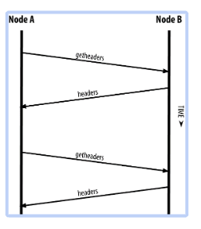

# 6章　ビットインネットワーク
## 概要
各ノードがどうつながって，どのような情報のやり取りをしているのかを見ていく
- [P2Pネットワークアーキテクチャ](#peer-to-peerネットワークアーキテクチャ)
- ノードのタイプと役割
- ノード間の接続
- ブロック情報の伝搬
- SPVノード
- ブルームフィルタ

## Peer-to-Peerネットワークアーキテクチャ
Bitcoinは，インターネット上でP2P (peer-to-peer)ネットワークを構成している

- P2Pネットワークとは
    - 世界中にあるノードがつながって運営されている
    - すべてのノードの役割が同じで特別なノードはない．
    - flatなトポロジーでつながっている
        → 階層構造やサーバー，中心サービスはない

P2Pネットワークの例：
- ファイル共有サービス：：Napster, BitTorrentなど

- ビットコインネットワーク
    - bitcoinのP2Pプロトコルを構成しているノードの集合である．

- 拡張ビットコインネットワーク
    - ビットコインネットワークに接続して動作しているすべてのコンポーネントを含めて「拡張ビットコインネットワーク」と呼ぶ．
        - 例えば「Stratum」というプロトコル
            - これはビットコインネットワークに接続してマイニングやモバイルウォレットを構成する別のネットワーク
            - ビットコインネットワークへGatewayの役割を持つサーバーを介して接続する
# ノード
## ノードのタイプと役割
- ビットコインのノードはflatであるが，いくつかの機能がある
- ノードの種類
1. ウォレット
2. マイニング
3. ブロックチェーンデータベース
4. ルーティング
    - 検証
    - トランザクションとブロックの伝搬
    - その他のノードの発見と接続維持

- すべてのノードはルーティング機能を備えている
    - ビットコインネットワークに参加するために必須

## ノードのタイプと役割
- フルノード
    - 最新のブロックチェーンデータを有する
    - 他のデータを参照することなくすべてのトランザクションの検証を自身で行うことができる．
-  マイニングノード
    - マイニングを行うノード
    - 新しいブロックを生成する
    - フルノードであることが多い
- SPVノード
    - ブロックチェーンデータの一部のみを持つ
    - SPV (Simplified payment verification)と呼ばれる手法で，トランザクションの検証を行う
- ウォレット
    - フルノードの一部
    - デスクトップのビットコインクライアントのようなもの
    - スマートフォンのように，リソースが限られた端末で動作するウォレットはSPVノードとなっているものが多い．

## 拡張ビットコインネットワーク
- ビットコインネットワークのノード
    - Bitcoin Core 
        - 7,000～10,000ノード
    - BitcoinJ, Libbitcoin, btcd 
        - 数百ノード
    - 独自のマイニングノード
    - 企業のノード
        - フルノードを持っている
        - 自社のサービスのエッジルーターとして使用
            - 取引所
            - ウォレット
            - ブロックエクスプローラー
            - 決済サービス
    - 周辺のシステム
        - ビットコインP2Pプロトコル以外のノード
        - 企業の自社サービスのフルノードの裏にあるものもここ
## ビットコインリレーネットワーク
#### ビットコインリレーネットワークの目的
- マイナーはPoWの解をいち早く見つけたとき、
    - 獲得したブロックをいち早くビットコインネットワーク状に伝搬させなければならない。
    - いち早く次のブロックのマイニングに着手したい

#### ビットコインリレーネットワークとは
- 2015年にMatt Coralloが開発した
- 世界中のAWS上に特殊なノードがいくつか配置され，多数のマイナーとマイニングプールを結んだ．
#### ビットコインリレーネットワークの進化
- FIBRE
    - 2016年にMatt Coralloは FIBRE (Fast Internet Bitcoin Relay Engine)でBitcoin Relay Networkをreplaceした
    - FIBREはUDBベースでのリレーネットワークで
    - コンパクトブロック最適化を実装している
    - データ転送量と遅延を削減した
- Falcon
    - Cornell大学の研究がベースになっている
    - Falconは「cut-through-routing」を「store-and-forward」の代わりに採用している
        - 完全なブロックができるまで受信するより，受信したブロックの一部でも伝搬させていくことで，遅延を少なくしている
## ネットワークの発見
- ノードを起動したとき、そのノードはどのようにしてビットコインネットワークに参加するのか？

#### ネットワークに参加するための方法
- DNSシード
    - ビットコインノードのIPアドレスリストを提供するドメイン
    - Bitcoin Coreは9つの異なるDNSシードを内部に持っている
        - https://github.com/bitcoin/bitcoin/blob/master/src/kernel/chainparams.cpp#L134
        - いくつかのIPアドレスを返す．（Aレコード）
    - 問い合わせのたびにランダムに変化する
- DNSシードを使わない場合
    - 少なくとも一つのノードのIPアドレスを与える必要がある
        - seednode オプションでノードのIPを指定
        - dnsseedオプションで0を指定するとDNSシードを使わないようにできる

- ネットワークの"発見"とは
    - 自分のIPアドレスを教えて伝搬
        - 他のノードに接続したとき，自分のIPアドレスを送信する（addrメッセージ）． そうすると，送られたノードは隣接ノードにそのIPアドレスを転送する．
    - 別のノードIPアドレス一覧を取得
        - getaddrメッセージを接続したノードに送り，その接続したノードが知っているノードのIPアドレスリストを取得する．
- Bootstrapping
    - 多様なP2P経路を保持するため，いくつかの別のノードに接続すること． 
    - コネクションは信用出来ないため，すぐに切断されることが想定され，いくつものノードに接続しておきたいためである
    - bootstrapのあとは，接続が成功したノードの情報は内部に保存しておくことで，クライアントがreboot（再起動）したあとにおいてもそれらのノードに再接続することを可能にしている

## 接続方法
- 8333ポート TCP接続
- 接続時にhandshakeをする．
    - 接続する側がversionメッセージを送信
        - nVersion
            - クライアントがしゃべるプロトコルバージョ  ン (e.g., 70002)
        - nLocalServices
            - ノードがサポートしているローカルサービスのリスト．現状 NODE_NETWORKのみ．
        - nTime
            - 現在時刻
        - addrYou
            - このノードから見えるリモートノードのIPアドレス
        - addrMe
            - このノードのIPアドレス
        - subver
            - このノードで動作しているソフトウェアの種類を表すサブバージョン(e.g., /Satoshi:0.9.2.1/)
        - bestHeight
            - このノードのブロックチェーンのブロック高

    - 接続される側がverackメッセージを返す
        - verack: 応答．特に何も情報は含まれない

## フルノード
- フルノードとは
    - 完全なブロックチェーンを保持しているノード
    - 初期のビットコインではすべてのノードはフルノードだった
    - 新しいブロックを取得したときに自分で検証できる
- Bitcoin Core
    - ビットコインネットワークの75%以上のノードはBitcoin Core
    - フルノードのクライアントの90%以上がBitcoin core
        - Satoshi クライアントとも呼ばれる
    - getpeerinfoで /Satoshi:0.8.6/ のようにバージョン情報が得られる
- 全ブロックチェーンデータ
    - 600GBくらいある．
    - Bitcoin coreを初めて起動すると，genesisブロックから取得して，7日以上はかかる．

# 他のノードからブロックチェーンデータを取得する手順
## Inventory（在庫）の交換
#### 在庫の交換の目的
- 新しいフルノードがピアと接続して最初に行うことは完全なブロックチェーンを構築すること
- 何十万ものブロックをネットワークからダウンロードする

#### 在庫の交換の手順
- 自分が持っていないブロックを1つずつ順番に取得すればよいと思うが，以下のことに注意した方法を考える．
1. ブロックチェーンはフォークしているケースがあり，最長のブロックチェーンを自ノードに取り込む必要がある．
2. 効率よく（ネットワーク上送信されるデータ量が偏らないように），ブロックチェーンデータの取得をしたい．

## Inventory（在庫）の交換・枝分かれしていないケース
1. version メッセージの交換
    - 各々のブロック高を取得する
2. getblocksメッセージの交換
    - 自分の最新ブロックのハッシュを送信
    - そのハッシュが自分のブロックチェーンのどこにあるかを確認することで相手のブロックチェーンの最新ブロックは自分のブロックチェーンのどこにあるかがわかる
    - ブロック高だけだとフォークしている可能性がある
3. 長いブロックチェーンのノードからinvメッセージの送信
    - 長いチェーンから短いチェーンに未取得ブロックのハッシュ値列を最大500送る．
4. 短いブロックチェーンのノードからgetdataメッセージの送信
    - どのブロックが欲しいかをハッシュ値で指定
    - getdataメッセージは接続しているすべてのピアに対して分散的に送り，ネットワーク全体に対する負荷が偏らないようにしている

5. ブロック情報を順次返信
    - リクエストを受けたブロック情報を送信．

2~5が繰り返される

## Inventory（在庫）の交換の例
#### ブロックが{0:a,1:b,2:c,3:d}のノードAとブロックが{0:a,1:b,2:c,3:d,4:e,5:f}のノードBの場合
1. version メッセージの交換
    - A→B：高3
    - B→A：高5
2. getblocksメッセージの交換
    - A→B：d
    - B→A：f
    - 　Aは，受け取ったfは自分がまだ持っていないとわかる
3. 長いブロックチェーンのノードからinvメッセージの送信
    - B→A：{e, f} 
    - BはAがまだ持っていないdより先の4番目以降のブロックのハッシュ値を送る
4. 短いブロックチェーンのノードからgetdataメッセージの送信
    - A→ B：eとfのブロックを送信してくれ，とリクエスト 
5. ブロック情報を順次返信
    - B→ A：eのブロックを送信
    - B→ A：fのブロックを送信

## SPVノード
#### SPVノードの目的
- スマートフォン、タブレットなどのデバイスでノードを動作させたい
    - フルノードはデータ容量が大きすぎて不便

#### SPVノードとは
- ブロック情報すべてではなくブロックのヘッダー情報のみを保有
    - getheadersメッセージ
    - トランザクションは含まない．
    - ヘッダのみのブロックチェーンの容量はフルブロックチェーンの10,000分の1以下
        - ヘッダ80バイト，ブロック1MB
    - ヘッダ内に前ブロックハッシュが含まれており，ブロック間の検証は可能．
- トランザクションを持たないので，UTXOプールの構築ができない．
- 自分のアドレスの残高がわからない
- トランザクション情報は，他のフルノードに問い合わせて取得する．
- 自分が送金する際，自分の残高を確認するときに，自分のUTXOリストをもらう

## SPVノードでのトランザクションの検証
トランザクションが特定のブロックに存在していることの検証の場合は以下の３通り
1. マークルパスを使用
2. フルノードに問い合わせる
    - 偽のネットワークやノードに接続するリスクは常に存在するため、フルノードが信頼できるかが重要
    - 複数のノードにランダムに接続
3. ブロックヘッダーに含まれるマークルルート値を使用

## SPVノードのプライバシーリスク
#### 自分のアドレスがばれる可能性がある．
- SPVは自分のアドレスの関係のあるトランザクションを多く他ノードに問い合わせするため
- さらに例えばそのSPVノードのネットワークに盗聴器を仕掛けられてしまうと，特定のアドレスに関するトランザクションを方々に問い合わせていることがわかってしまう
- これを解決するために「ブルームフィルター」という仕組みがある．

## ブルームフィルターとその概念
- PVノードがフルノードに対して，特定のパターンにマッチするトランザクション情報の問い合わせを行うことがあるが，それをどのアドレスなのかがわからないようにする仕組み．

#### ブルームフィルターの例え
- 検索フィルターのようなもの
    - イメージ的には，ある情報を取得するのに特定の検索ワードを指定するときの検索ワードのようなものである．
- 例 
    - 「23 Church St.」の検索を考える
    - 検索ワードとして「urch」や「Ch」とするとその情報はヒットするが，不要な情報も複数混ざる
    - 検索ワードを詳しくすればするほど検索結果は正確になるがプライバシーの問題が大きくなる
        - 「23」「Church」「St.」
    - など検索ワードを簡単にすればするほど検索結果は不要なものが多く含まれてしまうが，プライバシーの問題は少なくなる
        - 「urch」「Ch」
- というようなことと同じことをSPVノードがトランザクションを探すときに使えるようにして，正確性とプライバシーのバランスを取るようにする．

## ブルームフィルタの概略
- パターンAとBの2つのデータがあったときにその2つのデータのいずれかに，XとYが一致しているかどうかチェックする．
- 一致していることは確認できず，一致している可能性があることが確認できる．
- 逆にAとBとも一致していないことは確認できる．

## ブルームフィルタの仕組み
- AとBから作るブルームフィルター
    - 要素数Nのバイナリ配列
    - ハッシュ関数M個
        - ハッシュ値は1からNまでの値
- ブルームフィルターとは，あるインプットをM個のハッシュ関数から得られる値を配列に記録するモノ
    - 配列は最初すべて0が入っている．

例：
N=16
M=3
