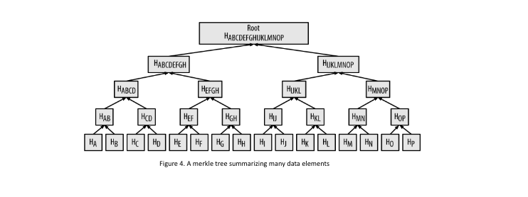
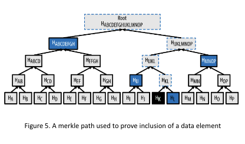
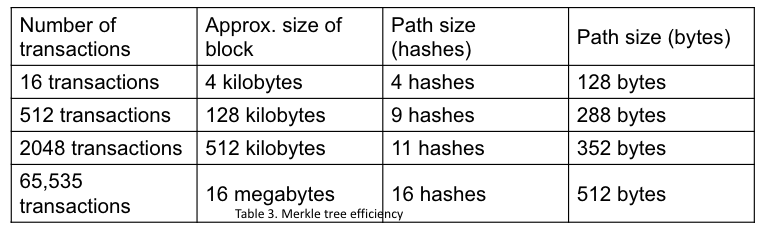
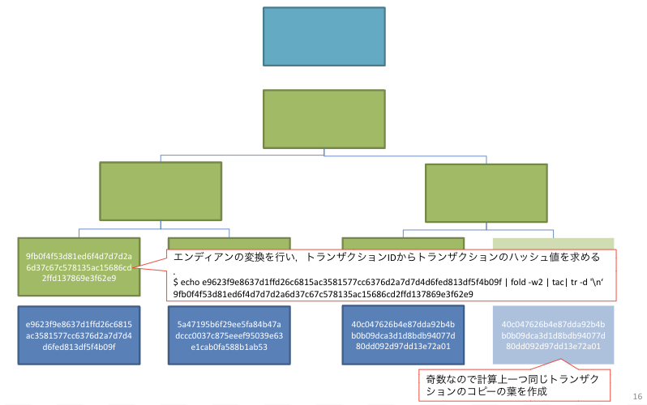
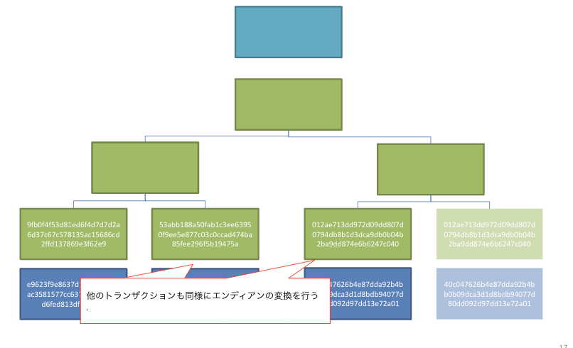
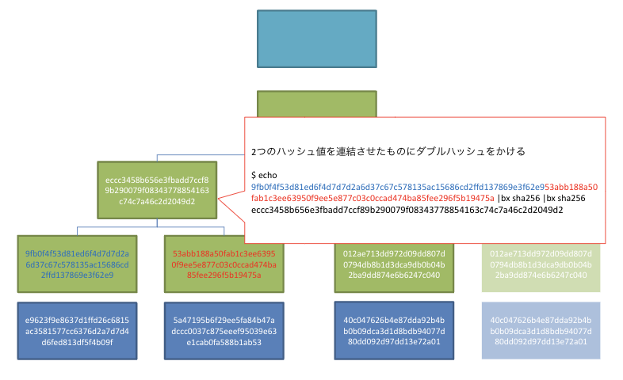
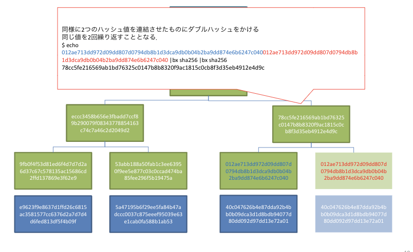
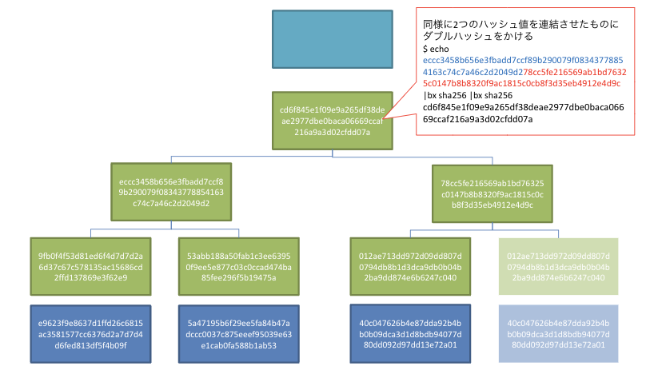
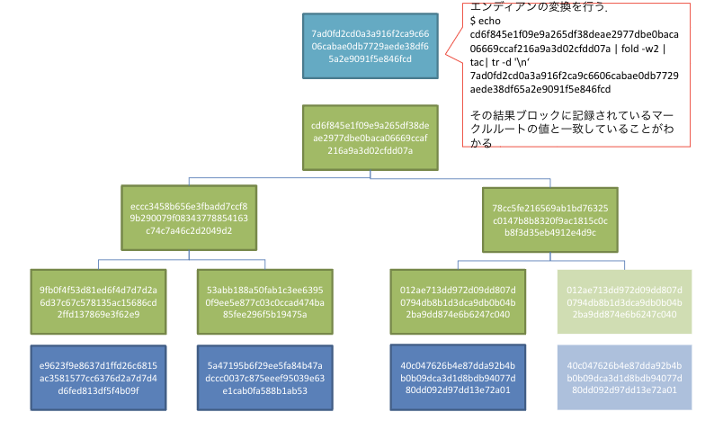

# 7章ブロックチェーン

## 概要
- ブロックチェーンの構造
    - [ブロックの構造の簡単な説明](#ブロックの構造の簡単な説明)
    - [ブロックの連鎖](#ブロックの連鎖)
    - [ブロックの構造の詳細な説明](#ブロックの構造の詳細な説明)
 - [ブロック識別子：ブロックヘッダハッシュとブロック高](#ブロック識別子ブロックヘッダハッシュとブロック高)
- [Genesis ブロック](#genesisブロック)
- [マークルツリー](#マークルツリー)

## ブロックの構造の簡単な説明
- ブロックサイズ
    - このフィールドを含まないこのブロックのサイズ
- ブロックヘッダー
    - 前ブロックハッシュ
    - difficulty
    - マークルルート
    - nonce
- トランザクション数
    - このブロックに含まれるトランザクション数
- トランザクション
- ブロックハッシュ

## ブロックの連鎖
- 前ブロックのハッシュ値が自身のブロックに含まれる
- このように最初のブロック(genesis block)にまで連鎖状に連なっている

## ブロックハッシュによる改ざん困難さ
- まずは改ざんしようとしているトランザクションを含むブロックの検証を通るようにしなければならない→新たなナンス値を求める必要性
- それができたとしても次のブロックに含まれるハッシュ値と相違してしまうため，つながらなくなる
- 最長ブロックのチェーンを選択するようになっているため連鎖的にそのブロック以降のナンス値をすべて改めて求めていく必要が出てしまう．

## ブロックの構造の詳細な説明
- ブロックサイズの内訳
    - 4bytes
    - トランザクション座椅子は最低250バイト
    - １つのブロックには平均1900トランザクションが含まれる
    - 1MB以下にならなければならない
- ブロックヘッダーの内訳
    - Version
        - 4 bytes
        - ソフトウェア、プロトコルバージョン情報
    - Previous BlockHash
        - 32 bytes
        - 前ブロックのブロックハッシュ
    - Markle Root
        - 32 bytes
        - 武特区の前トランザクションに対するマークルルリーのルートハッシュ
    - Time Stamp
        - 4bytes
        - ブロックの生成時刻
    - Difficulty Target
        - 4bytes
        - ブロック生成時のPoWのdifficulty
    - Nonce
        - 4bytes
        - ナンス値

## ブロック識別子：ブロックヘッダハッシュとブロック高
#### ブロック識別子の目的
- 各ブロックをユニークに識別する
   - ブロックを指定することが可能になる
   - ブロックの呼び出しが可能になる

#### 各ブロックをユニークに識別するためには以下の二つの手段がある
1. ブロックハッシュ
    - 32 byte
    - ブロック識別子として機能
    - ブロックヘッダに対して*SHA256を用いて2回*ハッシュ化した値
        →ブロックチェーン内にどのブロックハッシュがどのブロックを表現しているのかを紐づける情報は保存されていない
        →ブロックハッシュ値は各々のブロックヘッダから計算にすることでのみ導ける
        →クライアントソフト内で，検索高速化のために別DBで管理することはあり得る
        →前のブロックのブロックハッシュ値はヘッダー内に含まれている．
2. ブロック高
    - ブロックチェーンがフォーク（枝分かれ）している際に一意に定まらない

 ##  Genesisブロック
 - ビットコインブロックチェーンの最初のブロック
    - genesisブロックのTimestampの値は2009-01-04 03:15
        →2009年に作られた
    - ブロックハッシュは000000000019d6689c085ae165831e934ff763ae46a2a6c172b3f1b60a8ce26f
    - coinbaseトランザクションにメッセージが含まれている
        - 「The Times 03/Jan/2009 Chancellor on brink of second bailout for banks.」という文字列
            - 英国タイムズ紙の2009年1月3日の見出し．
            - Genesisブロックがこれ以前には存在しなかったことの証明としてサトシ・ナカモトが入れた．

# マークルツリー

## マークルツリーの概要
#### マークルツリーの目的
- そのブロックに含まれているトランザクションリストを一意に表現したい
- とあるトランザクションがそのブロックに含まれているかどうかを全トランザクションデータを用いなくても検証したい
    - SPVノードで使用される
    - マークルツリーの一部のみ使用すれば検証可能
    - ネットワーク転送量の削減につながる

#### マークルツリーの役割
- マークルルートがブロック内に含まれるトランザクション全体（値や順番）の要約を行う．
- マークルルートとは
    - ブロックヘッダーに含まれている．
    - マークルツリーのルート：ハッシュ値
    - トランザクションリストのフィンガープリント、つまりトランザクションの順番や値が変更されるとマークルルートの値も変わる

## マークルツリーの図示

*$H_k$ は　トランザクションkのハッシュ値を示す*

*$H_{jk}$はトランザクションjとkのハッシュ値を連結させたものにダブルハッシュをかけたもの*
#### ここからわかること
- トランザクションの数が1つでも100万でもマークルルートの値は同じ32バイト
    - $H_A$の値も$H_{ABCDEFGHIJKLMNOP}$の値も32バイト
        
        → *どれだけ多くのトランザクションでも表現できる*
- トランザクションの一つでも値が違ったり順番が違うと異なるマークルルートの値となる．
→ トランザクションリストをユニークに表現できる．

## マークルパス
#### マークルパスとは
- マークルツリーの一部
- そのトランザクションの検証に必要な途中の葉

#### マークルパスの目的
- マークルルート（マークルツリーのハッシュ値）が既知の状態で，あるトランザクションがそのマークルツリーに含まれているかを確認したい
    - SPVノードはブロックヘッダーのみ保持．すなわちマークルルートを持っている
    - そのブロックに含まれるTxを安全に他のフルノードから取得するには
トランザクションとともにマークルパスを取得．

## 実例

トランザクションKがブロックに含まれているかどうかを検証するとき、マークルパスとしてH_ABCDEFGH, H_MNOP, H_IJ, H_Lの4つ値があれば検証可能である
####  手順
1. $H_{K}$ → $K$から計算
2. $H_{KL}$ → $H_{K}$と$H_{L}$から計算
3. $H_{IJKL}$ → $H_{IJ}$と$H_{KL}$から計算
4. $H_{IJKLMNOP}$ → $H_{IJKL}$と$H_{MNOP}$から計算
5. Root → $H_{ABCDEFGH}$と$H_{IJKLMNOP}$から計算
6. 計算されたRootが既知のマークルルートと一致しているかどうかを確認．

## マークルツリーの効率性
トランザクション数が大きくなるとマークルパスのサイズも大きくなるはずだがどれくらいのサイズが削減できるのか

- ブロックサイズの増え方に比べてマークルパスのサイズの増え方は緩やか
- 4KBから16MBに増える場合でも128Byteから512Byteにしか増えない

## 実データのマークルルートを計算してみる
https://www.blockstream.info/testnet/block/000000002b35701826c61e9657b464e6418338f11f236c65903efe142a298636

を実際に計算してみてみる

### 初期状態の様子

### Txに対するハッシュ値を求める
$K$から$H_K$を求める

### 二つのハッシュ値を連結させたものにfダブルハッシュをかける
$H_K$と$H_J$から$H_{JK}$を求める

### 最終的な値がマークルルートと一致しているかを確認する

## まとめ
- ブロックチェーンの構造
    - 前ブロックのハッシュ値がそのブロックヘッダに含まれることで改ざん不可能なチェーンを構成している
- ブロック内に入っているデータ
    - ブロックヘッダとトランザクションリスト
- ブロック識別子
    - そのブロックハッシュ値．ブロックヘッダから求められるがその識別子そのものはどこにも保存されていない．
- Genesisブロック
    - ブロックチェーンの最初のブロックのこと
- マークルツリー
    -   マークルルートがブロックヘッダに保管
- SPVノードで使用．
    - マークルパスから，あるトランザクションがブロックに含まれてるかの検証ができる．
    - マークルパスのデータ量はトランザクションのデータ量に比べて極めて少ないし，増え方も微増

