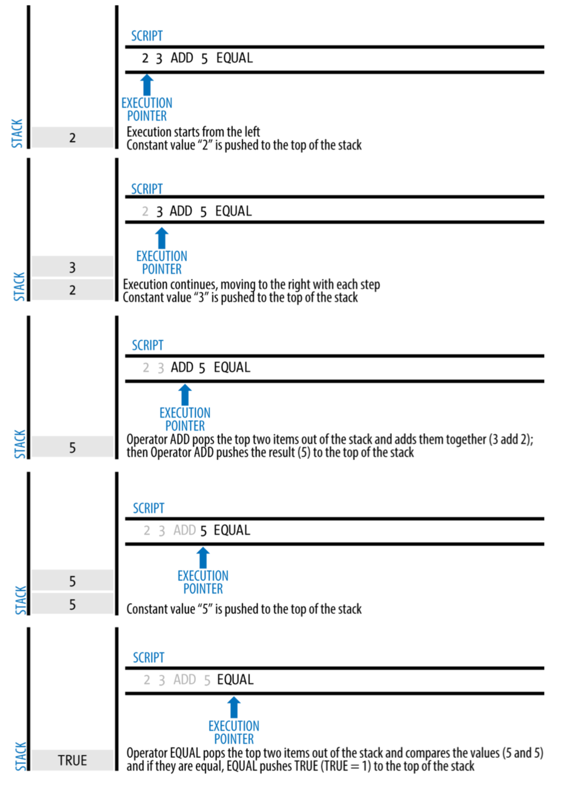

- [トランザクションとは何か](#トランザクションとは何か)
  - [従来の中央集権型取引との違い](#従来の中央集権型取引との違い)
- [トランザクションの登場人物](#トランザクションの登場人物)
  - [1. ブロックチェーン（ハッシュチェーン）](#1-ブロックチェーンハッシュチェーン)
    - [ハッシュについて](#ハッシュについて)
  - [2. P2P（Peer to Peer）](#2-p2ppeer-to-peer)
  - [3. ノード](#3-ノード)
  - [4. マイニング](#4-マイニング)
  - [5. PoW（Proof of Work）](#5-powproof-of-work)
    - [PoWの目的](#powの目的)
    - [PoWの流れ](#powの流れ)
    - [PoWの課題](#powの課題)
- [トランザクションのライフサイクル](#トランザクションのライフサイクル)
  - [トランザクションの検証について](#トランザクションの検証について)
  - [Orphan transaction（オーファントランザクション）について](#orphan-transactionオーファントランザクションについて)
- [トランザクションのモデル](#トランザクションのモデル)
  - [UTXOモデル](#utxoモデル)
  - [アカウントモデル](#アカウントモデル)
  - [比較](#比較)
  - [UTXOの保管について](#utxoの保管について)
- [UTXOの構造](#utxoの構造)


# トランザクションとは何か
- トランザクションとは、仮想通貨を使用する**権利**を取引すること

```
Bitcoin(仮想通貨)は分散型コミュニティによって管理される。
Bitcoinを所有したり、その権利を譲渡するためにはコミュニティ全体の承認を受ける必要がある。
そのため、利用者はトランザクションと呼ばれるデータをコミュニティに検証・承認してもらう。
この過程において、取引が正常に行われているかを確認する。
```
## 従来の中央集権型取引との違い
```
従来(Web2)における取引では、中央管理者が通貨の偽造や二重支払などの詳細をチェックしていたが、
Bitcoin(Web3)においてはすべてがプログラムで処理されるようになった。（PoWの恩恵、後述）
これによって取引の透明性やセキュリティ面が担保されるようになった。
```

# トランザクションの登場人物
- トランザクションを理解するにあたって必要な知識を最初にまとめた
- 特にトランザクションと切り離せない内容であるマイニングについてはよく理解してほしい

## 1. ブロックチェーン（ハッシュチェーン）
- ブロックチェーンとは、トランザクション情報をまとめた「ブロック」をハッシュポインタに従ってつないだもの
  - ハッシュポインタによってすべてが連結されているため、１つのブロックを改ざんするためには他の過半数も改ざんする必要がある
  - これによって実質的に改ざん不可能の性質を獲得している
- Bitcoinにおけるブロックは以下の要素で構成される

  | 項目 | 役割 |
  | ---- | ---- |
  | ブロックヘッダー（Header） | ブロックの整合性を保つための情報やマイニングに使われる情報、トランザクションの要約を提示する |
  | ブロック本体（Body） | トランザクションのデータを保持する |
  | ブロックのサイズ | ブロックの容量を示す |
  | トランザクションの個数 | トランザクションの数を示す |

- *特にブロックヘッダーは以下の構成になっている

  | 項目 | 役割 |
  | ---- | ---- |
  | ハッシュポインタ | 直前のブロックのハッシュを示しチェーン状を保つ（連結されていることを担保する） |
  | ナンス （Nonce） | マイニングの際に利用される一度だけ使われる数（使い捨ての数） |
  | Merkle tree | Merkle treeの根ノード（トランザクション内容の要約だと理解してよい） |
  | バージョン | プロトコルのバージョン番号 |
  | タイムスタンプ | ブロックのおおよその作成時間（UNIX形式） |
  | 難易度（Difficulty） | マイニング時に使用される難易度 |

  `注：Merkle treeについては後述する。`

- 2024年現在ではBitcoinの１ブロックは１MBが上限となっている
  - 初期では最大36MBの取引を含めることができていたが、2010年に縮小された
  - Bitcoinのブロック容量については様々な議論が起こっている
  - 近年ではBitcoinの利用者も増え、上限に達することも多いことから容量拡大を求める声もある（スケーラビリティ問題）
  - 一方でブロックサイズの拡大は、Full nodeの負担が大きくなったり、DoSなどの攻撃リスクを上昇させる可能性もある
  - ここからハードフォークや「セグウィット（Segregated Witness：SegWit）」が始まった
- 現在SegWitの採用率は上がっており、ブロックサイズは４MBに拡大されたと解釈する人もいる

----

### ハッシュについて
- Bitcoinにおけるハッシュとは、暗号学的ハッシュ関数「SHA-256」によって生成される256ビットの値である
- 簡単に言うと、この関数は入力された値に対して、入力値が特定困難な値を返す

以下、ハッシュ関数を $H$ , 入力 $x$ に対する出力を $H(x)$ とする
```
例：
      H(1) = 6b86b273ff34fce19d6b804eff5a3f5747ada4eaa22f1d49c01e52ddb7875b4b があったときに、
      H(1) から x = 1 を推測するのは困難であるということである。
```

- またハッシュ関数の特徴として、同じ入力値には必ず同じ出力値をとる
- これにより、推測された値 $x$ が正しいかどうかを確認するためには $H$ に $x$ を入力するだけで簡単にわかる
- これらの性質によって、ブロックチェーンは改ざん困難かつ、第三者の検証（PoW）が可能になっている

#### *暗号学的ハッシュ関数
- 暗号通貨に使用されるハッシュ関数は、数学的なハッシュ関数が満たす条件に加え以下の条件を満たすものである

1. ハッシュ値から入力値が特定困難であること（原像計算困難性）
    - これに関しては上述したとおりである

2. 同じハッシュ値を得るような入力値を見つけるのが困難であること（第2原像計算困難性）
    - すなわち、 $H(x) = H(y)$ かつ $x \neq y$ となるような組 $(x, y)$ を見つけるのが困難であるということである

- 「困難」というのは、理論上は可能だが実現性がとても低いという意味である

----


## 2. P2P（Peer to Peer）
- P2Pとは、サーバーなどの中心的な機関や装置を持たず、末端の端末（ピア）同士が互いに信頼し合うことで成立するネットワークのこと
- Bitcoinでは非構造化ネットワーク (Unstructured P2P Network) が利用されている
  - *BitcoinではプロトコルとしてGossipやDiffusionを使用している
- 冗長性がありデータ処理を分散して素早く実行できる一方で、悪意あるユーザーを排除しにくい

`注：このP2PこそがWeb3たる所以であり、これを通貨に取り込むことができたことが、Bitcoin提唱者「Satoshi Nakamoto」の偉業である。`


## 3. ノード
- ノードとは、Bitcoinソフトウェアを実行するコンピューターのこと
- ウォレットなどもノードに分類される
- Bitcoinにおけるノードには以下の種類がある

| | 検証の対象 | ストレージ要件 |
| ---- | ---- | ---- |
| Full node | チェーン全体を検証 | 約550GB程度 (2024/2時点) |
| Miner node | 複数のトランザクション | Full nodeと同じ |
| Light node (SPV) | ブロックヘッダーのみ | Full nodeの 1 / 1000程度 |

`注：Full nodeのストレージ要件はブロック数が増えるごとに日々増加している。`

- ### Full node
  - チェーン全体の完全なコピーをホストし同期する（クライアントが独立してチェーンを検証できる）
  - マイナーが作成したブロックの検証を行う（２重支払いのチェックなど）
  - イメージとしては、ネットワークのセキュリティと整合性の維持を目的とすると考えて構わない
  - Light nodeに対して信頼されたチェーンを提供する
  - Light nodeと比べ、セキュリティやプライバシーの観点で優れている
  - Pruned nodeというFull nodeのストレージ要件を削減するためにできたノードも存在する（Bitcoin Core）
  - Pruned nodeはLight nodeにブロックを提供できない

- ### Miner node
  - ネットワーク上にブロードキャストされたトランザクションをマイニングを通じて検証する
  - Full nodeはブロックの検証を行う一方で、Miner nodeは新たなブロックを作成する
  - 運用に多大な計算・ストレージリソースを割く必要がある

  ```
  Full nodeとMiner nodeに関しては、ノードとして同一種類であるという見解も多々存在する。
  それらの見解は、どちらもネットワークを健全に維持するためのノードであるという理由からである。
  今回大別したのは、「マイナー」がどのような存在かをイメージしやすくするためである。
  「マイニング」を行うためには、Full node以上の性能を備えた特殊なマシンが必要になることに留意してほしい。
  ```

- ### Light node (SPV: Simplified Payment Verification)
  - Full nodeから提供されたブロックヘッダーのコピーを基に、支払いを検証する
  - ウォレットやマルチビットで使用される
  - ノードに関係のあるヘッダーしか取得しないため軽量である一方で、閲覧できる情報に制限がある
  - Full nodeからデータを取得する際に、データ不整合が起こるリスクがある
  - *ノードのハッシュをツリー化した、Merkle treeによって検証可能になっている
  - *検証に必要なツリーの数はブロック内のトランザクション数 $N$ について $log_2(N)$ 個


## 4. マイニング
- マイニングとは、トランザクションを検証・承認しブロックに情報を保存すること
- マイニングが行われることによってBitcoinが新規発行される（発行上限は2100万枚と決まっている）
- これを実行するノードは「マイナー（Miner）」と呼ばれ、マイニングの報酬としてBitcoin（仮想通貨）を享受する
  - マイニングによってBitcoinを受け取れるのは、最初に数学的問題を解いた者だけである
  - これによりマイナー同士の競争が起こる
- Bitcoinには半減期という仕組みがあり、マイニングによって得られるビットコインが半分に減少するタイミングがある
  - 半減期はおよそ４年に１回程度で起こっている（正確には21万ブロックのトランザクションごと）
  - マイニング報酬の遷移は以下の通り

    | 半減期の回数（実施年） | マイニング報酬 |
    | ---- | ---- |
    | 初期 | 50BTC |
    | 1回目（2012年） | 25BTC |
    | 2回目（2016年） | 12.5BTC |
    | 3回目（2020年） | 6.25BTC |
    | 4回目（2024年と予想される） | 3.125BTC |


- マイニング作業は、コンセンサスアルゴリズムにPoW（Proof of Work）を採用しているブロックチェーンで行われる
  - PoS（Proof of Stake）やDPoS（Delegated Proof of Stake）といったアルゴリズムを用いるチェーンでは「ステーキング（Staking）」が行われる
  - BitcoinやLitecoinなどがPoWを、EthereumやBinance CoinなどがPoSを採用している
- マイニングの具体的な流れについては次項（PoWの流れ）を参照のこと


## 5. PoW（Proof of Work）
### PoWの目的
- PoWの目的は、ノード同士が相互に信頼できない環境（P2P）において、すべてのノード間で合意、つまり相互に信頼を得ることにある
- 直接的に言うのであれば、あるノードのマイニング結果が本当に正しいものなのかを、ノード同士で確認しあうのである
- PoWによる検証・承認を経て、新たなブロックが作成されチェーンに追加される

### PoWの流れ
- PoWにおける作業は、計算リソースを必要とする複雑な数学的問題を解くことである
  - 多量の計算リソースを要求することによってブロックの改ざんを実質的に不可能にするため
- マイニング結果が、承認を行うノードの51%（過半数）に承認されるとブロックが新規追加される
- 具体的な流れは以下の通り

```
1. ノードがトランザクションを作成・送信する
2. 送信されたトランザクションはネットワークにブロードキャストされ、プール（待機所のようなもの）に入れられる
3. マイナーがプールから複数のトランザクションを選択し、新たなブロックを作成する
4. マイナーが数学的問題を解き（有効なナンスを求めて）、ブロックを提示する
5. 他のノードが、検証・承認を行った上でブロックチェーンに追加する（トランザクションが承認される）
```

- このPoWを含めた一連の流れを「マイニング」と呼んでいる

### PoWの課題
- #### 消費電力が多い
  - マイニングを行うためにはただでさえ多くの計算リソースを要求される
  - それに加えて、最初の1人以外は利益（Bitcoin）を得ることができないため競争が起こる
  - マイナーはより大規模なマシンを用意し、消費電力が増える
  - 現在の電力消費量は年間59TWを超えるといわれている
  - したがって環境負荷が懸念されている
- #### スケーラビリティ問題
  - Bitcoinでは、約10分に１回新しいブロックが承認されるようになっている（「難易度（Difficulty）」によって自動調整される）
  - しかし需要がどんどん増える中で、10分という時間がボトルネックになってきた
  - トランザクションを処理しきれず、「詰まり」が発生するようになった
- #### 51%攻撃
  - 上記にあったように、マイニング結果が承認を行うノードの51%（過半数）に承認されれば新規ブロックを作成できる
  - したがって１つの組織（利用者）が51%の承認を行えるようになると、虚偽のトランザクションを通すことができるようになる
  - このような脆弱性があるが、現状大量の承認ノードが存在するので過半数を占めるのは困難
  - Bitcoin側も、マイニングの「難易度」を上げることで対策をしている


# トランザクションのライフサイクル
- トランザクションのライフサイクルは以下の通り（PoWの流れも参照のこと）

### 1. 組成
  - 送金先のアドレスを指定する
  - Bitcoinを送る人がデジタル署名を付与する
### 2. ブロードキャスト
  - トランザクションをネットワークに送信
  - 送信されたトランザクションは各ノードに送信される
### 3. マイニング
  - マイナーによって各トランザクションが検証される
  - 検証に成功した有効なトランザクションが、マイナーによって新規ブロックに含まれる
  - マイナーが新たに作成したブロックを提示する
### 4. 記録
  - マイナーから提出されたブロックをFull nodeが検証する
  - 検証に成功したブロックは最も長いチェーンへと繋がれる（記録される）

## トランザクションの検証について
- トランザクションが検証される内容については以下の通り
  1. 資金の不足がないか
  2. トランザクション形式は正しいか
  3. 二重支払ではないか
  4. オーファントランザクションが含まれていないか
  5. 署名は有効か
  6. 手数料は適切か

- この他にも、ネットワークの混雑状況、トランザクションを送信するソフトウェアなどが原因で検証に失敗することもある

## Orphan transaction（オーファントランザクション）について
- Orphan transactionとは、親子関係が逆転してしまったトランザクションのことである
  - トランザクションは必ずしも送信順に検証されるわけではない（ネットワーク間の伝達スピードの関係）
  - そのため、送金の順番が前後した状態でノードに届いてしまうことがある
  - この場合、トランザクションは「オーファントランザクションプール」に入れられ、親を待機する
  - 親が届くと、親を待機していたすべてのトランザクションが取り出される
- オーファントランザクションプールには上限（MAX_ORPHAN_TRANSACTIONS）がある
  - これはノードからのDOS攻撃を防ぐため
  - これを超えた場合、ランダムなトランザクションが破棄される
- 説明は省くが、オーファントランザクションと似たものに「Orphan block（オーファンブロック）」もある

# トランザクションのモデル
- トランザクションの構造はBitcoinなどが使用するUTXOモデルと、Ethereumなどが使用するアカウントモデルに大別される

```
注：以降、「インプット」「アウトプット」という単語が出てくるが、それぞれ「出金元」「送金先（または自身の口座）」
    というような理解で一旦読み進めて構わない。正確には「UTXOの構造」で登場する、「vin」「vout」に該当する。
```

- ## UTXOモデル
- **UTXO（unspent transaction output）** とは、トランザクションアウトプットのうちまだ使用されていないもの
- UTXOモデルにおける残高は、未使用のビットコインの固まりである
  - イメージとしては、普段使うお札のようにある程度の金額が固まっている状態である
  - したがって、UTXOモデルにおいて仮想通貨を使用する場合は「おつり」が返ってくることがある（後述する）
  - また、普段複数のお札を使って支払いができるように、UTXOにおいても複数のアウトプットを使って支払いができる（後述する）
  - どのアウトプットから使われるかはウォレットによる
- １度使用されたUTXOは２度と使用することができない
  - これによって２重支払いを防いでいる
  - 「おつり」が発生する場合は、金額分の新たなUTXOが生成される
- 残高を求めるにはUTXOのアウトプットを合計する必要がある
  - 誰がいくら持っているのかが分かりにくいため、プライバシーの観点では優れている
  - しかし一方で、残高を求めるためにその都度合計しないと求まらないという観点では扱いずらい

- ## アカウントモデル
  - 銀行口座のように、アカウントの残高を直接データとして記録する
  - したがって支払う際は、引き出し元の残高を減らし、送金先の残高を増やすだけ
  - 要するに銀行の振込と仕組みは同じ

- ## 比較
  | | UTXOモデル | アカウントモデル |
  | ---- | :----: | :----: |
  | プライバシー | ○ | |
  | データサイズ | | ○ |
  | 同時処理 | ○ | |
  | シンプルさ | | ○ |
  | 対リプレイアタック | ○ | |

  `注：リプレイアタックの詳細は省略するが、簡単に言うと資金流出である。`

  - アカウントモデルには複雑なインプットが必要ないのでトランザクションデータが比較的小さい
    - UTXOは複数のトランザクションをインプットにとる可能性があるが、アカウントモデルでは出金元は１つだけ
    - その分ほかの情報を詰め込むことができる
  - UTXOは複数のアウトプットから通貨を集めて支払うため、同時処理が比較的しやすい
    - 支払いに使用するアウトプットがすべて独立していれば（すなわち単射であれば）、同時処理が可能
    - 逆にアカウントモデルでは、同時処理する取引において、アカウントが十分な資金を持っているか確認する必要がある
  - 以上のように、アカウントモデルの方がシンプルな処理を行うので、機械処理もアカウントモデルの方が向いている
    - スマートコントラクトでアカウントモデルの方が利用されている一因である
  - また、UTXOはリプレイアタックのリスクが低い
    - UTXOが区別されれば同一に残高を計算できないから
    - Ethereumでは「The DAO事件」が起きた

## UTXOの保管について
- UTXOモデルではアカウントモデルと異なり各アドレスの残高をチェーンで管理しない
  - そのためUTXOはFull nodeのDBで管理される
  - この特別なDBは「UTXOセット」と呼ばれる
- UTXOセットは新たなブロックが作成されるごとに更新されブロードキャストされる
  - ウォレットなどのノードはその情報をもとに残高を算出する
  - また、仮想通貨の総流通量もこれを基に算出される
- UTXOのデータ構造は、Bitcoinのパフォーマンスとストレージ要件に直接影響を及ぼす
  - なぜならば、これらのデータはオンチェーンでの処理と切り離せないからである
  - したがって、UTXOセットのデータ構造を最適化することが重要視される


# UTXOの構造
- UTXOモデルは以下の要素で構成される
- ちなみに「tx」は「transaction」の略である

| 名称 | 説明 | 役割 |
| ---- | ---- | ---- |
| txid | トランザクションの一意の識別子（ウィットネスデータなし） |  どのトランザクションからUTXOを作成したかを保持する |
| *hash | ウィットネスデータを含めたトランザクションのハッシュ値 | SegWitにおいてトランザクションの完全性を保証する |
| size | トランザクションのデータの大きさ | ブロックを１MBに収めるためにマイナーが参照するための値 |
| *vsize | SegWitの重みを低くしたときの仮想サイズ | SegWit導入時のデータサイズを公平に計算するための値 |
| *weight | $nonWitnessDataSize*4+WitnessDataSize$で表せるブロックウェイト | SegWit導入時のアウトプットに係るコストを最適化するための値 |
| version | トランザクションのタイプを指定する整数値 | 適用されるフォーマットやルールセットの互換性を保つための値 |
| locktime（nLockTime） | UNIXタイムスタンプまたはブロック高 | アウトプットをいつから使用可能にするかを指定するための値 |
| vin | 入力されるトランザクションの配列 | どのトランザクションどの出力を支払いに使うのかを指定する |
| vout | 出力されるトランザクションの配列 | アドレスやスクリプトを指定し、新たに出力を作成する |

`補足：txidはデータをダブルハッシュ（SHA256を2回）した値をバイトオーダー逆順にしたもの。`

`注：使用するデコーダーによっては、名称、構造や要素の数が提示しているものとは異なる場合がある。`

- 実際のデータはこのようになっている（デコード済み）
- 見やすさのために、要素の並び替えや省略（vinのasm, hexの部分）を行った

```json
{
  "txid": "0627052b6f28912f2703066a912ea577f2ce4da4caa5a5fbd8a57286c345c2f2",
  "hash": "0627052b6f28912f2703066a912ea577f2ce4da4caa5a5fbd8a57286c345c2f2",
  "size": 258,
  "vsize": 258,
  "weight": 1032,
  "version": 1,
  "locktime": 0,
  "vin": [
    {
      "txid": "7957a35fe64f80d234d76d83a2a8f1a0d8149a41d81de548f0a65a8a999f6f18",
      "vout": 0,
      "scriptSig": {
        "asm": "3045022100884d142d86652a3f47ba4746ec719bbfbd040a570b1deccbb6498c",
        "hex": "483045022100884d142d86652a3f47ba4746ec719bbfbd040a570b1deccbb6498c6f191"
      },
      "sequence": 4294967295
    }
  ],
  "vout": [
    {
      "value": 0.015,
      "n": 0,
      "scriptPubKey": {
          "asm": "OP_DUP OP_HASH160 ab68025513c3dbd2f7b92a94e0581f5d50f654e7 OP_EQUALVERIFY OP_CHECKSIG",
          "desc": "addr(1GdK9UzpHBzqzX2A9JFP3Di4weBwqgmoQA)#ykrtxd0a",
          "hex": "76a914ab68025513c3dbd2f7b92a94e0581f5d50f654e788ac",
          "address": "1GdK9UzpHBzqzX2A9JFP3Di4weBwqgmoQA",
          "type": "pubkeyhash"
      }
    },
    {
      "value": 0.0845,
      "n": 1,
      "scriptPubKey": {
          "asm": "OP_DUP OP_HASH160 7f9b1a7fb68d60c536c2fd8aeaa53a8f3cc025a8 OP_EQUALVERIFY OP_CHECKSIG",
          "desc": "addr(1Cdid9KFAaatwczBwBttQcwXYCpvK8h7FK)#e6ft626y",
          "hex": "76a9147f9b1a7fb68d60c536c2fd8aeaa53a8f3cc025a888ac",
          "address": "1Cdid9KFAaatwczBwBttQcwXYCpvK8h7FK",
          "type": "pubkeyhash"
      }
    }
  ]
}
```

## locktime（nLockTime）について
- 「アウトプットをいつから使用可能にするかを指定する」と説明したが、タイムロックには２種類ある

| | 相対時間 | 絶対時間 |
| ---- | ---- | ---- |
| トランザクション単位 | nSequence | nLocktime |
| UTXO単位 | CSV（CHECK SEQUENCE VERIFY） | CLTV（Check Lock Time Verify） |

### トランザクション単位のタイムロック
- #### nSequence
  - もともとはlocktimeに達していないトランザクションを置換するための値だった
    - しかし、手数料によってはマイナーにインセンティブがなかった
    - そのためうまく機能しなかった
    - このほかにもサービスを妨害する脆弱性（割愛する）が見つかったため無視されるようになった
    - 現在デフォルトでは整数最大値である「0xFFFFFFFF（4294967295）」が設定されている
  - 元の用途で使用されなくなったので相対時間タイムロックとして再利用されることとなった（BIP-68による）
    - *これにより以下のように意味が再定義された

    | 名称 | 役割 |
    | ---- | ---- |
    | Disable Flag | 相対時間タイムロックを使用するかのフラグ |
    | Type Flag | 秒単位（512秒単位）とブロック高単位のどちらを使用するかを指定 |
    | Value | 時間のデータを示す |

    - *したがって nSequence $>$ 0xEFFFFFFFFF であればロック不使用を意味し、nSequence $\leqq$ 0xEFFFFFFF で使用を意味する
    - *ロックを使用する場合、22番目のビットが１であれば、秒単位の使用を意味する
    - *時間データは最初の16ビットから解釈される
    - *512秒なのはBitcoinのBlock timeが10分（600秒）に設定されているためである

    

    (https://github.com/bitcoin/bips/blob/master/bip-0068/encoding.png)

  - 時間指定のインプットが複数ある場合、例えば２つの場合、それぞれの条件 $A, B$ について $A \cap B$ を満たすと有効になる（積集合）

- #### nLockTime
  - トランザクションは指定時間までマイニングされない（ネットワークに伝搬されず，トランザクションプールにも入らない）
    - これによって、アウトプットは指定された時間まで使用できない
    - しかし、アウトプット（送金する資金）の資金源となる、インプットの使用は制限されていない
    - したがってロックが解除されたときには、トランザクションが無意味になっている（送金する通貨がすでに使用済みになった）可能性がある
  - この問題を解決するために生まれたのがCLTVである
  - *また、nLockTimeは値の範囲で意味が異なる

    | 範囲 | 意味 |
    | ---- | ---- |
    | $nLockTime = 0$ | タイムロックなし |
    | $0 < nLockTime < 500,000,000$ | そのトランザクションが有効になるブロック高 |
    | $500,000,000 < nLockTime$ | そのトランザクションが有効になるUnix Epoch Timestamp |

### UTXO単位のタイムロック
- #### CSV
  - マイニングされブロックに取り込まれた時間に対して、特定のブロック数または秒数が経過するまでUTXOの使用が制限される
  - ライトニングネットワークなどのオフチェーン技術で用いられている

- #### CLTV
  - UTXOに対する相対時間タイムロックを実現する
    - 2015年にBitcoin Scriptに加えられた
    - 資金をタイムロックの時点まで使用不可能にし、nLockTimeでの問題を解決した
  - *以下のようなロッキングスクリプトになる
    - 例えば、アリスがボブにお金を支払う例。3か月後に有効になるロッキングスクリプトとなっている

      `<now + 3 months> CHECKLOCKTIMEVERIFY DROP DUP HASH160 <Bob's Public Key Hash> EQUALVERIFY CHECKSIG`

    - <now + 3months>はnLockTimeと同じく5億を閾値とする
    - このUTXOをInputとするトランザクションを作成するときは以下に留意する
      - アンロックスクリプトにはボブの署名と公開鍵を入れる
      - トランザクション内のnLockTimeを3か月後以降にする

        ```
        設定されているnLocktimeが<now+3month>より小さかったら実行は停止（無効とされる）、大きかったら続行される。
        そもそも現在時刻が指定されているnLocktimeより大きい場合は、そのトランザクションは無効となり伝搬されない。
        ```

## vinの構造
- 資金の引き出し元を示す配列がvinである
  - 複数のUTXOを持つこともある
- vinは以下の要素で構成される
  - *txinwitnessはSegWit使用時のみ含まれる項目である

| 名称 | 説明 | 役割 |
| ---- | ---- | ---- |
| txid | インプットに入れられるUTXOを暗号化したもの | 使用するvoutを保有するトランザクションを示す |
| vout | 使用するUTXOのインデックス | txidで指定したトランザクションにあるvoutのうち、どのUTXOかを指定する |
| scriptSig（Unlocking Script） |トランザクションのロックを解除するための情報 | アウトプットの所有権を証明する |
| sequence（nSequence） | 現在は相対ロックタイムを示す | 前項[nSequence](#nsequence)を参照のこと |
| *txinwitness | インプットごとの証人データを格納した配列 | SegWit導入時に署名データなどを保持する |

### scriptSig（Unlocking Script）について
- scriptSigは、voutにあるscriptPubKeyによるロックを解除するための情報が入っている
  - トランザクションの形式によって、scriptSigの中身は変わる
  - 詳細は各トランザクション形式の説明を参照のこと
- 「asm」にアセンブリ形式で、<署名><公開鍵> の並びで入っている（Bitcoin Script）
  - 「hex」はそれの16進数形式のもの
  - 以下は上に掲載したトランザクションの、vinのasmデータ

    `3045022100884d142d86652a3f47ba4746ec719bbfbd040a570b1deccbb6498c75c4ae24cb02204b9f039ff08df09cbe9f6addac960298cad530a863ea8f53982c09db8f6e3813[ALL] 0484ecc0d46f1918b30928fa0e4ed99f16a0fb4fde0735e7ade8416ab9fe423cc5412336376789d172787ec3457eee41c04f4938de5cc17b4a10fa336a8d752adf`

- 正しいUnlocking Script作成には秘密鍵が必要である
  - 不正なUnlocking Scriptのトランザクションは、当然だがノード到達時に検証に失敗する

## voutの構造
- 資金の送信先を示す配列がvoutである
  - voutはそれぞれが新しく作成されるUTXOである
  - 「おつり」などの余剰分やトランザクションの手数料もいずれかのUTXOに含まれる

- voutは以下の要素で構成される

| 名称 | 説明 | 役割 |
| ---- | ---- | ---- |
| value | アドレスに送られるBitcoinの量 | 単位は「Satoshi」である（ $1Satoshi ＝ 0.00000001BTC$ ） |
| n | UTXOのインデックス | vinでUTXOを指定する際に使用するインデックス |
| scriptPubKey（Locking Script） |トランザクションのロックを解除するための情報 | アウトプットの所有権を証明する |

### scriptPubKey（Locking Script）について
- scriptPubKeyは、voutを使用できる人を制限するための条件を指定している
  - トランザクションの形式によって、scriptPubKeyの中身は変わる
  - 詳細は各トランザクション形式の説明を参照のこと
- 構成要素はおおよそ以下の通り（以下と異なる可能性もある）

  | 名称 | 説明 | 役割 |
  | ---- | ---- | ---- |
  | asm | トランザクションのロック解除条件スクリプト | 通貨の持ち主だけが使用できるようにロックをかける |
  | hex | asmの16進数表記版 | 受信側が検証の際に使用する |
  | address | 送金先アドレス | 送金先を指定する |
  | type | トランザクションの種類 | ロックにかかわる形式を指定 |
  | *desc | 出力記述子 | ウォレットやアドレス形式をサポートする |

  - typeではP2PKやP2SHといった形式を指定する（トランザクションの種類は後述する）
  - *descは様々な種類の記述しをサポートしている（今回はaddr）
    - *詳しくは (https://github.com/bitcoin/bitcoin/blob/master/doc/descriptors.md) を参照のこと

`補足：scriptSigとscriptPubKeyは鍵と南京錠のような、対の関係であることを理解してほしい。`

# Bitcoin Script
- Unlocking / Locking Scriptに使用される言語のこと

## 特徴
### 1. スタックベースの処理
  - データ、オペコードはLIFO（後入れ先出し）でスタックされる
    - *スタック上のバイトベクトルの長さの上限は520バイト
  - 左から右へ処理する
  - 故にシンプル

### 2. チューリング不完全
  - 簡単に言うと、特定の役割に特化しているということ
    - Bitcoin ScriptはUnlocking / Locking Scriptに特化している
  - またチューリング不完全だと、ループ、再帰、自身で強制終了しない他のgoto変数をサポートしない
    - これが任意の実行を走らせにくくしている

### 3. オペコードを使用する
  - 「OP_ADD」や「OP_EQUAL」のような、処理を指示する文字列をオペコードという
    - *整数や論理値をスタックから取り出すオペコードは4 バイト以下

### 4. ステートレス
  - これにより、どんなシステム上でも同じプロセスで実行できる
    - この結果の予測可能性はBitcoinシステムの本質的な利点である

## Bitcoin Scriptにおける処理の具体例
- 以下のコードが与えられたときの処理を考える

  `2 3 OP_ADD 5 OP_EQUAL`

- オペコードの役割は次の通り

  | 名称 | 役割 |
  | ---- | ---- |
  | OP_ADD | スタックから2つのデータをpopして、それらを加算した結果をスタックにpushする |
  | OP_EQUAL | スタックから2つのデータをpopして、それらが等しければTrue(数値の1)、等しくなければFalse(数値の0)をスタックにpushする |

| 処理 | 結果 |
| ---- | ---- |
| 1. OP_ADDに従って、左から２つデータを取り、足す |　`5 5 OP_EQUAL` |
| 2. OP_EQUALに従って、左から２つデータを取り比べる | $5 = 5$ |
| 3. 等しいので整数の１を入れる | `1` |
| 4. オペコードがないので終了 | 実行結果は**True** |

- 参考画像

  
  (https://www.oreilly.com/library/view/mastering-bitcoin/9781491902639/ch05.html)

- Unlocking / Locking Scriptもこの要領で処理される
  - 実行結果がTrue以外だった場合は、UTXOには何の変化も与えられない

# トランザクションの種類
- 以下が5つの標準的なトランザクションである

| 名称 | 説明 |
| ---- | ---- |
| Pay-to-Public-Key-Hash (P2PKH) | 標準的な送金トランザクション |
| Pay-to-Public-Key | 昔使用されていたトランザクション |
| Multi-Signature | 複数人の署名が必要なトランザクション |
| データアウトプット(OP_RETURN) | 支払いとは関係ないトランザクション用 |
| Pay-to-Script-Hash (P2SH) | より複雑な処理が可能なトランザクション |

## Pay-to-Public-Key-Hash (P2PKH)
- P2PKHはBitcoinアドレスに支払う場合に使われる
- 現在ではP2PKHが一般的な送金処理において使用されている

- ### 使用されているオペコードの役割
  | 名称 | 役割 |
  | ---- | ---- |
  | OP_DUP | スタックの一番上要素を複製してスタックにpushする |
  | OP_HASH160 | SHA256とRIPEMD160を通す関数（HASH160関数）のこと（ダブルハッシュ） |
  | OP_CHECKSIG| デジタル署名が公開鍵とマッチするかを確かめる |


- ### Unlocking / Locking Scriptのフォーマット
  - Locking Script

    `OP_DUP OP_HASH160 <送金先アドレスの公開鍵ハッシュ> OP_EQUAL OP_CHECKSIG`

    - `<送金先アドレスの公開鍵ハッシュ>`はアドレスをBase58でデコードした値

  - Unlocking Script

    `<送金先アドレスに対応する署名> <送金先アドレスの公開鍵> `

  - つなぎあわせた以下のScriptがTrueになればOK

    `<Unlocking Script> <Unlocking Script>`

  - やっていることは次の２つ
    - インプットにある公開鍵がアウトプットのものと同じかどうかがチェック
    - その公開鍵で署名の検証が可能か、すなわち秘密鍵をもっているかをチェック

## Pay-to-Public-Key
- 主にcoinbaseトランザクションで使用される
- P2PKHよりシンプルな送金形式で、公開鍵ハッシュではなく公開鍵そのものを使用する
  - 通常の送金時に使用する場合，送金先アドレスの公開鍵も必要になる


- ### Unlocking / Locking Scriptのフォーマット
  - Locking Script

    `<送金先アドレスの公開鍵> OP_CHECKSIG`

  - Unlocking Script

    `<送金先アドレスに対応するデジタル署名> `

  - つなぎあわせた以下のScriptがTrueになればOK

    `<Unlocking Script> <Unlocking Script>`

## Multi-Signature
- ロッキングスクリプトにいくつかの公開鍵を登録しておき，そのうちのいくつかの署名をアンロッキングスクリプトで必要とするトランザクション
  - 複数の署名がないと送金できないようにしたい場合に使用する（供用する場合など）
- Bitcoinだけの概念ではなく、一般に「M-of-Nスキーマ」として知られているものである
  - N個の公開鍵のうち、少なくともM個の対応する署名が必要（ $M \leqq N$ ）
  - 例えばよく使われる2-of-3マルチシグネチャの場合は、3個の公開鍵のうち2つの署名が必要
- マルチシグネチャscriptでは最大15個の公開鍵が使用可能
  - しかし`Support up to x-of-3 multisig txns as standard`と書かれている

    （https://github.com/bitcoin/bitcoin/blob/master/src/policy/policy.cpp#L80）

  - P2SHにラップされたマルチシグネチャスクリプトにおいて15個使用できる模様

- ### 使用されているオペコードの役割
| 名称 | 役割 |
| ---- | ---- |
| OP_CHECKMULTISIG | 設定されたN個の公開鍵に対応するデジタル署名がM個揃っているかを検証する |
| OP_0 | 空のバイト配列をスタックにpushする |

- ### Unlocking / Locking Scriptのフォーマット
  - Locking Script

    `M <公開鍵 1> <公開鍵 2> ... <公開鍵 N> N OP_CHECKMULTISIG`

    - `M`、`N`はM-of-Nの数字

  - Unlocking Script

    `OP_0 <デジタル署名1> <デジタル署名2> …`

    - `OP_CHECKMULTISIG`は実行した時に、処理に関係のないスタック上の要素を余分に1つpopしてしまうバグがある
    - そのため余分な`OP_0`を入れておく
    - この`OP_0`は`OP_CHECKMULTISIG`に無視される

  - つなぎあわせた以下のScriptがTrueになればOK

    `<Unlocking Script> <Unlocking Script>`

## データアウトプット（OP_RETURN）
- 支払いには関係がないトランザクションを作成する場合に使用する
  - トランザクションはブロックチェーンによって改ざん不可能なデータになる
  - これはデータの存在証明(Proof of Existence)に使用することができたりと応用が効く
  - そのような情報を作成するためにこのトランザクションが利用される
- 使用不可ということが明示的アウトプットを作り出す
  - そのため対応するUnlocking Scriptは存在しない

- ### 使用されているオペコードの役割
| 名称 | 役割 |
| ---- | ---- |
| OP_RETURN | トランザクションを無効としてマークする |

- ### Unlocking / Locking Scriptのフォーマット
  - Locking Script

    `OP_RETURN <data> `

  - Unlocking Script
    - 存在しない

  - 検証は常に失敗する

#### このトランザクション形式の存在理由について

## Pay-to-Script-Hash (P2SH)

# Note for me
- SegWit
- About ECDSA
- The longest chain
- Lightning tx
- UTXO set
- coinbase tx