- [トランザクションとは何か](#トランザクションとは何か)
  - [従来の中央集権型取引との違い](#従来の中央集権型取引との違い)
- [トランザクションの登場人物](#トランザクションの登場人物)
  - [1. ブロックチェーン（ハッシュチェーン）](#1-ブロックチェーンハッシュチェーン)
    - [ハッシュについて](#ハッシュについて)
  - [2. P2P（Peer to Peer）](#2-p2ppeer-to-peer)
  - [3. ノード](#3-ノード)
    - [\*Merkle tree について](#merkle-treeについて)
  - [4. マイニング](#4-マイニング)
  - [5. PoW（Proof of Work）](#5-powproof-of-work)
    - [PoW の目的](#powの目的)
    - [PoW の流れ](#powの流れ)
    - [PoW の課題](#powの課題)
- [トランザクションのライフサイクル](#トランザクションのライフサイクル)
  - [トランザクションの検証について](#トランザクションの検証について)
  - [トランザクションプールについて](#トランザクションプールについて)
  - [Orphan transaction（オーファントランザクション）について](#orphan-transactionオーファントランザクションについて)
- [トランザクションのモデル](#トランザクションのモデル)
  - [UTXO モデル](#utxo-モデル)
  - [アカウントモデル（参考）](#アカウントモデル参考)
  - [比較](#比較)
  - [UTXO の保管について](#utxoの保管について)
- [Bitcoin Script](#bitcoin-script)
  - [特徴](#特徴)
  - [Bitcoin Script における処理の具体例](#bitcoin-scriptにおける処理の具体例)
- [UTXO の構造](#utxoの構造)
  - [vin の構造](#vinの構造)
  - [vout の構造](#voutの構造)
  - [locktime（nLockTime）について](#locktimenlocktimeについて)
    - [トランザクション単位のタイムロック](#トランザクション単位のタイムロック)
    - [UTXO 単位のタイムロック](#utxo単位のタイムロック)
- [トランザクション手数料](#トランザクション手数料)
- [トランザクションの種類](#トランザクションの種類)
  - [Pay-to-Public-Key-Hash (P2PKH)](#pay-to-public-key-hash-p2pkh)
  - [Pay-to-Public-Key](#pay-to-public-key)
  - [Multi-Signature](#multi-signature)
  - [データアウトプット（OP_RETURN）](#データアウトプットop_return)
  - [Pay-to-Script-Hash (P2SH)](#pay-to-script-hash-p2sh)
- [Coinbase トランザクション](#coinbaseトランザクション)
  - [Coinbase トランザクションの vin について](#coinbaseトランザクションのvinについて)
  - [Coinbase トランザクションの承認について](#coinbaseトランザクションの承認について)
- [\*SegWit（Segregate Witness）](#segwitsegregate-witness)
  - [SegWit の導入理由について](#segwitの導入理由について)
  - [ブロックウェイト（Block Weight）](#ブロックウェイトblock-weight)
  - [ブロックサイズについて](#ブロックサイズについて)
  - [データ構造について](#データ構造について)
  - [トランザクション方式について](#トランザクション方式について)
- [まとめ](#まとめ)

# トランザクションとは何か

- **トランザクション** とは、**暗号資産所有者が使用権利を他の人に渡す、すなわち送金すること**

```
Bitcoin(暗号資産)は分散型コミュニティによって管理される。
Bitcoinを所有したり、その権利を譲渡するためにはコミュニティ全体の承認を受ける必要がある。
そのため、利用者はトランザクションと呼ばれるデータをコミュニティに検証・承認してもらう。
この過程において、取引が正常に行われているかを確認する。
```

## 従来の中央集権型取引との違い

```
従来(Web2)における取引では、中央管理者が通貨の偽造や二重支払などの詳細をチェックしていたが、
Bitcoin(Web3)においてはすべてがプログラムで処理されるようになった。（PoWの節を参照のこと）
これによって取引の透明性やセキュリティ面が担保されるようになった。
```

# トランザクションの登場人物

- トランザクションを理解するにあたって必要な知識を最初にまとめた
- 特にトランザクションと切り離せない内容であるマイニングについてはよく理解してほしい

## 1. ブロックチェーン

- **ブロックチェーン** とは、**トランザクション情報をまとめた「ブロック」をハッシュ値に従ってつないだもの**

  - ハッシュ値によってすべてが連結されているため、１つのブロックを改ざんするためにはその後のすべてのブロックも改ざんする必要がある
  - これによって実質的に改ざん不可能の性質を獲得している

- Bitcoin におけるブロックは以下の要素で構成される

  | 項目                       | 役割                                                                                         |
  | -------------------------- | -------------------------------------------------------------------------------------------- |
  | ブロックヘッダー（Header） | ブロックの整合性を保つための情報やマイニングに使われる情報、トランザクションの要約を提示する |
  | ブロック本体（Body）       | トランザクションのデータを保持する                                                           |
  | ブロックのサイズ           | ブロックの容量を示す                                                                         |
  | トランザクションの個数     | トランザクションの数を示す                                                                   |

- \*特にブロックヘッダーは以下の構成になっている

  | 項目                 | 役割                                                                           |
  | -------------------- | ------------------------------------------------------------------------------ |
  | ハッシュポインタ     | 直前のブロックのハッシュを示しチェーン状を保つ（連結されていることを担保する） |
  | ナンス （Nonce）     | マイニングの際に利用される１度だけ使われる数（使い捨ての数）                   |
  | Merkle root          | Merkle tree のroot値（トランザクション内容の要約だと理解してよい）           |
  | バージョン           | プロトコルのバージョン番号                                                     |
  | タイムスタンプ       | ブロックのおおよその作成時間（Unix timestamp形式）                                      |
  | 難易度（Difficulty） | マイニング時に使用される難易度                                                 |

  `注：Merkle treeについてはノードの項目を参照のこと。`

- 2024 年3月現在では Bitcoin の１ブロックは１ MB が上限となっている

  - 初期では最大 36MB の取引を含めることができていたが、2010 年に縮小された
  - Bitcoin のブロック容量については様々な議論が起こっている
  - 近年では Bitcoin の利用者も増え、上限に達することも多いことから容量拡大を求める声もある（スケーラビリティ問題）
  - 一方でブロックサイズの拡大は、Full node の負担が大きくなったり、DoS などの攻撃リスクを上昇させる可能性もある
  - ここからハードフォークや「セグウィット（Segregated Witness：SegWit）」が始まった

- 現在 SegWit の採用率は上がっており、ブロックサイズは4 MB に拡大されたと解釈する人もいる
  - SegWit については[SegWit（Segregate Witness）](#segwitsegregate-witness)を参照のこと

---

### ハッシュについて

- ハッシュ関数の性質は簡単に言うと、出力された値に対して、入力値が特定困難な関数である
- ここではBitcoinでよく使用される暗号学的ハッシュ関数「SHA-256」を例に説明する．出力値は256 ビットの値である

以下、ハッシュ関数を $H$， 入力 $x$ に対する出力を $H(x)$ とする

```
例：
      h = H(1) = 6b86b273ff34fce19d6b804eff5a3f5747ada4eaa22f1d49c01e52ddb7875b4b があったときに、
      hの値から x = 1 を求めるのは困難であるということである。
```

- またハッシュ関数の特徴として、同じ入力値には必ず同じ出力値をとる
- これにより、入力値 $x$ が一致しているかどうかを確認するためには $H$ に $x$ を入力するだけで簡単にわかる
- これらの性質によって、ブロックチェーンは改ざん困難かつ、第三者の検証（PoW）が可能になっている

#### \*暗号学的ハッシュ関数

- 暗号学的ハッシュ関数は、数学的なハッシュ関数が満たす条件に加え以下の条件を満たすものである

1. ハッシュ値から入力値が特定困難であること（原像計算困難性）

   - これに関しては上述したとおりである

2. ある値のハッシュ値と同じハッシュ値を得るような入力値を見つけるのが困難であること（第 2 原像計算困難性，弱衝突耐性）
   - すなわち、xから得られた$H(x)$に対して， $H(x) = H(y)$ かつ $x \neq y$ となるような $y$ を見つけるのが困難であるということである

- 「困難」というのは、理論上は可能だが実現性がとても低いという意味である

3. 同じハッシュ値となる入力値のペアを見つけるのが困難であること（強衝突耐性）
   - 「2」と似ているが，これはハッシュ値は任意に選んでも良く，$H(x)=H(y)$となる$x \neq y$のペアを見つけるのが困難であるということ．

---

## 2. P2P（Peer to Peer）

- **P2P**とは、**サーバーなどの中心的な機関や装置を持たず、末端の端末（ピア）同士が互いに信頼し合うことで成立するネットワークのこと**
- Bitcoin では非構造化ネットワーク (Unstructured P2P Network) が利用されている

  - \*Bitcoin ではプロトコルとして Gossip や Diffusion を使用している

- 冗長性がありデータ処理を分散して素早く実行できる一方で、悪意あるユーザーを排除しにくい

## 3. ノード

- **ノード**とは、**Bitcoin ソフトウェアを実行するコンピューターのこと**
- ウォレットなどもノードに分類される
- Bitcoin におけるノードには以下の種類がある

  |                  | 検証の対象             | データ容量              |
  | ---------------- | ---------------------- | --------------------------- |
  | Full node        | チェーン全体を検証     | 約 550GB 程度 (2024/2 時点) |
  | Miner node       | 複数のトランザクション | Full node と同じ            |
  | Light node (SPV) | ブロックヘッダーのみ   | Full node の 1 / 1000 程度  |

  `注：すべてのnodeのデータ容量はブロック数が増えるごとに日々増加している。`

---

- ### Full node

  - チェーン全体の完全なコピーをホストし同期する（クライアントが独立してチェーンを検証できる）
  - マイナーが作成したブロックの検証を行う（２重支払いのチェックなど）
  - イメージとしては、ネットワークのセキュリティと整合性の維持を目的とすると考えて構わない
  - Light node（SPV node）に対して信頼されたチェーンを提供する
  - Light node（SPV node）と比べ、セキュリティやプライバシーの観点で優れている
  - Pruned node という Full node のストレージ要件を削減するためにできたノードも存在する（Bitcoin Core）[参考](https://thebitcoinmanual.com/behind-btc/nodes/pruned-node/)
  - Pruned node は Light node（SPV node）にブロックを提供できない

- ### Miner node

  - ネットワーク上にブロードキャストされたトランザクションをマイニングを通じて検証する
  - Full node はブロックの検証を行う一方で、Miner node は新たなブロックを作成する
  - 運用に多大な計算・ストレージリソースを割く必要がある

  ```
  Full nodeとMiner nodeに関しては、ノードとして同一種類であるという見解も多々存在する。
  それらの見解は、どちらもネットワークを健全に維持するためのノードであるという理由からである。
  今回大別したのは、「マイナー」がどのような存在かをイメージしやすくするためである。
  多くの場合，Miner nodeは，自身でブロックチェーンの検証も行えるFull nodeでもある．
  ```

- ### Light node (SPV: Simplified Payment Verification)
  - Full nodeとちがい，ブロックデータ全てではなく，ブロックヘッダーのみのチェーンを保持する
    - ボディやその他の情報は取得せず、ヘッダ列のみを取得する
    - ヘッダだけでもジェネシスブロックからチェーンの検証ができるから
  - ウォレットやマルチビットで使用される
  <!-- TODO マルチビットとは？ -->
  - 必要なトランザクションなどのデータは他のFull nodeから適宜取得する
  - ノードに関係のある情報しか取得しないため軽量である一方で、閲覧できる情報に制限がある
  - Full node からデータを取得する際に、データ不整合が起こるリスクがある
  - \*ノードのハッシュをツリー化した、Merkle tree によって検証可能になっている

---

### \*Merkle tree について

- Merkle tree とは、多数のデータをハッシュ化して階層状にしたもの

  - Bitcoin ではトランザクションをマークルツリーで管理し、ブロック内に含まれるトランザクション全体を要約する
  - 特にブロックチェーン発祥の技術ではない
 
- 各要素のダブルハッシュを取り、隣のハッシュとつなげてまたダブルハッシュを取り、と繰り返していく
  - ダブルハッシュとはSHA256を2回繰り返す処理
  
- 最下層に要素を並べて，ハッシュを計算したものを一段上の層に並べ，と下から上に，山のように表現される構造である
  - 最上位の要素を特に「Merkle root」と呼ぶ
  - 一番下に並べてあるもともとの値のハッシュ値を「葉」と呼ぶ
  - Merkle rootを含め各要素は常に 32 バイトになる
  - \*葉の数が$2^n$でない時は、１番最後の要素が複製され使用される
  - 葉が，ブロック内に含まれる各トランザクションのダブルハッシュ値で構成される
    

- どこか１つでも「葉」が書き換えられると、Merkle root の値が変化する

  - したがって、トランザクションが書き換えられていないかの確認に使用される（ブロックヘッダーに保持）

- Merkle rootが与えられたときに，表現されるMarkle Tree内に特定の「葉」が含まれるかの検証が効率よく行える
  - \*検証に必要な要素の数は葉の数（ブロック内のトランザクション数） $N$ に対して $log_2(N)$ 個
  - 上記図を例にとり、 $H_A$ が含まれるかを確認するとする
  - 必要な要素は $H_B$ と $H_{CD}$ のみである
  - なぜならば、それら２つがあれば $H_A$ と合わせて Merkle root を求められるからである
  - $H_B$ と $H_{CD}$ のように、葉$H_A$に対して検証に必要な要素を「Merkle Proof」と呼ぶ

---

## 4. マイニング

- **マイニング**とは、**トランザクションを検証・承認しブロックに情報を保存すること**
- マイニングが行われることによって Bitcoin が新規発行される（発行上限は 2100 万枚と決まっている）
- これを実行するノードは「マイナー（Miner）」と呼ばれ、マイニングの報酬として Bitcoin（暗号資産）を享受する

  - マイニングによって Bitcoin を受け取れるのは、最初にハッシュによって構成される計算量を要する問題を解いた者だけである
  - これによりマイナー同士の競争が起こる

- Bitcoin には半減期という仕組みがあり、マイニングによって得られるビットコインが半分に減少するタイミングがある

  - 半減期はおよそ４年に１回程度で起こっている（21 万ブロックごと）
  - マイニング報酬の遷移は以下の通り

    | 半減期の回数（実施年）        | マイニング報酬 |
    | ----------------------------- | -------------- |
    | 初期                          | 50BTC          |
    | 1 回目（2012 年）             | 25BTC          |
    | 2 回目（2016 年）             | 12.5BTC        |
    | 3 回目（2020 年）             | 6.25BTC        |
    | 4 回目（2024 年と予想される） | 3.125BTC       |

- マイニング作業は、コンセンサスアルゴリズムに PoW（Proof of Work）を採用しているブロックチェーンで行われる

  - 一方で、PoS（Proof of Stake）や DPoS（Delegated Proof of Stake）といったアルゴリズムを用いるチェーンでは「ステーキング（Staking）」が行われる
  - Bitcoin や Litecoin などが PoW を、Ethereum や Binance Coin などが PoS を採用している

- マイニングの具体的な流れについては次項（PoW の流れ）を参照のこと

## 5. PoW（Proof of Work）

### PoW の目的

- PoW の目的は、ノード同士が相互に信頼できない環境（P2P）において、すべてのノード間で合意、つまり相互に信頼を得ることにある
- 直接的に言うのであれば、あるノードのマイニング結果が本当に正しいものなのかを、ノード同士で確認しあうのである
- PoW による検証・承認を経て、新たなブロックが作成されチェーンに追加される

```
PoWは一定の計算量を投じたブロックのみOKとすると定めたルールであり、そのルールに合意するかどうかはビットコインに参加する個々人の判断に委ねられる。
結果的に残った人はそのルールを受け入れているため、コンセンサスが得られている。
```

### PoW の流れ

- PoW における作業は、計算リソースを必要とする問題を解くことである

  - 多量の計算リソースを要求することによってブロックの改ざんを実質的に不可能にするため

- マイニング結果が、承認を行うノードに承認されるとブロックが新規追加される
- 具体的な流れは以下の通り

```
1. マイナーがトランザクションプールからいくつかのトランザクションを選択し、新たなブロックを作成する
2. マイナーが問題を解き、ブロックを提示する
3. 他のノードが、検証・承認を行った上で自身が持つブロックチェーンに追加する
```

- この PoW を含めた一連の流れを「マイニング」と呼んでいる

### PoW の課題

- #### 消費電力が多い

  - マイニングを行うためには多くの計算リソースを要求される
  - マイニングに成功した最初の 1 人以外は利益（Bitcoin）を得ることができないため競争が起こる
  - マイナーは競争に勝つためにより大規模なマシンを用意しマイニングを行うため、消費電力が増える
  - 消費電力は約20.45 GW と推定されているデータもある（https://ccaf.io/cbnsi/cbeci）

<!-- - #### スケーラビリティ問題

  - Bitcoin では、約 10 分に１回新しいブロックが生成されるようになっている（「難易度（Difficulty）」によって自動調整される）
  - しかし需要がどんどん増える中で、10 分という時間がボトルネックになってきた
  - トランザクションを処理しきれず、「詰まり」が発生するようになった 
  - TODO スケーラビリティはPoWと直接関係はないためコメントアウト-->

- #### 51%攻撃

  - とある組織が複数のノードを運営しマイニングを行うことで、ノード全体の 51%など非常に多くの計算パワーを得たとする
  - このときその組織は 高い確率でマイニングに成功する
  - さらに，2個分以上続けてブロック生成に世界でいち早くできる可能性もある．
  - これによって、その組織は一度生成されたブロックを意図的になかったことにし別のブロックを先端として採用することが可能になる
    - もともとのブロックに含まれていたトランザクションと矛盾するトランザクションをあとに生成したブロックに含むなど，2重支払いを可能にしてします
  - このような脆弱性があるが、現状大量のマイニングノードが存在するので全体に影響がでるくらいの多くの計算力を持つのは困難
  - 注意：特に「51%」の計算パワーがなくとも確率的には上記のような攻撃は可能．慣例的に「51%攻撃」と呼ばれている


# トランザクションのライフサイクル

- トランザクションのライフサイクルは以下の通り（PoW の流れも参照のこと）

### 1. 組成

- 送金先のアドレスを指定する
- Bitcoin を送る人がデジタル署名を付与する

### 2. ブロードキャスト

- トランザクションをネットワークに送信
- 送信されたトランザクションは各ノードに伝搬される

### 3. マイニング

- マイナーによってブロックに含むトランザクションリストが選ばれる
- マイナーがマイニングを行い，新たに作成したブロックをブロードキャストする

### 4. 記録

- マイナーから提出されたブロックを各ノードが検証する
- 検証に成功したブロックはブロックチェーンに繋がれる

## トランザクションの検証について

- トランザクションが検証される内容について、大まかには以下の通り

  1. 資金の不足がないか
  2. トランザクション形式は正しいか
  3. 二重支払ではないか
  4. 署名は有効か
  5. 手数料は適切か

- この他にも、通信状況、トランザクションを送信するソフトウェアなどが原因で検証や伝搬に失敗することもある

## トランザクションプールについて

- トランザクションプールとは、ブロックに入る候補となるトランザクションをためておくプールのこと

  - 伝搬されたトランザクションは、まず検証される
  - 検証が通った有効なトランザクションはトランザクションプールに入れられる
  - マイナーはこのプールの中からトランザクションを選択し、ブロックに組み込む

- このプールは各ノードが保有するもので，各々のノードのトランザクションプールは異なる

## Orphan transaction（オーファントランザクション）について

- Orphan transaction とは、親子関係が逆転してしまったトランザクションのことである

  - トランザクションは必ずしも送信順に伝搬されるわけではない（ネットワーク間の伝達スピードの関係などが原因）
  - そのため、送金の順番が前後した状態でノードに届いてしまうことがある
  - この場合、トランザクションは「オーファントランザクションプール」に入れられ、親を待機する
  - 親が届くと、親を待機していたすべてのトランザクションが取り出される

- オーファントランザクションプールには上限（MAX_ORPHAN_TRANSACTIONS）がある

  - これはノードからの DOS 攻撃を防ぐため
  - これを超えた場合、ランダムなトランザクションが破棄される

- 説明は省くが、オーファントランザクションと似たものに「Orphan block（オーファンブロック）」もある

# トランザクションのモデル

- ビットコインは UTXO モデルと呼ばれるモデルが採用されている
  - また、参考までに Ethereum はアカウントモデルと呼ばれるモデルで構築されている

```
注：以降、「インプット」「アウトプット」という単語が出てくるが、それぞれ「出金元」「送金先（または自身の口座）」
    というような理解で一旦読み進めて構わない。正確には「UTXOの構造」で登場する、「vin」「vout」に該当する。
```

- ## UTXO モデル
- **UTXO（unspent transaction output）** とは、**トランザクションアウトプットのうちまだ使用されていないもの**
- UTXO モデルにおける残高は、未使用のビットコインの固まりである
  - 自分から誰かに送金をすることをイメージすると，自分の残高があってそこから誰かに送金をする，と考えがちだがそうではない．（それはアカウントモデル）
  - 誰かが自分に◯BTC送金したトランザクションがあり，その受け取った◯BTCを起点に他の人に送金できる，というモデルがUTXOモデル．
  - イメージとしては、普段使うお札のようにある程度の金額が固まっている状態である
    - 例えばAさんからBさんに10BTC送金した場合，Bさんはその受け取った10BTCを起点に他の人に送金できる．
  - UTXO モデルにおいて暗号資産を使用する場合は「おつり」が返ってくることがある
    - 上記の例でBさんがCさんに2BTC送金した場合は，全部で10BTCの固まりのうち2BTCはCさんに，残りの8BTCは自分自身への送金（おつり）となる
  - また、普段複数のお札を使って支払いができるように、UTXO においても複数のアウトプットを使って支払いができる（[後述](#vin-の構造)する）

- １度使用された UTXO は2度と使用することができない

  - これによって2重支払いを防いでいる

- 残高を求めるには UTXO のアウトプットを合計する必要がある

  - ブロックチェーン上のすべてのトランザクションが未使用かどうかをチェックしUTXOを抽出し，アドレスごとのUTXOすべての金額を足し合わせるとそのアドレスの残高が求められる
  - 残高を求めるためにその都度合計しないと求まらないという観点では扱いずらい

- ## アカウントモデル（参考）

  - 銀行口座のように、アカウントの残高を直接データとして記録する
  - したがって支払う際は、引き出し元の残高を減らし、送金先の残高を増やすだけ
  - 要するに銀行の振込と仕組みは同じ

- ## 比較

  |              | UTXO モデル | アカウントモデル |
  | ------------ | :---------: | :--------------: |
  | データサイズ |             |        ○         |
  | 同時処理     |      ○      |                  |
  | シンプルさ   |             |        ○         |


  - アカウントモデルには複雑なインプットが必要ないのでトランザクションデータが比較的小さい

    - UTXOモデルでは複数のUTXOをインプットにとる可能性があるが、アカウントモデルでは出金元はアカウントなので１つ

  - UTXO モデルは複数のアウトプットから通貨を集めて支払うため、同時処理が比較的しやすい

    - 支払いに使用するアウトプットがすべて独立していれば、同時処理が可能
    - 逆にアカウントモデルでは、同時処理する取引において、該当アカウントはもちろん関連するアカウントの残高を相互に影響が受けないか確認する必要がある

  - アカウントモデルの方がシンプルな処理を行うので、機械処理はアカウントモデルの方が向いている

    - スマートコントラクトでアカウントモデルの方が利用されている一因である

## UTXO の保管について

- UTXO モデルではアカウントモデルと異なり各アドレスの残高をチェーンで管理しない

  - 毎回ジェネシスブロックからすべてのブロックをチェックすることで UTXO を抽出することは可能だが、計算コストがかかる
  - そのため UTXO はBitcoin Coreなどビットコインクライアントの機能として，ブロックチェーンの外側で独自に構築した DB で管理される
  - この特別な DB を「UTXO セット」と呼ぶ

- UTXO セットは新たなブロックが作成されるごとに更新される

  - ウォレットはその情報をもとに残高を算出する
  - また、暗号資産の総流通量もこれを基に算出される

- UTXOセット のデータ構造は、Bitcoin のパフォーマンスとストレージ要件に直接影響を及ぼす
  - なぜならば、これらのデータはオンチェーンでの処理と切り離せないからである
  - また、Full node が検証・マイニングを行うため、Full node の処理性能にかかわる部分が Bitcoin のパフォーマンスにも影響を及ぼす
  - したがって、UTXO セットのデータ構造を最適化することが重要視される

# Bitcoin Script

- Unlocking / Locking Script に使用されるBitcoin上で実行可能なスクリプト言語のこと
  - Unlocking / Locking ScriptとはUTXOに対してかかっている鍵を開ける方法，また鍵のかけ方である
  - 多くの場合は，電子署名とその検証で実現している．
  - つまり，普段送金の際に「秘密鍵を持っていないと送金できない」という処理を記述しているのは，このBitcoin script．

```
注： 以降「pop」「push」といった単語が出てくるが、それぞれスタックというデータのいれものに対して、
    「1番上のものを取り出す」「1番上に要素を追加する」という意味である。
```

## 特徴

### 1. スタックベースの処理

- データ、オペコードはスタック：LIFO（後入れ先出し）で管理される
  - 箱の中に最後に入れたものを，取り出すときは最初に取り出される
  - \*スタック上のバイトベクトルの長さの上限は 520 バイト

- 左から右へ処理する

### 2. チューリング不完全

- 簡単に言うと、特定の役割に特化しているということ

  - 逆にチューリング完全は、だいたいどんな計算でもできる、というような意味
  - Bitcoin Script は一般的なプログラミング言語で実現できるような処理の多くは実現できない

- また、ループ、再帰、自身で強制終了しない他， goto 変数をサポートしない．ステートの保持もできない．
  - これが任意の実行を走らせにくくしている

### 3. オペコードを使用する

- 「OP_ADD」や「OP_EQUAL」のような、処理を指示する文字列をオペコードという
  - \*整数や論理値をスタックから取り出すオペコードは 4 バイト以下

### 4. ステートレス

- これにより、どんなシステム上でも自己完結的な実行ができる
  - この結果の予測可能性は Bitcoin システムの本質的な利点である
- しかしながら，データを「記憶」することはできず，1回1回で処理が完結する必要がある

## Bitcoin Script における処理の具体例

- 以下のコードが与えられたときの処理を考える

  `2 3 OP_ADD 5 OP_EQUAL`

- オペコードの役割は次の通り

  | 名称     | 役割                                                                                                                          |
  | -------- | ----------------------------------------------------------------------------------------------------------------------------- |
  | OP_ADD   | スタックから 2 つのデータを pop して、それらを加算した結果をスタックに push する                                              |
  | OP_EQUAL | スタックから 2 つのデータを pop して、それらが等しければ True(数値の 1)、等しくなければ False(数値の 0)をスタックに push する |

- 実際の処理手順

  | 処理                                               | 結果               |
  | -------------------------------------------------- | ------------------ |
  | 1. データ「2」をスタックにpopする   | `2`   |
  | 2. 次のデータ「3」をスタックにpopする   | `2 3`   |
  | 3. 次のデータオペコードOP_ADD に従って、左から２つデータを取り、足す   | `5`   |
  | 4. 次のデータ「5」をスタックにpopする   | `5 5`   |
  | 5. 次のデータオペコードOP_EQUAL に従って、左から２つデータを取り比べた結果を入れる（5=5なのでTrue） | True            |
  | 6. 次のデータがないので終了                        | 実行結果は**True** |

- 参考画像

<!-- TODO 画像をスタックの一般的な上から積み上げていく形で書き直す -->
  

- Unlocking / Locking Script はBitcoin Scriptで記述される
  - 実行結果が True でない場合のトランザクションは検証に失敗し，ブロックには取り込まれない．

# トランザクション の構造

- トランザクション(略：tx)は以下の要素で構成される
- これは，Txを表現するデータ構造でないことに注意．データ内に含まれる，もしくはそこから抽出（デコード）できるデータを並べたもの．
<!-- TODO Txのデータ構造と何バイト目になんのデータが入っているのか一覧に作り直す．実質的に含まれる情報と，本当に入っている情報が混在していると混乱するため． 
ウィットネスデータありの場合のtxidはないってこと？
sizeはTx中のフィールドとして存在する？測ればよいだけな気がする．

-->

  | 名称                  | 説明                                                           | 
  | --------------------- | -------------------------------------------------------------- | 
  | txid                  | トランザクションの一意の識別子（ウィットネスデータなしの場合）   |
  | \*hash                | ウィットネスデータを含めたトランザクションのハッシュ値 TODO txidとは何が違う？  
 SegWit においてトランザクションの完全性を保証する           |
  | size                  | トランザクションのデータの大きさ． ブロックを１ MB に収めるためにマイナーが参照するための値    |
  | \*vsize               | SegWit の重みを低くしたときの仮想サイズ．SegWit 導入時のデータサイズを公平に計算するための値         |
  | \*weight              | $nonWitnessDataSize*4+WitnessDataSize$で表せるブロックウェイト．SegWit 導入時のアウトプットに係るコストを最適化するための値 |
  | version （nVersion）  | トランザクションのタイプを指定する整数値．適用されるフォーマットやルールセットの互換性を保つための値  |
  | locktime（nLockTime） | アウトプットをいつから使用可能にするかを指定するための値 ．UNIX タイムスタンプまたはブロック高で表現される．   |
  | vin                   | 入力されるトランザクションの配列．どのトランザクションのどのアウトプットからの支払いを実行するのかを指定する    |
  | vout                  | 出力されるトランザクションの配列．アドレスやスクリプトを指定し、新たなアウトプットを作成する          |

  `補足：txidはデータをダブルハッシュ（SHA256を2回）した値で，データ中には含まれていない`

- 実データの具体例を示す
<!-- TODO バイト列表記をここに記す．デコードデータは実データではなく，実データを人間が読みやすいようにJSONで表現したもの． -->

- デコードデータの具体例を示す
- 見やすさのために、要素の並び替えや省略（vin の asm, hex の部分）を行っている
<!-- TODO 以下に続く説明でこの具体例に触れながら説明したい． -->
```json
{
  "txid": "0627052b6f28912f2703066a912ea577f2ce4da4caa5a5fbd8a57286c345c2f2",
  "hash": "0627052b6f28912f2703066a912ea577f2ce4da4caa5a5fbd8a57286c345c2f2",
  "size": 258,
  "vsize": 258,
  "weight": 1032,
  "version": 1,
  "locktime": 0,
  "vin": [
    {
      "txid": "7957a35fe64f80d234d76d83a2a8f1a0d8149a41d81de548f0a65a8a999f6f18",
      "vout": 0,
      "scriptSig": {
        "asm": "3045022100884d142d86652a3f47ba4746ec719bbfbd040a570b1deccbb6498c",
        "hex": "483045022100884d142d86652a3f47ba4746ec719bbfbd040a570b1deccbb6498c6f191"
      },
      "sequence": 4294967295
    }
  ],
  "vout": [
    {
      "value": 0.015,
      "n": 0,
      "scriptPubKey": {
        "asm": "OP_DUP OP_HASH160 ab68025513c3dbd2f7b92a94e0581f5d50f654e7 OP_EQUALVERIFY OP_CHECKSIG",
        "desc": "addr(1GdK9UzpHBzqzX2A9JFP3Di4weBwqgmoQA)#ykrtxd0a",
        "hex": "76a914ab68025513c3dbd2f7b92a94e0581f5d50f654e788ac",
        "address": "1GdK9UzpHBzqzX2A9JFP3Di4weBwqgmoQA",
        "type": "pubkeyhash"
      }
    },
    {
      "value": 0.0845,
      "n": 1,
      "scriptPubKey": {
        "asm": "OP_DUP OP_HASH160 7f9b1a7fb68d60c536c2fd8aeaa53a8f3cc025a8 OP_EQUALVERIFY OP_CHECKSIG",
        "desc": "addr(1Cdid9KFAaatwczBwBttQcwXYCpvK8h7FK)#e6ft626y",
        "hex": "76a9147f9b1a7fb68d60c536c2fd8aeaa53a8f3cc025a888ac",
        "address": "1Cdid9KFAaatwczBwBttQcwXYCpvK8h7FK",
        "type": "pubkeyhash"
      }
    }
  ]
}
```

（「Mastering Bitcoin. O’Reilly Online Learning」(https://www.oreilly.com/library/view/mastering-bitcoin/9781491902639/ch02.html)より引用）

- 上記のトランザクションでは、以下のような操作をしている（以下のブロックエクスプローラーから実データにアクセス可能）

  参考：(https://www.blockchain.com/explorer/transactions/btc/0627052b6f28912f2703066a912ea577f2ce4da4caa5a5fbd8a57286c345c2f2)

  - 自分のアドレス`1Cdid9KFAaatwczBwBttQcwXYCpvK8h7FK`（残高 0.1BTC）から

    - 0.015BTC をアドレス`1GdK9UzpHBzqzX2A9JFP3Di4weBwqgmoQA`に送信
    - 0.0845 をアドレス`1Cdid9KFAaatwczBwBttQcwXYCpvK8h7FK`に送信（自分に戻した）

  - 残りの 0.0005BTC はトランザクション手数料になった
  - タイムロックは付与しない
  - トランザクション方式は P2PKH（[後述](#pay-to-public-key-hash-p2pkh)）

## vin の中身

- 資金の引き出し元を示す配列が vin である

  - 複数の UTXO を持つこともある

- vin は以下の要素で構成される

  - \*txinwitness は SegWit 使用時のみ含まれる項目である

  | 名称                          | 説明                                         | 
  | ----------------------------- | -------------------------------------------- | 
  | txid                          | インプットに指定する UTXO を含むTxのID  |
  | vout                          | 使用する UTXO がtxidで指定するTx中に含まれているアウトプットのうち何番目なのかを示すインデックス．txid で指定したトランザクションにある アウトプットのうち、どれを使用しているかを示す |
  | scriptSig（Unlocking Script） | トランザクションのロックを解除するための情報 |
  | sequence（nSequence）         | 現在は相対ロックタイムを示す． 前項[nSequence](#nsequence)を参照のこと                                   |
  | \*txinwitness（Witness Data） | インプットごとの証人データを格納した配列． SegWit 導入時に署名データなどを保持する                                   |

### scriptSig（Unlocking Script）について

- scriptSig は、インプットとして指定しているUTXOのscriptPubKey (Locking Script)を解除するための情報が入っている

  - トランザクションの形式によって、scriptSig の中身は変わる
  - 詳細は各トランザクション形式の説明を参照のこと

- 「asm」はアセンブリ形式で表現されており、<署名><公開鍵> の並びで入っていることがわかる（Bitcoin Script）

  - 「hex」はそれの 16 進数表現
  - 以下は上に掲載したトランザクションの、vin の asm データ
  <!-- TODO asmデータってアセンブリ形式で表現されているデータではなかったの？以下のデータは上記のJSON中でどこに記載されている？もし省略しているのであれば，以下のデータがどこに表現されているかわかるように省略すべきではない -->

    `3045022100884d142d86652a3f47ba4746ec719bbfbd040a570b1deccbb6498c75c4ae24cb02204b9f039ff08df09cbe9f6addac960298cad530a863ea8f53982c09db8f6e3813[ALL] 0484ecc0d46f1918b30928fa0e4ed99f16a0fb4fde0735e7ade8416ab9fe423cc5412336376789d172787ec3457eee41c04f4938de5cc17b4a10fa336a8d752adf`

  - 今回は P2PKH のアンロッキングスクリプトが表現されているが、トランザクションの種類によって対応するUnlocking Scriptが表現されることに注意
    - P2PKHの場合，正しい Unlocking Script 作成には秘密鍵が必要である
    - 不正な Unlocking Script のトランザクションは、検証に失敗するため伝搬されない

## vout の構造

- 資金の送信先を示す配列が vout である

  - vout はそれぞれが新しく作成される UTXO である
  - 「おつり」などの余剰分の手数料もいずれかの UTXO に含まれる

- vout は以下の要素で構成される

  | 名称                           | 説明                                         | 
  | ------------------------------ | -------------------------------------------- | 
  | value                          | アドレスに送られる Bitcoin の量． 単位は「satoshi」である 1 satoshi ＝ 0.00000001BTC ） |
  | n                              | UTXO のインデックス，すなわちvin で UTXO を指定する際に使用するインデックス           |
  | scriptPubKey（Locking Script） | トランザクションのロックを解除するための情報．送金先アドレス情報を含む．                           |

### scriptPubKey（Locking Script）について

- scriptPubKey は、vout を使用できる人を制限するための条件を指定している

  - トランザクションの形式によって、scriptPubKey の中身は変わる
  - 詳細は各トランザクション形式の説明を参照のこと

- 構成要素はおおよそ以下の通り（以下と異なる可能性もある）
<!-- TODO 以下は様々な比較不可能な情報が混在している．Txの固定長表現のLocking Scriptからどのような情報が抽出されるか，その情報を要記述．
そしてそれに含まれていない補足の情報はそのことが分かるように記述が必要．
Locking ScriptであるならばそれはBitcoin Scriptで表現されるもの以外の情報は入っていないはず． -->
  | 名称    | 説明                                       | 
  | ------- | ------------------------------------------ | 
  | asm     | トランザクションのロック解除条件スクリプト． UTXO の持ち主だけが使用できるようにロックをかける |
  | hex     | asm の 16 進数表記版 ．受信側が検証の際に使用する                        |
  | address | 送金先アドレス． 送金先を指定する                                  |
  | type    | トランザクションの種類．ロックにかかわる形式を指定                        |
  | \*desc  | 出力記述子．ウォレットやアドレス形式をサポートする            |

  - type では P2PK や P2SH といった形式を指定する（トランザクションの種類は[後述](#トランザクションの種類)する）
  - \*desc は様々な種類の記述しをサポートしている（今回は addr）
    - \*詳しくは (https://github.com/bitcoin/bitcoin/blob/master/doc/descriptors.md) を参照のこと

`補足：scriptSig (Unlocking Script) とscriptPubKey (Locking Script)は鍵と南京錠のような、鍵における対の関係であることを理解してほしい。`

## タイムロックについて

- lockTimeについて「アウトプットをいつから使用可能にするかを指定する」と説明したが、タイムロックは以下のような指定方法がある
- Tx中，nLocktimeやnSequenceというパラメータで表現される．

  |                      | 相対時間                     | 絶対時間                       |
  | -------------------- | ---------------------------- | ------------------------------ |
  | トランザクション単位 | nSequence                    | nLocktime                      |
  | UTXO 単位            | CSV（CHECK SEQUENCE VERIFY） | CLTV（Check Lock Time Verify） |

### トランザクション単位のタイムロック

- #### nSequence
  - Tx中vinに含まれるパラメータでsequenceという項目がある．
  <!-- TODO 以下の説明が意味不．locktimeの説明がまだだし，「locktime に達していないトランザクションを置換するための値」とは何？Txを値で置換するとは？
  手数料によってマイナーにインセンティブがないならユーザーは手数料を上げることで対応できるし，それは一般的にBitcoinのTx全般でそうしていることと矛盾しないのでは？
  元の用途が意味不明なので消してしまって良いかも．
   -->
   <!-- TODO vin中に含まれている値だが，Tx単位で設定するパラメータとしては不適切．各vinのsequenceが違う値だった場合はどうなる？ -->
  - もともとは locktime に達していないトランザクションを置換するための値だった

    - しかし、手数料によってはマイナーにインセンティブがなかった
    - そのためうまく機能しなかった
    - このほかにもサービスを妨害する脆弱性が見つかったため無視されるようになった (参考：https://techmedia-think.hatenablog.com/entry/2024/01/24/213309)
    <!-- nSequenceって4バイトでは？以下だと全数字が対象になる．というかTxが終了とは？Tx内部のパラメータでそのTxの状態を示すのは無理． 
    さらに例示されている上のJSONだとこのデフォルト値ではないのが不自然．
    0xffffffffが設定されているとどうなるかの説明が必要．
     -->
    - 現在デフォルトでは整数最大値である「0xFFFFFFFF（4294967295）」が設定されている．

  - 元の用途で使用されなくなったので相対時間タイムロックとして再利用されることとなった（BIP-68 による）

    - \*これにより以下のように意味が再定義された

      | 名称         | 役割                                                           |
      | ------------ | -------------------------------------------------------------- |
      | Disable Flag | 相対時間タイムロックを使用するかのフラグ                       |
      | Type Flag    | 秒単位（512 秒単位）とブロック高単位のどちらを使用するかを指定 |
      | Value        | 時間のデータを示す                                             |

    - このタイムロックを使用できるのは、トランザクションのバージョンが 2 以上であるときである
    - 4バイトで表現されるnSequenceをビットに変換(32bit)し考える．
    - \*32 番目のビットが 1 であればロック不使用を意味し、0 であれば使用を意味する（ビットについては[以下の説明](#ビットについて)を参照のこと）
    - \*ロックを使用する場合、23 番目のビットが１であれば秒単位の使用、0 であればブロック高単位の使用を意味する
    - \*時間データは最初の 16 ビットが解釈される
    <!-- TODO 16bitが時間データ領域だった2^16=65536では？ 512秒ってどこから出てきたんだろう-->
    - \*512 秒なのは Bitcoin の Block time が 10 分（600 秒）に設定されているためである

      - $2^8 = 256$ 、 $2^{10} = 1024$ であるため、600 に一番近い粒度の $2^9 =512$ が選ばれたと BIP には記されている

    - 以下の図はインデックスが 0 始まりなので注意してほしい（ BIP-68 の画像をそのまま再現した）
  <!-- TODO 白い部分の隙間が空いている理由はなんだろう． -->

    

    - ロックタイムと nSequence の例を挙げるので、参考にしてほしい
<!-- TODO 上の例の32ビット目が1なのでロック不使用となっている．いいのこれで？ -->
      |  hex | bit列                                  | delay type   | delay          |
      | --------------- | --------------------------------------- | ------------ | -------------- |
      | 0x00400001      | 00000000 01000000 00000000 00000001 | second       | 512 sec later  |
      | 0x00300012      | 00000000 00110000 00000000 00010010 | block height | 12 block later |

    - また、シリアル化されたトランザクション（ Bitcoin core cli の getrawtransaction で得られるようなデータ）は注意が必要
<!-- TODO sequenceってJSON中に数字で表現されているので，バイトオーダーはもう決まっているはずでは？解釈の問題とかではなく． -->
      - Bitcoin では、署名フィールドと公開キーフィールド以外はリトルエンディアンでエンコードされる（[エンディアンについてはこちらを参照](#エンディアンバイトオーダーについて)）
      - そのため、nSequence においてはリトルエンディアンにおけるビットが、上記図のビット位置に対応しているとする人もいる
      - しかしながら、筆者としてはビッグエンディアンでのビットの位置が、上記図のビット位置に対応すると考えている

      `要するにロック使用を明示する際も、 0xFEFFFFFF なのか、 0x7FFFFFFF なのかは BIP には明記されていないので注意してほしいということ`

  - 時間指定のインプットが複数ある場合、例えば２つの場合、2 つの条件両方を満たす場合に有効になる


  #### \*ビットについて

  - 「0」か「1」のみで表現されたデータ表現方法が「ビット」（2進数表現）

    - 1 ビットでは「0」「1」の 2 通りの表現ができる
    - 例えば 5 ビットでは $2^5 = 32$通りの値が表現できる

  - また、　$N$ 個の文字の種類で表せる値を $N$ 進数という

    - 2 進数とは、「0」、「1」の 2 種類の文字のみで表現される数値
    - 16 進数とは、「0」、「1」、・・・、「F」の 16 種類の文字で表現される数値

  - したがって、16 進数 1 文字を現すには $2^4 = 16$ より、4 ビット必要

    - 例えば、4 文字の 16 進数「0xE9F4」は以下の画像のようなビット配置になる（「0x」は 16 進数を表すマーク）
      - bit表記では「1110100111110100」

  - そして 8 ビットが「1 バイト」である

    - したがって、16 進数は「1 バイト」を2桁で表現される．

      

  #### \*エンディアン（バイトオーダー）について

  - エンディアンとは、バイトデータの並び順のこと

    - より正確には、 2 バイト以上のデータの、メモリへの格納方式及びデータ送信順序のことである

  - エンディアンには 2 種類ある

    | 名称               | データの並べ方                   | 
    | ------------------ | -------------------------------- | 
    | ビッグエンディアン | 最上位のバイトからメモリに入れる | 
    | リトルエンディアン | 最下位のバイトからメモリに入れる | 

    

  - 16 進数をリトルエンディアンで並べた際には以下のようになる

  

- #### nLockTime

  - nLockTimeが指定されたトランザクションは指定時間まで有効なトランザクションとみなされない

    - 検証に失敗するためトランザクションプールにもたまらないし、伝搬もされない
    - これによって、アウトプットは指定された時間まで使用できない
    - しかし、アウトプット（送金する資金）の資金源となる、インプットの使用は制限されていない
    - したがってロックが解除されたときには、トランザクションが無意味になっている（送金元アウトプットがすでに UTXO でなくなった）可能性がある
      - ロック解除までに同じアウトプットをインプットとする有効なTxが作れるため．
  - この問題を解決するために生まれたのが CLTV (Check Lock Time Verify)である
  - \*また、nLockTime は値の範囲で意味が異なる
  - nSequenceとの違いは，ロック期間をnSequenceが相対時間を指定できるのに対しこちらは絶対時間を指定する．

    | 範囲                          | 意味                                                  |
    | ----------------------------- | ----------------------------------------------------- |
    | $nLockTime = 0$               | タイムロックなし                                      |
    | $0 < nLockTime < 500,000,000$ | そのトランザクションが有効になるブロック高            |
    | $500,000,000 < nLockTime$     | そのトランザクションが有効になる Unix Epoch Timestamp |

### UTXO 単位のタイムロック

- #### CSV (Check Sequence Verify)

  - マイニングされブロックに取り込まれた時間に対して、特定のブロック数または秒数が経過するまで UTXO の使用が制限される
  - ライトニングネットワークなどのスケーリングソリューションで用いられている
  - nSequenceがTxに対応した相対時間のロックを実現するパラメータだったのに対して，こちらはUTXOに対応する相対時間のロックを実現する．

    - ライトニングネットワークは、P2P において 2 者が双方向に支払いチャネルを開くための支払いプロトコル
    - ビットコインと同じく、第 3 者を信頼して取引をするわけではないため、不正確さや不正行為を防止する役割で CSV が使われる
    - 例えば一方が不正をしているのが発覚したとき、CSV の遅延があることで、その対処をすることができる
<!-- TODO CSVはどうやって実現するか書く必要あり．Bitcoin Script？ -->

- #### CLTV (Check Lock Time Verify)

  - UTXO に対する絶対時間タイムロックを実現する

    - 2015 年に Bitcoin Script に加えられた
    - 資金をタイムロックの時点まで使用不可能にし、nLockTime での問題を解決した

  - \*以下のようなロッキングスクリプトになる

    - 例えば、トムがアレキサンダーにお金を支払う例。1 か月後に有効になるロッキングスクリプトとなっている

      `<now + 1 months> CHECKLOCKTIMEVERIFY DROP DUP HASH160 <Alexander's Public Key Hash> EQUALVERIFY CHECKSIG`

    - <now + 1 months> は nLockTime と同じく 5 億を閾値とする．
      - 具体的な日付・時刻を入れる．
    - この UTXO を Input とするトランザクションを作成するときは以下に留意する

      - アンロックスクリプトにはアレキサンダーの署名と公開鍵を入れる
      - トランザクション内の nLockTime を 1 か月後以降にする

        ```
        設定されているnLocktimeが <now + 1 month> より小さかったら実行は停止（無効とされる）、大きかったら続行される。
        そもそも現在時刻が指定されているnLocktimeより大きい場合は、そのトランザクションは無効となり伝搬されない。
        ```

# トランザクション手数料

- **トランザクション手数料**とは、**トランザクションをマイニングするマイナーに対するインセンティブのこと**

  - 経済的な合理性から、マイナー達は基本的にデータサイズに対して手数料が高いトランザクションを選択しブロックに取り込む

- 手数料にはスパム防止の意味合いもある

  - 仮に手数料がなかったとしたら、例えば次のようなスパムが考えられる

    - ダストトランザクション：　極小の金額を送金するトランザクションを大量に作成し、ネットワークを圧迫する
    - 自分宛てに送金：　ひたすら自分に送金し続けることで、UTXO セットやネットワークを圧迫する

- 適切な手数料はトランザクションのデータサイズによって左右される

  - データサイズが手数料を決定する
  - したがって、vin や vout に記述される量は少ないほうが、手数料は安くなる

- マイナーに渡される手数料は以下の式で算出される

  $TransactionFee = Sum(vinで指定されているvoutのvalue) - Sum(voutのvalue)$

多くの場合、ウォレットが自動的に手数料を計算して支払っている

  - だが手数料は自分で指定することもできる
  - 優先して処理したいトランザクションであれば、手数料を増加させれば優先的にマイニングされ，より早くブロックに取り込まれることが期待される．
  - 逆に手数料がデータサイズに対して過少であると、ずっとマイニングされない可能性もある

- したがって、手数料は市場原理のように決定される
- ノードによっては、フラグを立てておくことで、すでに送信したトランザクションの手数料をあとから変更することもできる
<!-- TODO どうやって実現しているか要確認 -->
  - \*オプトイン RBF（BIP-125）などがある
  - \*フラグには nSequence を使用する（参考：[BIP-125 におけるフラグの立て方](https://github.com/bitcoin/bips/blob/master/bip-0125.mediawiki)）
  - これはすでにブロードキャストしたトランザクションを取り下げることができる機能ではない
  - あくまでも手数料を高いものに置換しなおすことで、ブロックへの取り込み速度向上を期待できるというものである

# トランザクションの種類

- 以下が 旧来からのBitcoinにおける5つの標準的なトランザクションである
  - これら以外にも P2TR （Pay to Taproot）や P2WPKH （Pay to Witness Public Key Hash）など様々ある
    - 参考リンク (https://medium.com/geekculture/understanding-bitcoin-transaction-output-types-with-bigquery-c625643f2ab5)
    - P2TRとP2WPKHについては[後述](#トランザクション方式について)
<!-- TODO P2TRとP2WPKHがTaprootによって新しく追加された部分？もしそうならそれも追加で記述が必要． -->

| 名称                           | 説明                                   |
| ------------------------------ | -------------------------------------- |
| Pay-to-Public-Key-Hash (P2PKH) | 標準的な送金トランザクション           |
| Pay-to-Public-Key              | Coinbaseトランザクションで使用されている       |
| Multi-Signature                | 複数人の署名が必要なトランザクション   |
| データアウトプット(OP_RETURN)  | 支払いとは関係ないトランザクション用   |
| Pay-to-Script-Hash (P2SH)      | より複雑な処理が可能なトランザクション |

- Bitcoin Script が多く出てくるので、忘れてしまっていたら[ここ](#bitcoin-script)を見直してほしい

## Pay-to-Public-Key-Hash (P2PKH)

- P2PKH は Bitcoin アドレスに支払う場合に使われる
- 現在では P2PKH が一般的な送金処理において使用されている
<!-- TODO Taproot以降についてもそう？ -->

- ### 使用されているオペコードの役割

  | 名称           | 役割                                                                             |
  | -------------- | -------------------------------------------------------------------------------- |
  | OP_DUP         | スタックの１番上の要素を複製してスタックに push する                             |
  | OP_HASH160     | SHA256 を計算し，その値に対して RIPEMD160 を通す関数（HASH160 関数）．ハッシュ関数を2回通すことになる．           |
  | OP_EQUALVERIFY | 2 つの入力を比べ、一緒なら True、異なると False を返し、最後に OP_VERIFY を実行する　   |
  | OP_CHECKSIG    | デジタル署名が公開鍵で検証可能かをチェックする．                                     |
  | ( OP_VERIFY )  | スタックの１番上の要素が true 以外の場合、トランザクションを無効としてマークする |

- ### Unlocking / Locking Script のフォーマット
<!-- TODO LockingScriptがvinで参照されるアウトプットに含まれていて，Unlocking Srcriptは今回作成するTxのvin部分で新たに作ることを記す -->
  - Locking Script

    `OP_DUP OP_HASH160 <送金先アドレスの公開鍵ハッシュ> OP_EQUALVERIFY OP_CHECKSIG`

    - `<送金先アドレスの公開鍵ハッシュ>`はアドレスを Base58 でデコードした値

  - Unlocking Script

    `<送金先アドレスに対応する署名> <送金先アドレスの公開鍵> `

  - つなぎあわせた以下の Script が True になれば OK

    `<Unlocking Script> <Locking Script>`
    `<送金先アドレスに対応する署名> <送金先アドレスの公開鍵> OP_DUP OP_HASH160 <送金先アドレスの公開鍵ハッシュ> OP_EQUALVERIFY OP_CHECKSIG`

  - やっていることは次の２つ
    - インプットにある公開鍵がアウトプットのものと同じかどうかがチェック
    - その公開鍵で署名の検証が可能か、すなわち秘密鍵をもっているかをチェック
<!-- TODO 署名の対象としているMSGは何なのか要確認．-->
## Pay-to-Public-Key

- 主に coinbase トランザクションで使用される
- P2PKH よりシンプルな送金形式で、公開鍵ハッシュではなく公開鍵そのものを使用する

  - 通常の送金時に使用する場合、送金先アドレスだけでは不十分で，公開鍵が必要になる
  - 公開鍵そのものはアドレスから抽出できないので、通常の送金では使いにくい

- ### Unlocking / Locking Script のフォーマット

  - Locking Script

    `<送金先アドレスの公開鍵> OP_CHECKSIG`

  - Unlocking Script

    `<送金先アドレスに対応するデジタル署名> `

  - つなぎあわせた以下の Script が True になれば OK

    `<Unlocking Script> <Locking Script>`
    `<送金先アドレスに対応するデジタル署名> <送金先アドレスの公開鍵> OP_CHECKSIG`

## Multi-Signature

- ロッキングスクリプトにいくつかの公開鍵を登録しておき，そのうちのいくつかの署名をアンロッキングスクリプトで必要とするトランザクション
  - 複数の署名がないと送金できないようにしたい場合に使用する（供用する場合など）
- Bitcoin だけの概念ではなく、一般に「M-of-N スキーマ」として知られているものである
  - $N$ 個の公開鍵のうち、少なくとも $M$ 個の対応する署名が必要（ $M \leqq N$ ）
  - 例えばよく使われる 2-of-3 マルチシグネチャの場合は、3 個の公開鍵のうち 2 つの署名が必要
- マルチシグネチャ script では最大 15 個の公開鍵が使用可能

  - しかし`Support up to x-of-3 multisig txns as standard`と書かれている

    （https://github.com/bitcoin/bitcoin/blob/master/src/policy/policy.cpp#L80）

  - P2SH にラップされたマルチシグネチャスクリプトにおいては 15 個まで使用できる模様

- ### 使用されているオペコードの役割

  | 名称             | 役割                                                                       |
  | ---------------- | -------------------------------------------------------------------------- |
  | OP_CHECKMULTISIG | 設定された N 個の公開鍵に対応するデジタル署名が M 個揃っているかを検証する |
  | OP_0             | 空のバイト配列をスタックに push する                                       |

- ### Unlocking / Locking Script のフォーマット

  - Locking Script

    `M <公開鍵 1> <公開鍵 2> ... <公開鍵 N> N OP_CHECKMULTISIG`

    - `M`、`N`は M-of-N の数字

  - Unlocking Script

    `OP_0 <デジタル署名1> <デジタル署名2> …`

    - `OP_CHECKMULTISIG`は実行した時に、処理に関係のないスタック上の要素を余分に 1 つ pop してしまうバグがある
    - そのため余分な`OP_0`を入れておく
    - この`OP_0`は`OP_CHECKMULTISIG`に無視される

  - つなぎあわせた以下の Script が True になれば OK

    `<Unlocking Script> <Locking Script>`
    `OP_0 <デジタル署名1> <デジタル署名2> … M <公開鍵 1> <公開鍵 2> ... <公開鍵 N> N OP_CHECKMULTISIG`

## データアウトプット（OP_RETURN）

- 支払いには関係がないトランザクションを作成する場合に使用する

  - このときトランザクションはブロックチェーンによって改ざん不可能なデータとして活用できる
    - これはデータの存在証明(Proof of Existence)に使用することが可能

- 使用不可であるアウトプット（Locking Script）で構成される

  - そのため対応する Unlocking Script は存在しない

- ### 使用されているオペコードの役割

  | 名称      | 役割                                   |
  | --------- | -------------------------------------- |
  | OP_RETURN | トランザクションを無効としてマークする |

- ### Unlocking / Locking Script のフォーマット

  - Locking Script

    `OP_RETURN <data> `

    - `<data>`は 80 バイト

  - Unlocking Script

    - 存在しない


## Pay-to-Script-Hash (P2SH)
<!-- TODO 受け取り側の都合により送金側のTxサイズが大きくなってしまっていたのを解消，ということを最初に書く -->
- 複雑な script を単純化できるようにしたもの
  - 複雑なスクリプトを使用するのは現実的に難しい（以下の[例](#p2sh-の使用例)を参照）
- スクリプトそのものの代わりにそのスクリプトのハッシュ値をロッキングスクリプトに用いる

  - そのスクリプトをリディーム（引き換え）スクリプト（Redeem script）と呼ぶ
  - これにより，複雑な長いスクリプトはアンロッキングスクリプト内に含まれることになる

- ### P2SH の使用例

  #### 状況

  - 2-of-5 マルチシグでの P2SH の利用を考える

    ```
    とある会社では会社のアドレスからの送金に，社長と役員3人，弁護士の計5人のうちの2人の署名が必要としている。
    顧客からの支払い先にこのアドレスを使っている
    ```

  #### P2SH を使用する理由

  - マルチシグをそのまま利用すると以下の問題がある

    - 支払い前に受け取り側のいくつかの公開鍵の共有が必要
    - 公開鍵を複数含むためスクリプトサイズが大きい
    - UTXO プールを圧迫したり、手数料が増加したりする
    - 受け取り側の都合で、本来関係ないはずの送金側に余計な手数料負担が発生してしまう

  - P2SH はこのような問題を解決できる
    - 送金側で必要な手続きが減る
    - 長いスクリプトはアンロック側（資金を受け取る側）になるため、送信者に高額な手数料がかからない

  #### Script

  - Redeem Script

    ```
    2 <自分の Public Key> <パートナー1の Public Key> <パートナー2の Public Key> <パートナー3の Public Key> <弁護士の Public Key> 5 CHECKMULTISIG
    ```

  - Locking Script

    `OP_HASH160 <20-byte hash of Redeem Script> OP_EQUAL`

    - `<20-byte hash of Redeem Script>`は Redeem Script を、HASH160（Double hash）に通したもの

  - Unlocking Script

    `<Sig1> <Sig2> <Redeem script>`

  #### 実行

  - 通常の Bitcoin Script の実行手順と少し異なる

    1. `<Redeem Script> <Locking Script>`が`True`かを確認する
    2. `True`なら`<Unlocking Script> <Redeem Script>`が実行される
    3. 2.の Script が True になれば OK

  - アンロック処理の実行の前に、署名対象（アンロック対象）が適切か（意図したものか）どうかを確認している

    (https://learnmeabitcoin.com/technical/p2sh) より引用

### P2SH の利点

- トランザクションのデータサイズを小さくすることができる

  - 手数料の削減
  - UTXO サイズの削減

- Script はアドレスとして実装されるので、ウォレットは P2SH に関する複雑な実装の必要がない

  - 取引の簡略化

- 長いスクリプトのトランザクション手数料は、受け取り側が支払うようにできる

  - 受け取り側は払う側に負担を強いる必要がなくなる

- 複雑な送金処理ができる
- P2SH アドレスとして通常の Bitcoin アドレスと全く同じように使用することができる
  - \*P2SH を Base58 encode して使用する
  - \*Version Prefix には「5」を使用し、アドレスは「3」から始まる

### P2SH の注意点

- 設計上、再帰処理ができない

  - すなわち、P2SH Redeem Script の中に P2SH を置くことはできない

- Redeem Script の中で`OP_RETURN`を使用することはできない

  - すなわち、OP_RETURN トランザクションは使用不可

- 正しくない Redeem Script を作成すると、使用できない UTXO が生まれる
  - Redeem Script はアンロックされて実行されるまで検証されない（ハッシュ化されているため）
  - したがってエラーも出ないし、UTXO の使用もできないといった事態が発生しうる

# Coinbase トランザクション

- **Coinbase トランザクション**とは、**マイナーへの報酬を支払うためのトランザクションのこと**

  - 誰かから資金を移動するのではなく、新しく Bitcoin を生成するトランザクション
  - したがって、vin に UTXO は含まれない

- vout には複数のアドレスを指定可能

  - 要するに通常のトランザクションと同じ構造
  - しかし[後述](#coinbase-トランザクションの-vin-について)するように、vin だけ少し特殊になっている

- このトランザクションは、ブロックに１つだけ存在する

  - ほとんどの場合トランザクションの１番最初に位置する

- このトランザクションのアウトプット総額は以下のように決まる

  - ブロック内の各トランザクションの手数料の合計
  - ブロック高に対する半減期を考慮したマイニング報酬
  - 式にすると以下のようになる

    $totalVout = Sum(transactionFees) + halvingRelative$

    $halvingRelative$ は[半減期](#4-マイニング)によって変動する報酬（Bitcoin）のこと

## Coinbase トランザクションの vin について

- UTXO をインプットにとらないため、以下の項目は一定である

  | 名称      | 値               |
  | --------- | ---------------- |
  | txid      | 32 バイトの null |
  | index     | 0xffffffff       |
  | nSequence | 0xffffffff       |

- 新たに Bitcoin を生成する性質上、Unlocking Script が不要

  - したがってマイナーは、Coinbase トランザクションの Script には任意のデータを入れることができる
  - これは「Coinbase Script」と呼ばれている
  - 使用可能なデータサイズは 2 ~ 100bytes
  - \*一般的にマイナーは、マイニング プールを識別する追加のナンス値と文字列を置く

- \*また BIP-34 に従って、「version」が 2 のブロックではブロックの高さを含める必要がある

- 創設者の「Satoshi Nakamoto」も「Coinbase Script」で遊んでいる（有名なので紹介する）

  - `The Times 03/Jan/2009 Chancellor on brink of second bailout for banks.`
  - 英国タイムズ紙のその日の見出しらしい（マイニング開始の日付を残すためだとか）

## Coinbase トランザクションの承認について

- Bitcoin は新規ブロックを最長のチェーンにつなぐというルールがある

  - これは、最長のチェーンは最も労力（PoW）をかけて検証された、最も信頼できるものであるということから
  - これにより、ブロック生成で競合が起こってもチェーンが分裂するのを防いでいる

- Coinbase トランザクションは、少なくとも 100 回の確認を受ける（100 ブロック後）まで使用できない

  - これは、マイニングによってチェーンにフォークが生じてしまった際にも、損失が起こらないようにするためである

    - 例えば、100 回の確認がいらない状況下で、フォークによってチェーン X と Y ができたとする
    - そして X で得られた Coinbase トランザクションのアウトプット 10BTC を即座に送金したとする
    - しかし、Y が最長チェーンとなり X が破棄されると、X で生成された 10BTC も破棄される
    - そうすると、X で生成された 10BTC を受け取った人は、急に自身のアドレスから 10BTC が消失する

  - このような受け取り側の損失を防ぐために、Coinbase トランザクションでは、最長チェーンが確定するまでの猶予を持たせている

  （参考：(https://bitcoin.stackexchange.com/questions/1991/what-is-the-block-maturation-time) ）

# \*SegWit（Segregate Witness）

- **SegWit**とは、**署名データをトランザクションデータから分離したトランザクション方式のこと**

  - 署名データの扱いに関しては後述の[データ構造について](#データ構造について)を参照のこと

- SegWit は 2017 年にソフトフォークとして実装された
  - ブロックに入れられる容量を増やすために実施された
  - しかしながら，**ブロックサイズの上限を変更しているわけではない**

    ```
    ブロックサイズの上限自体を変更する（コードを書き換える）と後方互換性を保てないため、ハードフォークするしかない。
    しかしハードフォークは利用者にとっても開発者にとっても、望ましいことではない。
    そこでブロックサイズの上限は変えないが、実際にはデータが 1 MBを超えても互換性を保てる仕組みとして登場したのがSegWitである。
    そのため、従来のブロックサイズ上限 1 MBもサポートしている。
    どのような形で互換性を保っているのかに注目すると、SegWitのイメージがつかめるだろう。
    ```

  - ちなみにハードフォークである「SegWit2x」も存在する（ブロックのサイズが 2MB に変更）

- SegWit に対応していないノードでは Witness Data が無視される
  - 検証に通らない（署名がない）ため、トランザクションは失敗する
<!-- TODO Segwit付きのTxは検証に失敗して伝搬されないという意味か，それともWitnessに対応したLockingScriptが解除できない（ P2WPKH、P2WSHを解除できない）ということなのか-->

## SegWit の導入理由について

- SegWit は以下の問題を解決するために導入された

  - #### トランザクションデータの削減（効率化）
  - #### 取引速度の向上
  - #### トランザクション展性（Malleability）の克服

---

### トランザクションデータの削減（効率化）

- 前述したように、Bitcoin のブロックサイズは１ MB という制約がある

  - 署名データは最大でトランザクションデータのおよそ 65%ほどを占める
  - そこで Unlocking Script のデータを「Witness Data」に移すことによって、実質的なトランザクションデータの拡張を実現している

- これによって得た実質的な上限は４ MB である

- 1 つのブロックにより多くのトランザクションを含めることができるようになった

### 取引速度の向上

- １つのブロックにより多くのトランザクションが含まれることで、１秒間に処理できる件数（TPS）も多くなる
- これにより、ネットワークの混雑が緩和され手数料も安くなる

### トランザクション展性（Malleability）の克服

- トランザクション展性（Malleability）とは、トランザクション ID の改ざん可能性のこと

  - もう少し直感的に言うなら、トランザクションの意味を失わないようにしたまま、txid を変更すること
  - これにより２重支払いが引き起こされる可能性がある

- txid は Unlocking Script を含めたトランザクションデータをハッシュの対象にする

  - アンロックに無害なスクリプトを追加すれば、txid だけ変わる（`OP_NOP`など何もしないオペコードを追加するなど）
  - 同じトランザクション内容なのに txid だけ変わると、不一致が起こる（作成したトランザクションが見つからないなど）
  - 自身の作る同じUTXOから同じ金額のTxでもtxidが異なるTxをいくつも生成できてしまうことを意味する．


- SegWit は Unlocking Script を「Witness Data」に移動することで、この脆弱性に対応した
<!-- TODO 同じWitnessで同じようにUnlockingSrcriptに意味のないスクリプトを埋め込めばtxid変えられるのでは？ -->
  - txid の作成において Witness Data は無視されるから

- この改善によって「ライトニングネットワーク」が誕生した
<!-- TODO Segwit以前にもLightning Networkってあったのでは？ -->
  - オフチェーンでのシステムを安全に展開できるようになった

---

## ブロックウェイト（Block Weight）

- 以下の式で定義される値を「ブロックウェイト」という
  
  これは，Segwitにおいてブロックの大きさを表す表現方法．

  $BlockWeight = nonWitnessDataSize*3 + TotalDataSize = nonWitnessDataSize*4 + WitnessDataSize$

  - $nonWitnessDataSize$ は Witness Data を除いたブロックサイズ
  - $TotalDataSize$ は Witness Data も含めた全体のブロックサイズ

    - すなわち、 $TotalDataSize = nonWitnessDataSize + WitnessDataSize$
    - ブロックサイズの上限は変わっていないため、 $0 < TotalDataSize \leqq 1MB$

  - $BlockWeight$ の単位は「Weight Unit（WU）」（上記式では MWU）と表現される．
    - 単位はByte，MegaByteと同じ（1 WU = 1 B, 1 MWU = 1 MB)
  - また、 $0 < BlockWeight \leqq 4,000,000 WU$ である

- **SegWit 対応ノードではブロックウェイトが、ブロックサイズに代わる１ブロックあたりの容量の制限となる**
  - すなわち、ブロックサイズが１ MB 以内という制限ではなく、**ブロックウェイトが 4,000,000WU 以内という制限に置き換わる**

## ブロックサイズについて

### 非 SegWit トランザクションの場合

- Witness Data が存在しないため$witnessDataSize = 0$、すなわち$TotalDataSize = nonWitnessDataSize + 0$ より $TotalDataSize = nonWitnessDataSize$
- また $TotalDataSize \leqq 1MB$ より、 $nonWitnessDataSize \leqq 1MB$
- したがって、 $BlockWeight = nonWitnessDataSize*3 + TotalDataSize \leqq 1*3 + 1 = 4$
- 以上より、ブロックウェイトが 4,000,000 WU 以内という条件と同値である（この条件で後方互換性を保てる）

### SegWit トランザクションの場合

- $0 < BlockWeight \leqq 4,000,000WU$であり，Segwit Txの場合は $0 < nonWitnessDataSize$ 、 $0 \leqq WitnessDataSize$ である

  - $0 = WitnessDataSize$ になることはほぼない

- $0 < nonWitnessDataSize < 1$ なので

$4 \geqq  BlockWeight  = nonWitnessDataSize*4 + WitnessDataSize >  WitnessDataSize$ 

すなわち

$0 \leqq WitnessDataSize < 4$ 

である（単位は MB）

  - 実際データサイズは、1 ～ 2.2 MB の範囲であることが多いようだ

## データ構造について

- 従来のトランザクションのデータ構造に、新たに以下の項目が追加される

  | 名称    | 説明                                    | 役割                         |
  | ------- | --------------------------------------- | ---------------------------- |
  | marker  | 1 バイトの値`0x00`                      | SegWit であることを示す      |
  | flag    | `0x00`以外の 1 バイトの値、現在は`0x01` | SegWit の互換性を示す        |
  | witness | witness データをシリアル化したもの      | 署名に関わるデータを保持する |

- 比較すると以下のようになる

  - 非 SegWit（従来）　 `[nVersion] [vin] [vout] [nLockTime]`
  - SegWit 　　　　　　 `[nVersion] [marker] [flag] [vin] [vout] [witness] [nLockTime]`

- このように、署名データは ScriptSig から分離され、nLockTime の直前に witness として配置される
- また witness は署名データであるが、ScriptSig のようなスクリプトではないことに注意

- `witness`のデータ構造は以下のようになっている

  | 名称         | 説明                                      | 役割                                    |
  | ------------ | ----------------------------------------- | --------------------------------------- |
  | var_int      | トランザクションの vin の長さを表すバイト | vin と witness フィールドとを関連付ける |
  | witness_data | サイズと署名値で構成されるデータ          | 署名データを保持する                    |

- var_int と witness_data でサイズを示すのに使われる数字は、「Compact size」と呼ばれるフォーマットである

  - 参考 (https://learnmeabitcoin.com/technical/general/compact-size/)

- witness の構成例 `02 87<署名値 135byte> 34<公開鍵 52byte>`

  - 前から順に var_int、witness_data（本来スペースは存在しないが、見やすさを考え筆者が挿入した）
<!-- TODO scriptPubKeyではなくscriptSig (Unlocking Script)では？LockingのほうだとコインベースTxからマイナーが送金する際に関係してしまう． 
https://en.bitcoin.it/wiki/BIP_0141
ここを見るとやはりscriptPubKeyと書いてあった．OP_RETURNなので処理されない領域．OP_RETURNに続いて，普通のLocking Scriptが書いてある？そうしないとマイニング報酬が受け取れない．コインベースからのvoutを２つ作って，そのうちの一つがこのコミットメントを表現している，ということかも．
コミットメントとあるが・・？
マークルツリーっていうことは，ブロック内のTxでwitnessがあるものを使ってマークルツリーを作っているっていうこと？
なんでそんなことしているんだろう．通常のTxのマークルルートだけではなぜ不十分なのか．
135バイトの署名値とは？BitcoinのECDSA署名は512bitだったはず．
このwitteness_dataが署名の代わりに使われ，実質1MB→4MBを実現しているコアの部分のはずなためもっと詳しく説明すべき．

公開鍵もなぜ52byte？
楕円曲線上の点なので64byteじゃない？圧縮された公開鍵でも33byteだが・・．
-->
- Witness データは改ざん対策として、Witness データのルートハッシュを、Coinbase トランザクションの scriptPubKey (Locking Script, Coinbase Tx
では任意の値を入れられる)においている
  - ルートハッシュの計算方法は Merkle tree と同じ
  - scriptPubKey は`0x6a24aa21a9ed <Double-SHA256(witness root hash | witness reserved value)>`
  - `witness reserved value`は容量確保のための予約語で、現在はコンセンサスの意味はない
  - なので 32 バイトの`0000 ... 0000`が設定されることが多いよう
  <!-- TODO これ，意味としては式の中は「|」でビットのORを取っているということで実際は何も計算してなくてwitness root hashだけの値をダブルハッシュしているってこと？ -->

## トランザクション方式について

- P2PKH、P2SH に対応するものとしてそれぞれ P2WPKH、P2WSH がある
- 署名の効率化を行う提案である「BIP-143」にて示されている
- それぞれのトランザクションの種類は Locking Script で「何バイトのハッシュが使われるか」で判別される

### Pay-to-witness-public-key-hash （P2WPKH）

- P2WPKH は 20 バイトのハッシュを使用する

- #### Unlocking / Locking Script / Witness のフォーマット
LokingScriptを対応するVinにおけるUnlockingSrcriptで解除する，というのではなく代わりにTx内のフィールドに規定されているWitnessで解除するように変わった．
  - Locking Script

    `OP_0 <20-byte-key-hash>`

    - `<20-byte-key-hash>`は受け取り側の公開鍵を HASH160 関数に通した値
    - 先頭の文字が`0014`になる
    - `00`が`OP_0`、`14`が`OP_PUSHBYTES_20`
    - `OP_PUSHBYTES_20`後続の 20 バイトをスタックにプッシュするという意味
    - ただ、`OP_PUSHBYTES_<数>`はオペコードとしては扱わない（そういうルール）

<!-- TODO OP_PUSHBYTES_20が消えている解釈がわけわからん．普通にOPコードいれて14と対応している，ということではない？ -->
  - Unlocking Script

    - 空である

  - Witness

    ` 02 87<署名値 135byte> 34<公開鍵 52byte>`

  - つなぎあわせた以下の Script が True になれば OK

    `<Witness> <ScriptCode>`

    - `ScriptCode`は`0x1976a914 {20-byte-key-hash} 88ac`で作成されるもの
    - `19`は後続の 25 バイト（`76a9 ... 88ac`のこと）をスタックにプッシュするという意味 (OP_PUSHBYTES_20)
    - `76a914`、`88ac`はそれぞれ P2PKH で出てきた`OP_DUP OP_HASH160`、`OP_EQUALVERIFY OP_CHECKSIG`のことである
    - つまり`<ScriptCode>`は，
    `OP_PUSHBYTES_20 OP_DUP OP_HASH160 {20-byte-key-hash} OP_EQUALVERIFY OP_CHECKSIG`のこと．

  - すなわち`ScriptCode`は P2PKH における Unlocking Script と同じである

  - したがって、`<Witness> <ScriptCode>`は P2PKH の`<Unlocking Script> <Locking Script>`と同じ操作である
  <!-- TODO 同じ操作ってなに？UnlockingSrcriptは空とあるが，ScriptPubKeyには何をいれる？ 
  P2WPKHのときは式の評価方法が<UnlockingSrcript><LockingScript>とは違うってこと？
  それをクライアントはどうやって検出する？
  -->
  - 全体の処理としては
  
    `<Witness> <ScriptCode>`

    `02 87<署名値 135byte> 34<公開鍵 52byte> <OP_PUSHBYTES_20 OP_DUP OP_HASH160 {20-byte-key-hash} OP_EQUALVERIFY OP_CHECKSIG>`

    <!-- TODO これの実行をしてどうやって検証されるのか流れを示す必要あり -->

<!-- TODO 何と何を比べればよい？というか全体で3バイトしか節約してなくて，ブロックサイズが1MBから実質4MBまで拡張できているのは納得感がない． -->
    - しかし比べてみると、Script Code を使うことで Locking Script より 3 バイト節約できている

### Pay-to-witness-script-hash（P2WSH）

- P2WSH は 32 バイトのハッシュを使用する
<!-- TODO  P2WPKHと用途は何が違う？ -->
- #### Unlocking / Locking Script / Witness のフォーマット

  - Locking Script

    `OP_0 <32-byte-hash>`

    - `<32-byte-hash>`は Witness Script を SHA256 関数に通した値
    - Witness Script は witness の最後のデータのこと（以下Witness のところを参照のこと）

  - Unlocking Script

    - 空である

  - Witness

    `OP_0 <署名> <WitnessScript>`

    - `<WitnessScript>`は P2SH における Redeem Script のようなものである
    - なので`<WitnessScript>`は`M <公開鍵 1> ... <公開鍵 N> N OP_CHECKMULTISIG`のようになっている（マルチシグの場合）

  - 検証では以下の操作を行う
<!-- TODO Bitcoinスクリプトですべての処理を記述すべき 上と同様に`<Witness> <ScriptCode>`を評価していっている？-->
    1. `<WitnessScript>`のハッシュ（SHA256）が`<32-byte-hash>`と同じ（True）かを確認する
    2. `True`なら`OP_0 <署名>`がスタックにプッシュされる
    3. `<WitnessScript>`を逆シリアル化して 2 のスタックにプッシュする
    4. 3.の Script が True になれば OK

  - したがって、やってる操作の内容は P2SH と同じである

# まとめ
  - トランザクションは資金残高の移動を表現するデータである
  - ブロックチェーンの改ざん耐性により，記録されたトランザクションの永続化を実現している
  - Txは大きく分けて3種類
    - 通常のトランザクション
      - 送金トランザクションはここに含まれる
    - Coinbaseトランザクション
      - マイニング報酬の支払い
    - Segwitトランザクション
      - 送金Txであるが，サイズが圧縮されている

