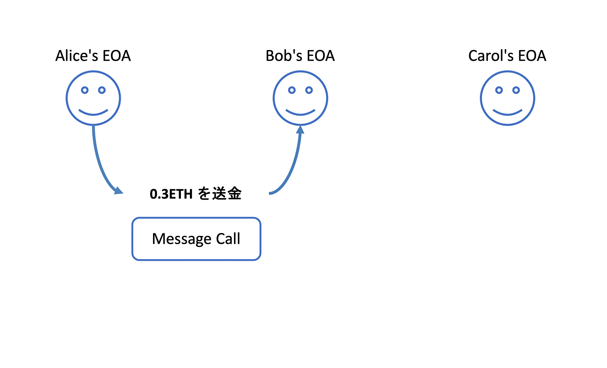

<center>
  

  **Ethereum: 送金からプログラムへ**

</center>

Ethereumは、ブロックチェーン上でプログラム（スマートコントラクト）を実行するためのプロトコルであり、2014年にVitalik ButerinとGavin Woodによって提案されました。
スマートコントラクトを実行するために、EthereumはBitcoin Protocolの様々な仕様を変更しています。
では具体的に、どこを / どのように / なぜそのように 変更したのでしょうか？
そしてそもそも、スマートコントラクトなるものには一体どのような意義があるのでしょうか？
この資料は、はじめてEthereumに触れたときに誰しもが抱くであろう上記の疑問を解消し、その設計について体系的に理解できるようになることを目指して書かれています。

【キャスレー：スマートコントラクトとは？
　⇒簡単に言えばトランザクション等の処理を自動で実行してくれるもの。
 　 ★これがあるとないとでどのように変わるのか、スマートコントラクト自体はどういう概念なのか説明があると嬉しい】

`Writer: @knskito`

`Donated by: `

- [Ethereumとは何か？](#ethereumとは何か)
  - [端的に言えばBitcoin Protocolの一般化である](#端的に言えばbitcoin-protocolの一般化である)
  - [この一般化を計算機科学の文脈で捉えると...](#この一般化を計算機科学の文脈で捉えると)
  - [この一般化によって様々なアプリケーション開発が可能となる](#この一般化によって様々なアプリケーション開発が可能となる)
- [大枠の仕様について](#大枠の仕様について)
  - [2種類のアカウント](#2種類のアカウント)
  - [2種類のトランザクション](#2種類のトランザクション)
  - [トランザクションのライフサイクル](#トランザクションのライフサイクル)
  - [EVM (Ethereum Virtual Machine)](#evm-ethereum-virtual-machine)
  - [状態 (state) データの管理](#状態-state-データの管理)
- [まとめ](#まとめ)


# Ethereumとは何か？

## 端的に言えばBitcoin Protocolの一般化である

処理の一般化: 送金からプログラムへ
- 「AliceからBobに0.3BTC送金せよ」から 
- 「AliceからBobに0.3ETH送金せよ、ただしもしこの処理を既に4回行っていた場合、5回目以降はCarolに0.3ETH送金せよ」などへ
  - Bitcoin Protocolのscriptでも似たようなことは可能だが、繰り返し構文が使えなかったり、scriptに状態(state) を保持することが出来なかったりと不便
- **このプログラムのことを「スマートコントラクト」と呼ぶ**
- なぜスマートでなぜコントラクトなのかは良くわからない
- 恐らくふわっとしたノリで言っている

管理対象の一般化: bitcoinの移転記録 から アカウントが持つ状態 (state) の遷移記録 へ
- 「0.3BTC from Alice to Carol」から 
- 「Alice 0.7→0.4ETH; Carol 0→0.3ETH, コントラクト4→5回目」などへ

`なぜ？: ワールドコンピューターを作りたい＆その上でアプリケーション開発を行いたい から`
  
## この一般化を計算機科学の文脈で捉えると...

- 電卓と (プログラム内蔵方式の) コンピューター
  - 電卓はプログラムを保持出来るようになったことでコンピューターへと大きく進歩した
- Bitcoin ProtocolとEthereum
  - "Bitcoin Protocolは電卓のようなものに思えた" by Vitalik Buterin
- Ethereumは「**ワールドコンピューター**」である
  - ワールドコンピューターを実現するためには、Bitcoin Protocolの様々な仕様を変更する必要がある
  - この資料だけを読んでもわかるようなってはいるが、基本的にはP01 Bitcoinの読了を前提に説明を行う
【キャスレー：ワールドコンピューターは検閲や削除、改ざんがなく世界中のコンピューターとやりとりができるという状態？ワールドコンピューターの説明も簡単にあるとEthereumの全体像について理解しやすいと思う。
　※プログラムを実行できるようになった、その実行の状態をstateと呼び、記録できるようになる⇒コンピューターと呼ぶ
　　↑のコンピューターを作ってみよう⇒イーサリアムのビジョン、ワールドコンピューターと呼ぶ】
  
## この一般化によって様々なアプリケーション開発が可能となる

- 分散型アプリケーション（Decentralized Applications; DApps）
  - プログラム（スマートコントラクト）の集合体
【キャスレー：分散型アプリケーションとは？
　　⇒Google Driveなどのような誰か大企業が関与しているアプリではなく、管理者がユーザをコントロールできないもの】
- プログラムの実行や、その実行履歴・実行結果の管理をどこかの誰かがやってくれる
【キャスレー：どこかの誰かがやってくれるということがあまりイメージできなかった
  ⇒世界中のノードがやってる（どこの誰がやったのかはあまり知る必要がない、素性は分からない）
  　変な行為をしたら報酬がもらえないので、ちゃんとやってるよねという担保ができる】
- ユーザーはその誰かを信用する必要がない！
  - DAppsの一例: 分散型取引所 (Decentralized Exchange; DEX)
  - DEXでは取引記録は各ノードが分散的に保持している
    - 企業や政府がその気になれば取引記録を改ざんできる構造になっていない
【キャスレー：DAppsの説明にあったように、アプリの管理者はユーザをコントロールできないので他者を信用する必要がないという理解？
　※ブロックチェーン自体は改ざんが難しいDBと言われている⇒正しい内容をみんなで決めないといけない
　　⇒これを実現するのはイーサリアム
　※ユーザが実際にプログラムの中身を確認できることもポイント⇒公平な利用方法として利用できる】


# 大枠の仕様について

## 2種類のアカウント

- アカウントとはBitcoin Protocolにおけるアドレスのようなもの
- Ethereumには、2種類のアカウントが存在する
- `なぜ？: Bitcoin Protocolとは異なりスマートコントラクト用のプログラムを記録・保存しておく必要があるから (言い換えれば、Bitcoin ProtocolにはEOA的なアドレスしか存在しない) `

**EOA (Externally Owned Account)**
- 外部所有アカウント
- 人が管理する
- 秘密鍵を持つ
  - トランザクションを作ることができる
- 作成にコストがかからない 

<center>


EOAくん (人間くん)
</center>

**CA (Contract Account)**
- スマートコントラクトのアカウント
- スマートコントラクトコードを持つ
- 人が管理していない
- 秘密鍵がない
  - トランザクションを作ることができない
- 作成にコストがかかる

<center>


CAくん (プログラムくん)
</center>


## 2種類のトランザクション

- EOAから発せられるトランザクション(tx)は、2種類が存在する
- `なぜ？: EOAからCAに対しては「作成」と「実行」の2種類の操作が必要だから`

**Message Call**
- Bitcoin Protocolの送金に相当する、いわゆるトランザクション
- トランザクション実行後には、結果をまとめたレシートが発行される

**Contract Creation**
- コントラクトを新たに生成するためのトランザクション
- トランザクション実行後には、結果をまとめたレシートが発行される

よって送信元・送信先アカウントと組み合わせると、トランザクションは3 (+1) 分類
- EOA to EOA (Message Call) Bitcoin Protocolと同様、ETHの送金
- EOA to CA (Contract Creation) コントラクトを新たに生成
- EOA to CA (Message Call) 既存のコントラクトに引数を送り、プログラムを実行　【キャスレー：こちらはEOAがCAを通して他のEOAへMessage Callができるという意味？↓のCA to CAにつながるイメージ】
- CA to CA (*Internal Transaction) 
  - CAが (プログラムに従って) 別のCAにETHを送金したり、新たなCAを作成する場合もある。
  - ただしあくまでトリガーはEOAによるMessage Call
  - これはブロックチェーンに記録されないし、トランザクションでないし、レシートも発行されない
【キャスレー：CA to CAの中で他のEOAに送金する他に、新たなCAを作成するというのはどういうケースや使い方（具体例）なのか？】

<center>

</center>

## トランザクションのライフサイクル
- EOAが発するトランザクションの実行は、Bitcoin Protocolと同様にマイナーノードが担う
- なんとなくEOAが実行していると思ってしまいがちなので注意！
【キャスレー：EOAはトランザクションを実行するわけではなく、新たにトランザクションを作るのに必要なものという認識？】
- `なぜ？: トランザクションおよびその実行がもたらす状態（state）遷移の「正しさ」について、分散的な合意形成を行いたいから`

基本的なライフサイクルはBitcoin Protocolと同様以下の通り  (*The Merge以前のもの) 
```
EOAは、トランザクション(Message Call or Contract Creation)を各ノードに伝搬する
各ノードは、受け取ったトランザクションを独立に検証する
各ノードは、問題が無いトランザクションのみを溜め、かつ他のノードに伝搬する
マイナーノードは、溜まりから任意のトランザクションをブロックに格納する
マイナーノードは、ブロック内のトランザクションを実行する
マイナーノードは、ブロックを既存のチェーンに含まれるいずれかのブロックに繋ぐ
マイナーノードは、PoW (Proof-of-Work) を経てブロックを完成させる
マイナーノードは、完成したブロックを各ノードに伝搬する
各ノードは、受け取ったブロックに問題が無いかを独立に検証する
各ノードは、問題が無いブロックのみを自身のチェーンに反映する
Ethereumは、最も重いチェーンを「正しい」状態遷移の記録とする
```

## EVM (Ethereum Virtual Machine)
- 全てのマイナーノードは、 EVM (Ethereum Virtual Machine) と呼ばれる仮想マシンを持つ
- `なぜ？: トランザクションの実行は、ほとんどの場合スマートコントラクトの実行を伴うから`
  - Bitcoin Protocolでは台帳の内容を (UTXOを通じて間接的に) 変更するだけだった
  - Ethereumではスマートコントラクト用のプログラムを読み込まなければならない
  - このようなプログラムの読み込みと実行にEVMを用いる
    - 異なるマイナーノードが手元のEVMでスマートコントラクトを実行したとき、同じ入力に対しては同じ出力が返ってこなければならない
    - そうでなければ合意形成のやりようがない

補足として...

- スマートコントラクト用のプログラムは、人間が書きやすいように **Solidity** (Ethereum用に開発された言語、Javascriptに近い) で記述する仕様になっている
- EVMは、トランザクションを実行する際にSolidityコードをコンピューターが認識出来るbytecode (16進数) 形式へと変換する

<center>

</center>

たとえばこちらのSolidityコード
```solidity
// SPDX-License-Identifier: MIT
pragma solidity >=0.6.12 <0.9.0;

contract HelloWorld {
  function print() public pure returns (string memory) {
    return "Hello World!";
  }
}
```
は以下のようなbytecodeに変換される
```bytecode
608060405234801561000f575f80fd5b506101688061001d5f395ff3fe608060405234801561000f575f80fd5b5060043610610029575f3560e01c806313bdfacd1461002d575b5f80fd5b61003561004b565b6040516100429190610112565b60405180910390f35b60606040518060400160405280600c81526020017f48656c6c6f20576f726c64210000000000000000000000000000000000000000815250905090565b5f81519050919050565b5f82825260208201905092915050565b5f5b838110156100bf5780820151818401526020810190506100a4565b5f8484015250505050565b5f601f19601f8301169050919050565b5f6100e482610088565b6100ee8185610092565b93506100fe8185602086016100a2565b610107816100ca565b840191505092915050565b5f6020820190508181035f83015261012a81846100da565b90509291505056fea26469706673582212201fe629a1426d6729fa075cb52013ff69644a2a145b2ca78e2db97a7dd023603064736f6c63430008180033
```

- このbytecodeがopcodeに変換されて処理が実行される
- つまりEVMとは、コンピューターのCPUの挙動をソフトウェアで表現したようなもの
- ただし同じ入力に対して同じ出力が返ってくる必要があるため、乱数や浮動小数点などの仕様が一般的なCPUの挙動から変更されている

## 状態 (state) データの管理
- トランザクションはブロックチェーン内に記録されるが、実行結果を示す状態 (state) データ (e.g., Alice 0.4ETH; Carol 0.3ETH, コントラクト5回目) は、ブロックチェーン外でマイナーノードが保持している
- `なぜ？: 容量が非常に大きい状態 (state) データをブロックチェーンに含めると、ノードを作成するハードルが高くなってしまうから`
  - 状態 (state) データは持たずにブロックチェーンだけを保持するノードの存在を許容している
- 直感的には、フローはブロックチェーン内で管理しているがストックはブロックチェーン外で管理しているというイメージ
  - Bitcoin Protocolでは、フロー (トランザクション) だけでシステムを成立させていた

# まとめ
- EthereumとはBitcoin Protocolの一般化である
- 一般化のためにアカウントが2種類になっている
- 一般化のためにトランザクションが2種類になっている
- トランザクションのライフサイクルは基本的にBitcoin Protocolと同じ
- すべてのマイナーノードはEVMと呼ばれる仮想マシンを持つ
- 状態 (state) データはブロックチェーン外で管理している
【キャスレー：冒頭の、「どこを / どのように / なぜそのように 変更した」のか、スマートコントラクトの意義などをまとめで記載があると嬉しい。】

