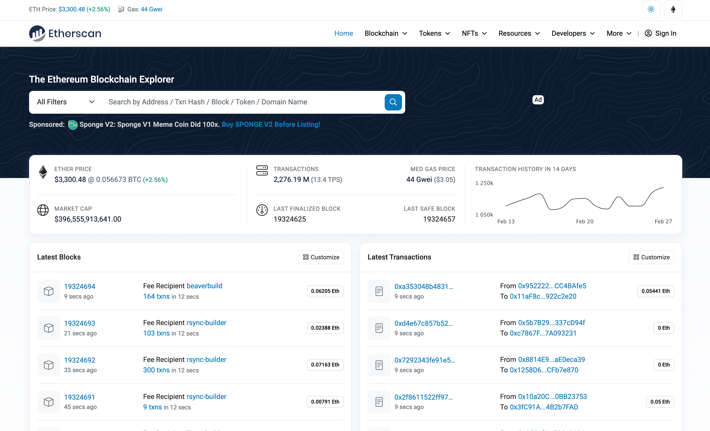

- [各構成要素が保持するデータ](#各構成要素が保持するデータ)
  - [EOA (Externally Owned Account)](#eoa-externally-owned-account)
    - [補足: Ethereumの通貨単位](#補足-ethereumの通貨単位)
  - [CA (Contract Account)](#ca-contract-account)
    - [補足: マークル・パトリシアツリー](#補足-マークルパトリシアツリー)
  - [Message Call トランザクションのデータ構造](#message-call-トランザクションのデータ構造)
  - [Ethereumの手数料 (gas)](#ethereumの手数料-gas)
    - [各用語の意味](#各用語の意味)
    - [手数料の徴収ルール](#手数料の徴収ルール)
  - [Message Call トランザクションのレシート](#message-call-トランザクションのレシート)
  - [Contract Creation トランザクションのデータ構造](#contract-creation-トランザクションのデータ構造)
  - [Contract Creation トランザクションのレシート](#contract-creation-トランザクションのレシート)
    - [補足: Internal トランザクションのデータ構造](#補足-internal-トランザクションのデータ構造)
  - [データ構造を実際に確認してみましょう](#データ構造を実際に確認してみましょう)
- [まとめ](#まとめ)

# 各構成要素が保持するデータ

Ethereumの構成要素である2種類のアカウントと2種類のトランザクションについて、詳細を確認してみましょう。

## EOA (Externally Owned Account)
- EOAはBitcoin Protocolにおけるアドレスのようなもの
- 作成の基本的なプロセスはBitcoin Protocolと同じ

ただし...
- Bitcoin Protocolとは異なり、ハッシュ関数はSHA-256ではない
    - `なぜ?: 新しいハッシュ関数でより安全と言われているから`
- Bitcoin Addressとは異なり、後ろにチェックサムが付いていない
    - `なぜ?: 将来的にアドレスに文字を対応させて使う想定だから (e.g., knskito.eth)`
    - *アドレス自体にチェックサムを付けかつ誤読を防ぐ文字列にエンコーディングする仕組みもあるにはある

**EOAが保持する「状態 (state)」データ**

**Ethereum Address (EOA)**: 
0x001d3f1ef827552ae1114027bd3ecf1f086ba0f9

| 名称 | 役割 |
| ---- | ---- |
| Nonce | EOAのトランザクションがこれまでにいくつ実行されたか |
| Balance | EOAが所持している残高 (wei) |

*Nonce: number used onceの略。一度だけしか使われない数のこと。　

  - Bitcoin Protocol (のUTXO) とは異なり、アカウントが残高を保持している (この設計をアカウントベースと呼ぶ)
  - 取引 (0.3BTC from Alice to Carol) ではなく残高 (Alice 0.7→0.4ETH; Carol 0→0.3ETH)
  - `なぜ?: (スマートコントラクトの結果を含む)状態遷移を管理するには、トランザクションにアドレスを紐付けるよりもアドレスにトランザクションを紐付けたほうが設計しやすいからなのだと思う...おそらく`

### 補足: Ethereumの通貨単位
- Ethereum通貨の1単位は「イーサ」「ether」と呼ばれ「ETH」と表記する.「Ξ」「♦」とも書く
  - 1 ether = 1 ETH = Ξ1 = ♦1
  - 通貨はあくまでetherであって、Ethereumはシステム名
- weiという単位もあり、etherの最小単位
  - 1 ETH = 1 * 10^18 or 1,000,000,000,000,000,000 wei
  - 1 ETH = 100京 wei
- 参考:Bitcoin Protocolにおけるsatoshiは・・・
  - 1 BTC = 1 * 10^8 or 100,000,000 satoshi
  - 1 BTC = 1億 satoshi
- etherは直感的には、スマートコントラクトを動かすための燃料
  - bitcoin: Digital Gold
  - ether: Digital Oil　
と、良くたとえられる

## CA (Contract Account)
- CAもアドレスを持つが、コントラクトの入れ物であるため作り方は大きく異なる
  - そもそもCAは秘密鍵を持たないことを思い出しましょう
- 具体的には、EOAのアドレスとそのEOAが保持するnonceをハッシュ化して作成する

**CAが保持する「状態 (state)」データ**

**ETHeum Address (CA):** 0xa4803f17607B7cDC3dC579083d9a14089E87502b 

| 名称 | 役割 |
| ---- | ---- |
| Nonce | CAが別のCAをこれまでいくつ生成したか |
| Balance | CAが所持している残高 (wei) |
| Code Hash | コントラクトの中身 (プログラムコード) をハッシュ化 |
| Storage Root | コントラクトの結果をハッシュ化 |

- CAのnonceは、別のCAを生み出すinternal transactionが実行された場合にのみ増える
- コントラクトの結果は、複数のアウトプット (e.g., コントラクト5回目, ‘送金が完了しました’) をマークル・パトリシアツリーに格納する形式で保存される。
- ただし、CAが保持するのは、根(root)の部分のみ。
  - `なぜ?: コントラクトの全てのアウトプットを結果としてブロックチェーンに記録すると、容量を圧迫してしまうから`

### 補足: マークル・パトリシアツリー
- マークルツリー + パトリシアツリー
- データ探索の効率性をさらに高めるために採用されている
- ETHeumにおける木構造でのデータ保存は、全てマークル・パトリシアツリーとなっている
- 詳細な説明は割愛するが、興味がある方はたとえば以下の資料を参照のこと
  - https://qiita.com/yanagisawa-kentaro/items/bfdbb5564d1751c3d2ea (JP)
  - https://wiki.nebulas.io/en/latest/go-nebulas/design-overview/merkle_trie.html (EN)

## Message Call トランザクションのデータ構造

Bitcoin Protocolの送金に相当する、いわゆるトランザクション

| 名称 | 役割 | 備考 |
| ---- | ---- | ---- |
|blockhash| このtxを含むブロックのブロックヘッダーハッシュ| ブロックに入ってからの話なので、最初はnull
|blocknumber| このtxを含むブロックが何番目か| ブロックに入ってからの話なので、最初はnull
|transaction index| このtxがブロックの中で何番目のトランザクションか|
|from| このtxを作成したEOAのアドレス| ビットコインと異なり、fromと署名欄は統合している `なぜ？: ETHeumは将来的に楕円曲線暗号以外の署名形式もサポートするつもりだから (後半で詳述)`
|to| このtxの宛先 (EOA or CA) のアドレス|
|nonce| 作成者であるEOAにとってこのtxが何番目か|
|hash| このtx自体のハッシュ|
|value| 送金するETHの量 (wei)|
|data| データ領域 (16進数の数列にエンコード化されている)| 引数を入れてCAに送ることでコントラクトを実行
|gasLimit| EOAがtx実行に対して支払えるGasの最大量| 手数料 (以下に詳述)
|maxPriorityFeePerGas| EOAがマイナーノードに支払えるGasの最大金額| 手数料 (以下に詳述)
|maxFeePerGas| EOAがtx実行のために支払えるGasの最大金額| 手数料 (以下に詳述)

## Ethereumの手数料 (gas)
- Bitcoin Protocolと同様、Ethereumのトランザクション実行には手数料が必要
  - `なぜ?: スパム攻撃 (意味のないトランザクションを大量に送ってネットワークを混雑させる) 対策のため&実行を担うマイナーノードへのインセンティブのため`
- 他方でEthereumは、ether (wei) 単位での手数料入力にgasという単位を噛ませている
  - e.g., あるEOAが自身が作成したトランザクションの手数料を決める場合
  - 「手数料は0.1ETHとする」 ではなく
  - 「feePerGas = 0.000002ETH, gasLimit = 50000」 といった入力を行う
    - (0.000002*50000 = 0.1ETH)
  - `なぜ?: トランザクションの実行に必要な計算量を、マイナーノードに対して定量的にわかりやすく示したいから`
- Bitcoin Protocolは (inputの数などで決まる) トランザクションの大きさだけが手数料に影響するが、スマートコントラクトを含むEthereumはマイナーノードが負担する計算量も手数料に影響する
  - Bitcoin Protocolのマイニングノード
    - 「ブロックに多く格納出来ない分、大きなトランザクションには高い手数料が欲しいな...」
  - Ethereumのマイナーノード
    - 「ブロックに多く格納出来ない分、大きなトランザクションには高い手数料が欲しいな...」
    - 「複雑なコントラクトを動かすトランザクションには高い手数料が欲しいな...」 
- 直感的には、タクシーの料金表示で、走行距離と運賃だけでなく消費燃料の量と価格も出るイメージ
  - gas: 1km走らせるのに必要なガソリン量みたいなもの
  - feePerGas: (EOAが支払える) ガソリンのリッター価格みたいなもの
  - gasLimit:  (EOAが支払える) ガソリン量みたいなもの

### 各用語の意味

**Gas**
- 所与の値
- スマートコントラクトの計算量に基づいてあらかじめ定められている (後半で詳述)
- 長い処理を行えば行うほど多くgasを消費する
- 同じ処理は同じ量のgasが消費される

**baseFeePerGas**
- 所与の値 (ただしブロック毎に変動)
- tx実行に必要な1gas あたりの費用 (wei/gas)
- Ethereumの混雑具合によって変動するルールが設けられている (後半で詳述)
- これが高いほどEthereumは混雑している
- baseFeeとして支払われたetherはマイナーノードには渡らずburnされる

**priorityFeePerGas**
- EOAが決める値
- マイナーノードに支払う1gas あたりの費用 (wei/gas)
- Bitcoin Protocolの手数料に相当する存在
- これを高く設定すればするほどtxはブロックに速く取り込まれやすくなる

**gasLimit**
- EOAが決める値
- ここまでのgasならば払っても良いとする値を入力する
- `なぜ?: txの実行前にどれだけgasが必要かわからない場合もあるから`
- `なぜ?: 処理が無限ループを含むせいで手数料が無限になってしまう事態を防ぎたいから`

**gasUsed**
- txを実行した結果、実際にかかったgasの値
- tx実行後のレシートに記載される

つまり**feePerGas (計算単位あたりの手数料)は、baseFeeとpriorityFeeの2階建てになっている!**
- `なぜ?: スケーラビリティ問題に対処したいから(後半で詳述)`
- `なぜ?: etherの総供給量を減らす仕組みが必要だから`

マイナーノードの目線でトランザクションを見ると、
- maxPriorityFeePerGas: EOAは計算単位あたり(最大でも)これだけのetherを私に支払って良いと考えているんだな
- gasLimit: EOAはこのトランザクションに(最大でも)これだけの計算が必要だと考えているんだな

これらの情報に基づいてブロックに格納するトランザクションを選定する。

### 手数料の徴収ルール

- いざマイナーノードがtxの実行を試みると、EOAが指定した手数料が不十分だったなんてこともありうる

`実際の手数料 = feePerGas * gasUsed`　>　`EOAが支払い可能な手数料 = feePerGas * gasLimit`

- この場合txは実行されないが、 feePerGas * gasLimit 分のetherは消費 (i.e., baseFeePerGas * gasLimitはburnされ、priorityFee * gasLimitはマイナーノードが獲得) される
  - そうしなければスパム攻撃対策にならない

- 反対にtxを実行した結果、EOAが指定した手数料が余る場合もある

`実際の手数料 = feePerGas * gasUsed`　<　`EOAが支払い可能な手数料 = feePerGas * gasLimit`　

- この場合txは実行され、feePerGas * gasLimit 分のetherは消費 (i.e., baseFeePerGas * gasLimitはburnされ、priorityFee * gasLimitはマイナーノードが獲得) される
- 余ったetherはEOAに返却される

## Message Call トランザクションのレシート
トランザクションの実行後、以下のレシートが発行される

| 名称 | 役割 | 備考 |
| ---- | ---- | ---- |
| blockhash | 実行txを含むブロックのブロックヘッダーハッシュ |トランザクション実行後なので、最初から値が入っている
| blocknumber | 実行txを含むブロックが何番目か |　トランザクション実行後なので、最初から値が入っている
| transaction index | 実行txがブロックの中で何番目のトランザクションか |トランザクション実行後なので、最初から値が入っている
| contractAddress | 作成したCAのアドレス |Contract Creationではないので、必ずnull
| from | txを作成したEOAのアドレス |
| to | 宛先 (EOA or CA) のアドレス |
| hash | 実行tx自体のハッシュ |
| gasUsed | txの実行に使ったGasの量 | このMessage Callを引き金にCAがinternal transactionを連鎖的に発する場合もある
| cumulativeGasUsed | txの実行に使ったGasの量 (internal transaction 含む) |
| logs | txの実行ログ |
| logsBloom | ブロック内の全txの実行ログ (Bloom Filter形式) |
| root | 実行の結果変化したアカウントの状態 (state) の要約 | 詳細は後述

## Contract Creation トランザクションのデータ構造
コントラクトを新たに生成するためのトランザクション

| 名称 | 役割 | 備考 |
| ---- | ---- | ---- |
|blockhash| このtxを含むブロックのブロックヘッダーハッシュ| ブロックに入ってからの話なので、最初はnull
|blocknumber| このtxを含むブロックが何番目か| ブロックに入ってからの話なので、最初はnull
|transaction index|  このtxがブロックの中で何番目のトランザクションか| ブロックに入ってからの話なので、最初はnull
|from| このtxを作成したEOAのアドレス|
|to| このtxの宛先 (EOA or CA) のアドレス| 必ずzero address “0x000…” が宛先となる
|nonce| 作成者であるEOAにとってこのtxが何番目か|
|hash| このtx自体のハッシュ|
|value| 送金するetherの量 (wei)|
|data| データ領域 (16進数の数列にエンコード化されている)| 作成したいCAの中身 (プログラム) を記入
|gasLimit| EOAがtx実行に対して支払えるGasの最大量|
|maxPriorityFeePerGas| EOAがマイナーノードに支払えるGasの最大金額|
|maxFeePerGas| EOAがtx実行のために支払えるGasの最大金額|

## Contract Creation トランザクションのレシート
トランザクションの実行後、以下のレシートが発行される

| 名称 | 役割 | 備考 |
| ---- | ---- | ---- |
| blockhash | 実行txを含むブロックのブロックヘッダーハッシュ |トランザクション実行後なので、最初から値が入っている
| blocknumber | 実行txを含むブロックが何番目か |　トランザクション実行後なので、最初から値が入っている
| transaction index | 実行txがブロックの中で何番目のトランザクションか |トランザクション実行後なので、最初から値が入っている
| contractAddress | 作成したCAのアドレス | 今度はアドレスが入る
| from | txを作成したEOAのアドレス |
| to | 宛先 (EOA or CA) のアドレス | 必ずzero address “0x000…” が宛先となる
| hash | 実行tx自体のハッシュ |
| gasUsed | txの実行に使ったGasの量 |
| cumulativeGasUsed | txの実行に使ったGasの量 (internal transaction 含む) | Internal transactionを生まないため、必ずgasUsedと等しくなる
| logs | txの実行ログ |
| logsBloom | ブロック内の全txの実行ログ (Bloom Filter形式) |
| root | 実行の結果変化したアカウントの状態 (state) の要約 | 詳細は後述
 

### 補足: Internal トランザクションのデータ構造
CAから発せられる、ブロックチェーンに記録されない処理 (正式にはトランザクションではない)

*Internal Transactionなので、レシートは発行されない

| 名称 | 役割 | 備考 |
| ---- | ---- | ---- |
|blockhash| このtxを含むブロックのブロックヘッダーハッシュ| ブロックに入ってからの話なので、最初はnull
|blocknumber| このtxを含むブロックが何番目か| ブロックに入ってからの話なので、最初はnull
|transaction index|  このtxがブロックの中で何番目のトランザクションか| ブロックに入ってからの話なので、最初はnull
|from| このtxを作成したEOAのアドレス| 
|to| このtxの宛先 (EOA or CA) のアドレス|
|nonce| 作成者であるEOAにとってこのtxが何番目か|
|hash| このtx自体のハッシュ|
|value| 送金するetherの量 (wei)|
|data| データ領域 (16進数の数列にエンコード化されている)|
|gasLimit| EOAがtx実行に対して支払えるGasの最大量| null EOAが出したMessage Callに依存
|maxPriorityFeePerGas| EOAがマイナーノードに支払えるGasの最大金額| null EOAが出したMessage Callに依存
|maxFeePerGas| EOAがtx実行のために支払えるGasの最大金額| null EOAが出したMessage Callに依存

## データ構造を実際に確認してみましょう

アカウントやトランザクションのデータ構造は、[Etherscan](https://etherscan.io/)などのエクスプローラーサイトを通じて直接確認することができます。
この資料で各要素の意味はおおまかに掴めたと思いますので、ぜひ実際の中身を確認してみてください。

# まとめ
- 2種類のアカウント (EOA, CA) が保持するデータ構造を確認した
- 2種類のトランザクション (Message Call, Contract Creation) が保持するデータ構造を確認した
- トランザクションの手数料がどのように決まるのかを確認した

次回はいよいよ、こうしたETHeumの構成要素がどのようなプロセスで動くのか？というブロックチェーンの議論を、トランザクションのライフサイクルを軸に確認していく。
