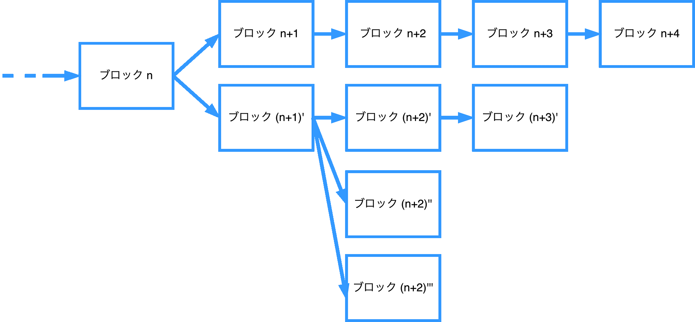

- [トランザクションのライフサイクル](#トランザクションのライフサイクル)
  - [EOAは、トランザクション(Message Call or Contract Creation)を各ノードに伝搬する](#eoaはトランザクションmessage-call-or-contract-creationを各ノードに伝搬する)
    - [Ethereumネットワークのノードについて](#ethereumネットワークのノードについて)
    - [Ethereumネットワークへの参加について](#ethereumネットワークへの参加について)
  - [各ノードは、受け取ったトランザクションを独立に検証する](#各ノードは受け取ったトランザクションを独立に検証する)
    - [Intrinsic gasについて](#intrinsic-gasについて)
  - [各ノードは、問題が無いトランザクションのみを溜め、かつ他のノードに伝搬する](#各ノードは問題が無いトランザクションのみを溜めかつ他のノードに伝搬する)
  - [マイナーノードは、溜まりから任意のトランザクションをブロックに格納する](#マイナーノードは溜まりから任意のトランザクションをブロックに格納する)
    - [Etherreumブロックのデータ構造](#etherreumブロックのデータ構造)
    - [ブロックヘッダの新要素](#ブロックヘッダの新要素)
    - [Uncle Blockについて](#uncle-blockについて)
    - [Block Gas Limitについて](#block-gas-limitについて)
    - [baseFeePerGasの決定ルールについて](#basefeepergasの決定ルールについて)
    - [State Root, Receipts Rootについて](#state-root-receipts-rootについて)
  - [マイナーノードは、ブロック内のトランザクションを実行する](#マイナーノードはブロック内のトランザクションを実行する)
  - [マイナーノードは、ブロックを既存のチェーンに含まれるいずれかのブロックに繋ぐ](#マイナーノードはブロックを既存のチェーンに含まれるいずれかのブロックに繋ぐ)
  - [マイナーノードは、PoW (Proof-of-Work) を経てブロックを完成させる](#マイナーノードはpow-proof-of-work-を経てブロックを完成させる)
    - [block intervalと難易度調整について](#block-intervalと難易度調整について)
  - [マイナーノードは、完成したブロックを各ノードに伝搬する](#マイナーノードは完成したブロックを各ノードに伝搬する)
  - [各ノードは、受け取ったブロックに問題が無いかを独立に検証する](#各ノードは受け取ったブロックに問題が無いかを独立に検証する)
  - [各ノードは、問題が無いブロックのみを自身のチェーンに反映する](#各ノードは問題が無いブロックのみを自身のチェーンに反映する)
  - [Ethereumは、最も重いチェーンを「正しい」状態遷移の記録とする](#ethereumは最も重いチェーンを正しい状態遷移の記録とする)
    - [GHOSTプロトコルについて](#ghostプロトコルについて)
    - [EthererumのGHOSTプロトコルについて](#ethererumのghostプロトコルについて)
    - [Ethererumのマイニング報酬について](#ethererumのマイニング報酬について)
- [まとめ](#まとめ)


# トランザクションのライフサイクル
 
ここまでEthereumの構成要素を確認してきましたが、これらはどのように連動しているのでしょうか。
あるトランザクションが作成されてから実行され、ブロックチェーンに格納されるまでのライフサイクルを軸に詳細を確認してましょう。

Introductionで示したとおり、トランザクションのライフサイクルは大きく以下のような流れになっています。

```
EOAは、トランザクション(Message Call or Contract Creation)を各ノードに伝搬する
各ノードは、受け取ったトランザクションを独立に検証する
各ノードは、問題が無いトランザクションのみを溜め、かつ他のノードに伝搬する
マイナーノードは、溜まりから任意のトランザクションをブロックに格納する
マイナーノードは、ブロック内のトランザクションを実行する
マイナーノードは、ブロックを既存のチェーンに含まれるいずれかのブロックに繋ぐ
マイナーノードは、PoW (Proof-of-Work) を経てブロックを完成させる
マイナーノードは、完成したブロックを各ノードに伝搬する
各ノードは、受け取ったブロックに問題が無いかを独立に検証する
各ノードは、問題が無いブロックのみを自身のチェーンに反映する
Ethereumは、最も重いチェーンを「正しい」状態遷移の記録とする
```

## EOAは、トランザクション(Message Call or Contract Creation)を各ノードに伝搬する

### Ethereumネットワークのノードについて
Ethereumネットワークのノードは、full node, light node, archive nodeの3種類に大別される
- Bitcoin Protocolは、full node, SPV (軽量) nodeの2種類に大別される
- ただしarchive nodeをfull nodeの派生版とみなす分類もある
- Ethereumにはブロックデータ以外に状態 (state) データというものが存在する (詳細は後述)

|  | 保持データ | 検証の対象 | マイニングおよびトランザクション実行 |
| ---- | ---- | ---- | ---- |
| full node | 全てのブロックデータ, 直近128ブロックの状態 (state) データ | トランザクション, ブロック | 可 |
| light node | ブロックヘッダ | ブロック (ブロックヘッダを使った検証のみ) | 不可 |
| archive node | 全てのブロックデータ, 全ての状態 (state) データ | トランザクション, ブロック | 可 (だがほぼ全てのマイナーはfull node) |


`なぜ？：マイニングに参加する障壁を下げることで、マイナーノードの分散化を図りたいから`
- full node: 550GB-1.1TB, archive node: 12TB (2024年1月時点)
- Bitcoin Protocolのfull node: 375GB

### Ethereumネットワークへの参加について
- トランザクションはfull nodeとarchive nodeへ伝搬される
- Bitcoin Protocolと同様に隣接するノードへの伝搬が繰り返される (gossip-based flooding protocol)

ただし手前の、最初にノードを建ててネットワークに参加する際の手続きがBitcoin Protocolとは異なる

- Ethereumでは、最初に接続するノードは所与の8個のノードの中から選択される
  - 自身のノードとIDが近いノードが複数個(デフォルトでは3つ)選択される
  - ネットワークのトポロジーに制約がある → Structured P2P network
- Bitcoin Protocolでは、最初に接続するノードを自分で設定することが出来る
  - 基本的に所与のノードに接続する (DNSシード) 形だが、オプションでこういうことも可能
  - ネットワークのトポロジーに制約がない → Unstructured P2P network

`なぜ？：ネットワークのトポロジーを、トランザクションやブロックの伝搬をより速く効率的に行える形にしておきたいから`


## 各ノードは、受け取ったトランザクションを独立に検証する

- 各ノードは、受け取ったトランザクションについて以下の内容を検証する
- 検証内容は基本的にビットコインと同様 (だがUTXOとアカウントベースという設計の違いが存在)

  - トランザクションがEthereumで採用されているRLPフォーマットという形式に沿っているか
    - RLPフォーマットの詳細な説明については割愛
    - 興味がある方は[こちらの動画](https://goblockchain.network/2020/01/rlp-merkle-patrical-tree/)などをご参照ください
  - トランザクションのgasLimitがintrinsic gas以上に設定されているか
    - 次で説明
  - 送信者(EOA) の残高が必要な額 `gasLimit × feePerGas + value(送金するetherの量)` 以上か
  - デジタル署名が有効か
  - トランザクションのnonceが、送信者(EOA)のnonceよりも大きいか？
    - 復習: トランザクションのnonceは、送信者(EOA)によるトランザクションがこれまでいくつ実行されてきたかを表していました

### Intrinsic gasについて

- トランザクションに必要な計算量 (gas) は、正確には実行してみなければわからない
- しかし検証の段階でも「少なくとも絶対にこれだけのgasは必要だよね」という量はわかる
- この部分をintrinsic gasと呼ぶ

具体的には、intrinsic gasは以下の仕様に沿って計算される
- トランザクションの実行には21,000gasが必要 (predefined gas fee)
- トランザクションのInput部分に対して最低68gasが必要で、そこから送るデータが1byte増えるごとに4gas増える (storage fee)
- Contract creationトランザクションの場合は32,000gasが必要

これにも満たないgasLimitが設定されていたら、トランザクションは絶対に実行不可なので弾く

<center>

</center>

## 各ノードは、問題が無いトランザクションのみを溜め、かつ他のノードに伝搬する
各ノードが検証の済んだトランザクションを溜めておく領域をMempoolと呼ぶ
- Bitcoin Protocolと同じ

EthereumのMempoolは、以下の2階層に分かれている

- Pending pool
- Queued pool
  - Pending pool内のトランザクションの順序を揃えるために、噛ませておくpool
  - 伝搬されたトランザクションのnonceが、送信者(EOA)のnonce+1にならない場合がある
    - あるEOAはこれまで4つトランザクションを送信している
    - 1番目と2番目は既に実行された
    - あるノードへ、3番目より先に4番目のトランザクションが伝搬された
  - この場合、4番目のトランザクションをQueued poolに一旦保持し、3番目が伝搬された後に3番目、4番目の両方をPending poolへと移動する
  

Bitcoin ProtocolのMempoolもTransaction poolとOrphan transaction poolがあった
- 名前は違うがやっていることは同じ
- ただしUTXO型のBitcoin Protocolは親を見ていたが、アカウントベース型のEthereumはnonceを見る


## マイナーノードは、溜まりから任意のトランザクションをブロックに格納する
### Etherreumブロックのデータ構造
- マイナーノードはMempool (のPending pool) に溜まったトランザクションから、任意のトランザクションを選択してブロックに格納する
  - このとき、gasLimitとgasPriceがトランザクションを選ぶ際の参考になる
  - 普通は計算量に対して得られる手数料が高そうなトランザクションを選択する
- トランザクションは、マークル・パトリシアツリー構造でブロックに格納される
- ここまでは基本的にBitcoin Protocolと同じ
  - しかし、Ethereumにおけるブロックの作成作業はこれだけに留まらない!
  - Ethereumのブロックは、Bitcoin Protocolのそれ以上に様々な情報を格納している

バリデーターノードは、Mempool (MempoolのうちPending pool) に溜まったトランザクションから、任意のトランザクションを選択してブロックに格納します。このとき、gasLimitとgasPriceがトランザクションを選ぶ際の参考になります。普通は計算量に対して得られる手数料が高そうなトランザクションを選択します。

トランザクションは、マークル・パトリシアツリー構造でブロックに格納されます。ここまでは基本的にBitcoin Protocolと同じです。しかし、Ethereumにおけるブロックの作成作業はこれだけに留まりません。Ethereumのブロックは、Bitcoin Protocolのそれ以上に様々な情報を格納しているのです。

<center>

</center>
 
### ブロックヘッダの新要素

| 名称 | 役割 | 備考 |
| ---- | ---- | ---- |
| sha3Uncles | Uncleブロックのブロックヘッダリストをハッシュ化したもの| 詳細は後述
| extraData | 任意のデータ (32byteまで)|
| gasLimit | ブロック全体のgasLimit| 詳細は後述
| gasUsed | ブロックに格納された全トランザクションのgasUsedの合計|
| logsBloom | ブロック内の全トランザクションの実行ログ (Bloom Filter形式)|
| miner | ブロックを作成したノードが持つ、報酬受取用のアドレス|
| mixHash | nonce と合わさることでPoWのための十分な計算がされたことの証明になる256bitのハッシュ|
| number | ブロックの番号 (genesis blockを0として累積)|
| totalDifficulty | このブロック以前のブロックのdifficultyの総和| `なぜ?: Bitcoin Protocol以上にブロックチェーンが頻繁に分岐する環境下で、最長のチェーンに含まれるブロックを効率的に把握したいから`
| State Root | このブロックの全トランザクションが実行された後の、全てのアカウント状態をマークルパトリシアツリーで要約したRoot値のハッシュ値 (Keccak-256ハッシュ形式)| 詳細は後述
| Receipts Root | このブロックの全レシートをマークルパトリシアツリーで要約したRoot値のハッシュ値 (Keccak-256ハッシュ形式)| 詳細は後述

### Uncle Blockについて
- マイナーノードは、トランザクションに加えてUncle blockの情報もブロックに格納する
  - Uncle block: メインチェーンから分岐したブロックのこと
  - 具体的には、任意のUncle blockのブロックヘッダを2つまで格納することが出来る
- `なぜ?:Ethereumのブロックチェーンは、Bitcoin Protocolと比べてより頻繁に分岐するから`
  - (後述するが) Ethereumのblock intervalは15秒に設定されている。
  - Block intervalが短くなると、同時にマイニングに成功する可能性が高まるため、ブロックチェーンはより頻繁に分岐してしまう
  - (これも後述するが) その対策として、Nakamoto Consensusの代わりにUncle blockを考慮した合意形成 (GHOST protocol) を採用し、かつUncle blockにも報酬を与えている
  - 以下の図では親の親を共有している(文字通りの)Uncle blockを示しているが、これだけをUncle blockと呼ぶ場合もある

バリデーターノードは、トランザクションに加えてUncle blockの情報もブロックに格納します。Uncle blockとは、メインチェーンから分岐したブロックのことです。各ブロックに任意のUncle blockのブロックヘッダを2つまで格納することが出来ます。Ethereumは、Block intervalがBitcoin Protocolと比較するとより頻繁に分岐するため、Uncle blockを考慮した合意形成 (GHOST protocol) を採用し、かつUncle blockにも報酬を与えています。

【キャスレー：Uncle blockはなぜ必要？⇒ほぼ同時にブロックが生成されることがあるが、最終的に採用されるのは1つだけ。Uncle blockをメインチェーンには入れないが、存在していることで中央集権化のリスクを減らす＆セキュリティも担保される？】

<center>

</center>

### Block Gas Limitについて
- Ethereumのブロックには、ブロックサイズの上限が設定されていない
  - Bitcoin Protocolは現状4MB
- その代わりに、block用のgasLimitが設定されており、ブロックに格納された全トランザクションのgasLimitの合計がこのblock gasLimitを超えてはならないことになっている
  - Block gasLimitとTransaction gasLimitはしばしば混同されるので注意！
  - 前者はマイナーノードが決める変数で、後者はEOAが決める変数である
- なぜ？：Ethereumにおいてマイナーノードはトランザクションの実行も担うため、彼らの負担は容量よりも計算量で把握した方が適切だから
  - このような「スマートコントラクト用のプラットフォームとして計算量(gas)を軸に物事を考えよう」という思想はEthereumのブロックチェーンにおいて一貫しています
- マイナーノードは、Block gasLimitを30,000,000Gweiまで増やすことが出来る
  -  1Gwei = 10^8 wei
  - ただし次の仕組みが示すとおり、ターゲット値は15,000,000Gweiである


Ethereumのブロックには、ブロックサイズの上限が設定されていません（Bitcoin Protocolは4MB）。その代わりに、block用のgasLimitが設定されており、ブロックに格納された全トランザクションのgasLimitの合計がこのblock gasLimitを超えてはならないことになっています。
（ここで、Block gasLimitとTransaction gasLimitはしばしば混同されるので注意してください。前者はバリデーターノードが決める変数で、後者はEOAが決める変数です）

Ethereumにおいて、バリデーターノードはトランザクションの実行も担うため、彼らの負担は容量よりも計算量で把握した方が適切です。このような「スマートコントラクト用のプラットフォームとして計算量(gas)を軸に物事を考えよう」という思想はEthereumのブロックチェーンにおいて一貫しています。

バリデーターノードは、Block gasLimitを30,000,000Gweiまで増やすことが出来ます。ただしこれから説明する仕組みのとおり、ターゲット値は15,000,000Gweiとなっています。

### baseFeePerGasの決定ルールについて
- baseFeePerGasはブロック毎に固定で、以下のルールに沿って内生的に決まる
  - 1つ前のブロックのBlock gasLimitが…
    - 最大値 (30,000,000Gwei) の0%である → baseFeePerGasは-12.5%
    - 最大値 (30,000,000Gwei) の0〜50%である → baseFeePerGasは-12.5〜±0%
    - 最大値 (30,000,000Gwei) の50%である → baseFeePerGasは±0%
    - 最大値 (30,000,000Gwei) の50〜100%である → baseFeePerGasは±0〜 +12.5 %
    - 最大値 (30,000,000Gwei) の100%である → baseFeePerGasは+12.5% 
- つまり... Txが増える → マイナーノードがBlock gasLimitを増やす → 次のbaseFeePerGasが増加する → EOAが高い手数料を忌避してTxを作らなくなる → 混雑の緩和に繋がる、という流れが想定されている (and vice versa)
- 直感的に言えば、手数料に難易度調整のような仕組みを導入している
- `なぜ？: (Bitcoin Protocolのように) EOAにfeePerGasを決めさせるよりも、支払う手数料を最適化出来そうだから`

baseFeePerGasはブロック毎に固定で、以下のルールに沿って内生的に決まります。

1つ前のブロックのBlock gasLimitが最大値(30,000,000Gwei)の何％であるかによって、baseFeePerGasの増減割合が決まります。

- 0%の場合 → -12.5%
- 0〜50%の場合 → -12.5〜±0%
- 50%の場合 → ±0%
- 50〜100%の場合 → ±0〜 +12.5 %
- 100%の場合 → +12.5% 


つまり：Txが増える → バリデーターノードがBlock gasLimitを増やす → 次のbaseFeePerGasが増加する → EOAが高い手数料を忌避してTxを作らなくなる → 混雑の緩和に繋がる(and vice versa)という流れが想定されています。直感的に言えば、手数料に難易度調整のような仕組みを導入していると言えます。これは、EOAにfeePerGasを決めさせるよりも、支払う手数料を最適化できそうであるため

### State Root, Receipts Rootについて
- Ethereumでは、トランザクションを実行した結果として、状態とレシートをマークルパトリシアツリー状にしたRootもブロックに格納する 
- ただしトランザクションとは違い、**ブロックに格納されるのはRoot部分のみ!**
- 状態ツリーとレシートツリーの全歴史は、archive nodeが保持している
  - full nodeは直近120ブロックまでのデータを保持している

<center>

</center>


Ethereumでは、トランザクションを実行した結果として、状態とレシートをマークルパトリシアツリー状にしたRootもブロックに格納することになっています。トランザクションとは違い、ブロックに格納されるのはRoot部分のみです。

EOAとCAが保持する状態データと、Message CallトランザクションとContract Creationのレシートは、全ての歴史をarchive nodeが保持していることを思い出してください。

改めて整理すると、状態(state)に関して各ノードが保持するデータは以下の通り:

- **Light node**
  - Transaction root, state root, receipt root (block header)
- **Full node**
  - Transaction root, state root, receipt root (block header)
  - Transaction data (block)
  - State data (latest 120 blocks)
  - Receipt data (latest 120 blocks)
- **Archive node**
  - Transaction root, state root, receipt root (block header)
  - Transaction data (block)
  - State data
  - Receipt data

**つまりスマートコントラクト用に書かれたプログラムの実行結果は、archive nodeも持っていない!**
- ハッシュ化したものだけをstorage rootとして保持している。
- (プログラムのコード自体はエンコード化されたものがcontract creation トランザクションのinputに入っている)
- 「あるEOAの過去の残高」などの情報は、ブロックチェーン内のトランザクションデータを計算することでfull nodeでも把握することは出来る。ただしarchive nodeが持つ状態データを参照した方が早い。

## マイナーノードは、ブロック内のトランザクションを実行する
マイナーノードは、各トランザションに対して以下の処理を行う:
1. 状態ツリーにあるトランザクション作成者(EOA)のnonceを1増やす
2. 実行に必要であろうether (gasLimit * feePerGas + value) を作成者 (EOA) の残高から徴収
3. inputにある処理を (EVMを用いて) 実行
   - もし結局Gasが足りなければ、out of gas exceptionエラーとして処理を中断
4. 実行結果に関するレシートを発行
5. 処理にかかったGas feeのうち、priority fee部分 (priorityFeePerGas * gasUsed) を自身のアドレスへ送金
   - もしGasが余ったならば、その分は作成者(EOA)に返金


マイナーノードは、ブロックに対して以下の処理を行う:
1. 状態ツリーとレシートツリーを作成する
   - Full nodeの場合、128ブロック経過したらlocal storageから削除
2. ブロックヘッダーにState rootとReceipt rootを書き込む
3. ブロックヘッダーにgasUsedを書き込む

## マイナーノードは、ブロックを既存のチェーンに含まれるいずれかのブロックに繋ぐ
ここはBitcoin Protocolと同じ。親のブロックヘッダのハッシュを自身のブロックヘッダに格納することでチェーンを形成する

<center>

</center>

## マイナーノードは、PoW (Proof-of-Work) を経てブロックを完成させる
- 以前のEthereumはBitcoin Protocolと同様にPoWを採用していた
  - 現在はProof-of-Stake型へと以降している
  - `なぜ?: ブロック作成にかかる時間を短縮し、処理速度の向上を図りたいから (後述)`
- ただしEtherumのPoWは、オリジナルのEthashというアルゴリズムを採用している
  - `なぜ?: マイナーノードの寡占化を可能な限り防ぎたいから`
  - 当時Bitcoin Protocolのマイニングは、それ専用の演算マシンであるASICが開発されたためにマイナーの寡占化が進んでいた
  - この現状を鑑みて、Ethereumは演算を繰り返す形ではなく、メモリからデータを繰り返し呼び出して比較する形でnonceを探すPoWを実装した (ASIC-resistantなどと呼ばれる)
- Ethashの詳細については説明を割愛するが、たとえば[こちらの資料](https://www.etarou.work/posts/4983481)が非常にわかりや
すい

### block intervalと難易度調整について
- Ethereumのblock intervalは、Bitcoin Protocolの10分に対して、15秒に設定されている
  - `なぜ?:スマートコントラクト用プラットフォームとして、処理速度の向上を図りたいから`
  - 送金ならば10分待てるかも知れないが、プログラムの実行はそんなに待てない
- ただし先述のとおり、block intervalが短いとその分チェーンが分岐しやすくなる
- Ethereumの難易度調整は、 Bitcoin Protocolは2016ブロック毎だったが、1ブロック毎に行われる
  - `なぜ?:より安定的に規定のblock intervalを維持したいため`
  - 難易度調整の仕様はメジャーアップデートの度にコロコロ変更されているが、現在は
    - Parent blockのdifficultyとtimestamp
    - Uncle blockのdifficultyとtimestampを元に計算されている。
  - 昔はuncle blockは用いられていなかった
- 計算方法の詳細については説明を割愛するが、たとえば[こちらの資料](https://blockchain.gunosy.io/entry/ethereum-difficulty-summary)が非常にわかり
やすい

## マイナーノードは、完成したブロックを各ノードに伝搬する

- トランザクションと同様、ブロックはfull nodeとarchive nodeへ伝搬される
- Bitcoin Protocolと同様に隣接するノードへの伝搬が繰り返される (gossip-based flooding protocol)
  
## 各ノードは、受け取ったブロックに問題が無いかを独立に検証する

- 各ノードは、受け取ったブロックについて以下の内容を検証する
  - トランザクションの検証はlight nodeを含む全てのノードが行っていたが、ブロックの検証はlight node以外のノードが行う
- 検証内容は基本的にビットコインと同様 (だがUTXOとアカウントベースという設計の違いが存在)
- トランザクションと同様、検証に通ったブロックのみを隣接ノードへと転送する
  - ブロックのデータ構造が正しいか
  - ブロックヘッダに含まれるtimestampが、ノードが持つ時間より+2時間以内に収まっているか
  - ブロックヘッダに含まれているdifficultyが正しいか
  - ブロックヘッダに含まれるnonceがdifficultyの条件を満たしているか (PoWの検証)
  - Transaction gasLimitの合計 ≦ Block gasLimitになっているか
  - 適切なUncle blockを格納しているか
  - ブロックに含まれるすべてのトランザクションが 「独立したトランザクション検証」のチェックリストをすべて満たすか
  - ブロックに含まれるすべてのトランザクションを実行した結果である、State root, Receipts root, gasUsed, logsBloomが正しいか

## 各ノードは、問題が無いブロックのみを自身のチェーンに反映する
ここは特に記載すべきことはなし

## Ethereumは、最も重いチェーンを「正しい」状態遷移の記録とする
  
### GHOSTプロトコルについて
- Ethereumでは、Bitcoin Protocolとは異なり「最も長いチェーン」を正統な記録とする (Nakamoto
consensus) わけではない!
- 代わりに「最も重いチェーン」を正統とする
- これはGHOST (Greedy Heaviest Observed Subtree) プロトコルと呼ばれる
  - 元々はBitcoin Protocolに対する改善提案でした
- チェーン選択のアルゴリズムは比較的単純で、小ブロックのサブツリー数を比較し続けるだけ
  - 特に頻繁に分岐するブロックチェーンでは、このように「長さより重さ」で選択すべきではないか?

<center>

</center>

- 頻繁に分岐するブロックチェーンにおいては、攻撃に必要なコストもより高くなる
- たとえば以下の例では、攻撃者がメインチェーンとなるためには、GHOSTプロトコルの場合はさらに5ブロックが必要
  - Nakamoto Consensusの場合はすでにメインチェーンを奪われてしまっている
- 言い換えれば、合意形成においてUncle (or Orphan) blocksにも意味を持たせることが出来る

<center>

</center>

### EthererumのGHOSTプロトコルについて
Ethereumでは、このようなGHOSTプロトコルに以下の変更を加えている
- サブツリー数の比較は、現在のメインチェーンの先端から7つ前にあるブロックから始める
  - `なぜ?: Genesisブロックから始めると計算が大変だから`
- メインチェーンの先端のブロックが2つ以上になった場合、ブロックが含むUncle block (のブロックヘッダ) に記載されたdifficultyの合計が大きい方を先端のブロックとする
  - いわゆるタイブレークのルールに、difficultyを導入している

### Ethererumのマイニング報酬について
Ethereumでは、ブロックの作成に成功したマイナーノードへ2ETHが新規発行される
- Bitcoin Protocolと異なり半減期はない
  - したがってBitcoin Protocolのように総発行量があらかじめ決まっているわけでもない
- Bitcoin Protocolと異なりblock maturityの設定 (100 confirmations) もない

さらに、もしブロックがuncle blockのブロックヘッダを含んでいる場合...
- 2ETHの報酬が3.125%増える (Uncle inclusion rewards)
  - `なぜ?:マイナーノードに、uncle blockの格納を促したいから`
- Uncle blockを作成した各ノードに対して、2ETHの87.5%分の報酬が新規発行される
- Uncle blockの子ブロック (nephew block) を作成した各ノードに対して、 2ETHの3.125%分の報酬が新規発行される
  - `なぜ?: 頻繁にブロックチェーンが分岐する環境でもマイニングへの参入を促したいから`
  - ただし対象となるUncle blockは (EthereumのGHOSTプロトコルが扱う範囲である) 現在のメインチェーンの先端から7つ前以内のブロックから分岐している必要がある

*この仕様が本当に上手く機能するものなのか?特に、block maturityの設定が存在せずとも良いのか?については、個人的に疑問を持っています。

# まとめ
- 以下のトランザクションのライフサイクルに沿って、Ethereumの構成要素がどのように連動しているかの詳細を確認した　

```
EOAは、トランザクション(Message Call or Contract Creation)を各ノードに伝搬する
各ノードは、受け取ったトランザクションを独立に検証する
各ノードは、問題が無いトランザクションのみを溜め、かつ他のノードに伝搬する
マイナーノードは、溜まりから任意のトランザクションをブロックに格納する
マイナーノードは、ブロック内のトランザクションを実行する
マイナーノードは、ブロックを既存のチェーンに含まれるいずれかのブロックに繋ぐ
マイナーノードは、PoW (Proof-of-Work) を経てブロックを完成させる
マイナーノードは、完成したブロックを各ノードに伝搬する
各ノードは、受け取ったブロックに問題が無いかを独立に検証する
各ノードは、問題が無いブロックのみを自身のチェーンに反映する
Ethereumは、最も重いチェーンを「正しい」状態遷移の記録とする
```

詳細は構造はここまで。最後にEthereumのガバナンスと課題をみてみよう。
