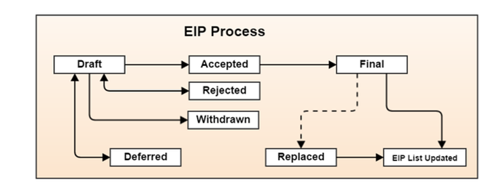
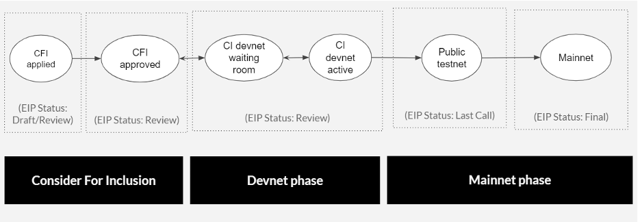

- [ガバナンスとEIP (Ethereum Improvement Proporsal)](#ガバナンスとeip-ethereum-improvement-proporsal)
  - [Ethereum自体の仕様をどのように変更するのか？](#ethereum自体の仕様をどのように変更するのか)
  - [いくつかのEIP紹介](#いくつかのeip紹介)
- [スケーラビリティ問題](#スケーラビリティ問題)
  - [ボトルネック](#ボトルネック)
  - [ブロックチェーンの外部ネットワークでのトランザクションの処理](#ブロックチェーンの外部ネットワークでのトランザクションの処理)
  - [BitcoinとEthereumにおける、スケーラビリティ問題に対する解決手法の違い。](#bitcoinとethereumにおけるスケーラビリティ問題に対する解決手法の違い)
- [再びEthereumとは何か？](#再びethereumとは何か)

# ガバナンスとEIP (Ethereum Improvement Proporsal)

## Ethereum自体の仕様をどのように変更するのか？
- Ethereumの仕様変更は、Bitcoinと同様、**EIP (Ethereum Improvement Proposal)** に基づく
- オープンソースソフトウェア開発と同様、Githubや掲示板、メーリングリストなどで議論される

 

*Source: https://github.com/ethereum/execution-specs/tree/master/network-upgrades#getting-the-considered-for-inclusion-cfi-status

- とはいえ新たな仕様は各ノードがそれぞれの意志で反映させることになる
- コンセンサスがどうしても取れない場合、**最終的にブロックチェーンは分岐し、どちらが正統かは市場の判断に委ねられる**
- このような分岐は、これまでもすでに複数回発生している

e.g., 
EthereumにおけるThe DAOハッキング事件 (2016)
- Ethereum
- Ethereum Classic

BitcoinにおけるSegwit (Segregated Witness) 機能の実装 (2017)
- Bitcoin
- Bitcoin Cash
  - Bitcoin Cash ABC
- Bitcoin Gold
- Bitcoin Diamond, Bitcoin X, Super Bitcoin…

EthereumにおけるThe Merge (2022)
- Ethereum
- Ethereum PoW

## いくつかのEIP紹介
EIPの一覧は[こちら](https://eips.ethereum.org/all)から確認可能
- 仕様変更の提案 (Core) のみならず、プログラマへの呼びかけ (ERC; Ethereum Request for Comments) も存在する

ERCに分類されるEIPには、例えば以下が存在する

- **EIP20**
  - 1つ1つがユニークではないトークン (Fungible Token) の規格を設定した
  - e.g.,投票用に総発行量1,000枚のトークンを発行する
- **EIP721** 
  - 1つ1つがユニークなトークン (NFT; Non-Fungible Token) の規格を設定した
  - e.g., 1000種類の異なる画像と紐付けられたトークンを発行する
- **EIP1155**
  - 条件を満たすとユニークになるトークン (Semi-Fungible Token) の規格を設定した
  - e.g., 投票後にNFTへと変わる1000枚のトークンを発行する

これらはEthereumの仕様変更ではなく、利便性のために書式を統一しようという呼びかけである

Coreに分類されるEIPには、例えば以下が存在する

- **EIP86, EIP2938** (未実装, 現在検討中)
  - Account Abstractionの提案
  - EOAとCAの区別を無くして、全てのアカウントをCAに統一する (！)
  - 署名は、トランザクションのデータ領域であるinputにコントラクトとして記載する
  - これにより、楕円曲線暗号以外の署名も使用出来る
  - これにより、署名無しのトランザクションも必要に応じて作成出来る

Bitcoinと比較して根本的な仕様変更が積極的に議論・実装されている印象がある

# スケーラビリティ問題
ブロックチェーンでは、ネットワークに参加する全てのフルノードが全てのトランザクションを検証するという仕様から、1秒当たりに処理できるトランザクション数 (transaction per second; TPS)が制限されます。具体的には、VISAカードのTPSが1500-2000であるのに対し、BitcoinとEthereumのTPSはそれぞれ5、10-20程度しかありません。このように、TPSが小さく処理可能なトランザクション数やユーザ数を拡大できない問題を、スケーラビリティ問題と呼びます。今後ブロックチェーンを世界中で利用されるシステムに発展させるためには、スケーラビリティ問題を解決することが不可欠です。さらに、上述の通り、BitcoinやEthereumにおけるトランザクションの手数料は市場によって変動するため、この問題は既に手数料の高騰という問題を招いており、直近に解決する必要があります。

## ボトルネック
スケーラビリティ問題を解決するためには、次の3つのボトルネックを解消しなければなりません。
- トランザクションの検証のための計算量
- 通信帯域幅
- ストレージ

自明な解決策として、フルノードの計算能力や通信速度、ストレージ量を増加させれば、1ブロック当たりに処理できるトランザクション数を増やすことができ、TPSが改善すると思われるかもしれません。しかし、そのようにフルノードを動かすためのリソースの要求を大きくすると、十分な資本を持つ一部の人しかフルノードを動かせなくなり、ブロックチェーンのネットワークの分散性が悪化します。

## ブロックチェーンの外部ネットワークでのトランザクションの処理
他の方法として、ブロックチェーンの外部ネットワークで複数のユーザのトランザクションをまとめて処理し、最終的な取引結果だけをブロックチェーンに書き込むというアイデアも考えられます。例えば、100人のユーザのグループがいるとして、そのグループ内のユーザ間の送金はブロックチェーンの外部で処理し、グループ外部のユーザへの送金・出金のトランザクションをブロックチェーンに書き込むという設計です。確かに、外部ネットワークでトランザクションをまとめるという考え方は、後述するLayer2で基本となる設計ですが、このような単純な設計には安全性の問題があります。一例として、アリスがボスに外部ネットワークで1 ETHを送った後、アリスが不正に1 ETHをその外部ネットワークからブロックチェーンへ出金した場合、ボブはこの1 ETHを取り戻すことができません。これを防ぐためには、出金するためのトランザクションをブロックチェーンのフルノードが検証すれば良いですが、今度は正当なユーザによる出金が必ずその検証をパスできることを保証しなければなりません。

以上のように、スケーラビリティ問題の理想的な解決策は、元のブロックチェーンの分散性を悪化させずに、不正なトランザクションが発生し得ないという性質（セーフティ）と、トランザクションをこれ以上実行できない状態にならないという性質（ライブネス）を満たす必要があります。これらが満たされれば、ユーザは自分の資産を取引手数料が小さい外部ネットワークに置いたとしても、BitcoinやEthereumなど元のブロックチェーンの安全性が保たれる限り、その資産が他のユーザに奪われたり、その資産を送金・出金できない状態になったりすることはないと信じられます。このような制約条件の下でTPSを向上させるという点で、スケーラビリティ問題は難しいと同時に、技術的に興味深い問題なのです。

## BitcoinとEthereumにおける、スケーラビリティ問題に対する解決手法の違い。
スケーラビリティ問題は、BitcoinとEthereumの両方が抱える問題ですが、その解決手法（スケーリング手法）はそれぞれ異なります。なぜなら、Bitcoinでは主にトークンの送金やそれに類する処理についてのみTPSを改善すれば良いのに対して、EthereumではEVM上で実行される任意のスマートコントラクトの処理について考える必要があるためです。より厳密には、Ethereumでは、トークンの残高データなど、中身を変更できるユーザが明確に定義できる状態データだけではなく、AMMのプール残高など、不特定多数のユーザがスマートコントラクトの制約下で自由に変更できるものも存在することから、Ethereum特有のスケーリング手法が提案されてきました。なお、後者のデータは一般にグローバルステートと呼ばれます。以降、第X章で、EVM上で実行できる任意の処理について、そのトランザクションをブロックチェーンのフルノードが検証する計算量を圧縮することができる手法である、Rollupを解説します。第Y章では、現行のEthereumであるThe Mergeが、どのように通信帯域幅やストレージのボトルネックが解消するかを説明します。
<!-- ブロックチェーンの文脈におけるスケーラビリティ問題とは、分散的な合意形成の処理がトランザクションの増加に追いつかなくなる問題を意味する。これはBitcoinと共通する課題である

TPS (transaction per second)
- Bitcoin: 5
- Ethereum (PoW): 10-20
- VISAカード: 1500-2000

しかし「スマートコントラクト」「ワールドコンピューター」を謳う以上、Ethereumにとってスケーラビリティはより重要な問題である -->

<!-- ## The Merge
The Mergeは、まさにこのスケーラビリティ問題への対処が主目的 (EIP2982, EIP3675などで議論された)
- PoWからPoS (Proof-of-Stake) への移行
  - マイニングを廃止。代わりにブロックを作成するノードを確率的に選択。その確率はノードが保持するEtherの量で重み付けされる (平均TPSが10%向上)
- 将来的なShardingの導入
  - トランザクションの検証やブロックの作成などの作業をノードが分担して行う (i.e., 並列処理) 

しかし10%程度にとどまらず、Ethreumはここからさらなる大幅アップデートを繰り返すことで 100,000 TPS (！) を目指している

## Layer2
加えて、スマートコントラクト部分をEthereumのブロックチェーンから一旦切り離して別の仕組みで実行、その結果だけを戻すという “Layer2” の提案も行われている
- Zero-knowledge rollups
- Optimistic rollups
- ...

Layer2は、専ら集権的な存在を置くがそいつが内容を改ざん出来ないような構造になっており、スケーラビリティ問題の解消とEOAが負担する手数料の引き下げを目指している

一方で 「スマートコントラクト部分を切り離すことは本末転倒であり、それならBitcoinを使えば良いのでは？」 という批判もある

また、分散的な合意形成自体を諦めてしまうことでスケーラビリティ問題と高い手数料に対処するブロックチェーンも登場している
- Binance Smart Chain (Ethereumのソースコードを転用している)
- Solana
- ...

## ブロックチェーンのトリレンマ
以下の要素のうち、2つまでしか同時に実現出来ない
- Scalability
- Security
- Decentralization

参考: Vitalik Buterinの発言

> “If Eth fails to scale, then Eth definitely failed. If Eth succeeds at scaling, but it turns into something that’s centralized, then I think it also failed. If Eth succeeds at scaling and decentralization, but nothing interesting gets built on top of it then it also fails.”

> “もしスケーリングに失敗したら、 Ethereumは失敗する。もしスケーリングに成功しても、そこに集権的な要素があればEthereumは失敗する。もしスケーリングと分散化に成功しても、そこで面白いものが作られなければEthereumは失敗する。” (拙訳)
 -->

# 再びEthereumとは何か？

端的に言えば、**Bitcoinの一般化**であった
- 処理の一般化: 送金 から プログラム へ
- 管理対象の一般化: Bitcoinの移転記録 から アカウントが持つ状態 (state) の遷移記録 へ

この一般化を計算機科学の文脈で捉えると...
- 電卓と (プログラム内蔵方式の) コンピューター
- Ethereumは「ワールドコンピューター」である

これを実現するために、Bitcoinの様々な (本当に様々な！) 仕様を変更していた
- アカウント
- トランザクション
- ブロック
- ブロックチェーン
- コンセンサス
- etc…

