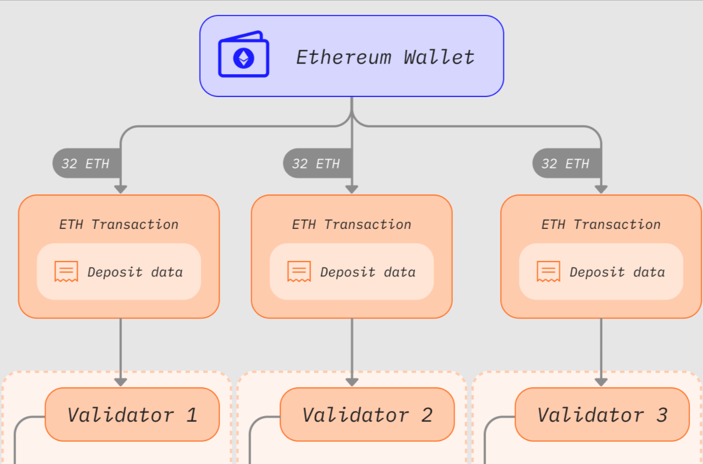

<center>

  

  **Ethereum2.0: スケーラビリティ向上**

</center>

Ethereumは、ブロックチェーン上でプログラム（スマートコントラクト）を実行するためのプロトコルであり、2014年にVitalik ButerinとGavin Woodによって提案されました。
スマートコントラクトを実行するために、EthereumはBitcoin Protocolの様々な仕様を変更しています。
では具体的に、どこを / どのように / なぜそのように 変更したのでしょうか？
そしてそもそも、スマートコントラクトなるものには一体どのような意義があるのでしょうか？
この資料は、はじめてEthereumに触れたときに誰しもが抱くであろう上記の疑問を解消し、その設計について体系的に理解できるようになることを目指して書かれています。

`Writer: @knskito`

`Donated by: `

- [Ethereum 2.0 とは何か？](#ethereum-20-とは何か)
  - [1.0 から 2.0 での主な変更点](#10-から-20-での主な変更点)
- [大枠の仕様について](#大枠の仕様について)
  - [Execution LayerとConsensus Layerの分離](#execution-layerとconsensus-layerの分離)
  - [バリデータという概念の導入](#バリデータという概念の導入)
  - [トランザクションのライフサイクル](#トランザクションのライフサイクル)
- [まとめ](#まとめ)


# Ethereum 2.0 とは何か？

基本的なコンセプトはそれまでのEthereumと同様である

- [端的に言えばBitcoin Protocolの一般化である](../P02_ethereum/1_introduction.md#端的に言えばbitcoin-protocolの一般化である)
  - 送金からプログラムへ
- [この一般化を計算機科学の文脈で捉えると...](../P02_ethereum/1_introduction.md#この一般化を計算機科学の文脈で捉えると)
  - 計算機からコンピューターへ
- [この一般化によって様々なアプリケーション開発が可能となる](../P02_ethereum/1_introduction.md#この一般化によって様々なアプリケーション開発が可能となる)
  - 集権的な存在が実行や実行結果に介入できないアプリーケーション (DApps) が実現する
 

## 1.0 から 2.0 での主な変更点

- [スケーラビリティ問題](../P02_ethereum/4_scalability.md#スケーラビリティ問題)に対処するために、2022年の9月に互換性の無い形での大規模な仕様変更 "The Merge" を行った
- Proof of Work (PoW) から Proof of Stake (PoS) へ (i.e., マイニングの廃止)
- この資料では、**PoS移行に伴うEthereumプロトコルの変化部分について説明する**

【キャスレー：PoWとPoSの違いとか？⇒PoW：計算問題を解けたノードが提案できる（一番早いやつが勝ち？）、PoSは確率で提案の権利が与えられるが、予めデポジットと預ける必要があり、不正を働いたりしたらペナルティが課せられる（仕事をちゃんとやらないと罰金？）のイメージ⇒これがバリデータ
デポジット⇒決まった金額（32eth）で宝くじを一枚買えるイメージ、たくさん買えば買うほど当たる確率が高いのに対し、PoWは計算資源をたくさん使えば使うほど当たる
※より多く犠牲を払った人の方が嘘はつきにくい⇒不正がないブロックを作ってくれる】

<center>


Source: https://ethereum.org/en/roadmap/merge/
</center>


# 大枠の仕様について

以下の要素はそれまでのEthereumと同様である
- [2種類のアカウント](../P02_ethereum/1_introduction.md#2種類のアカウント)
  - EOAとCAがあるよ　
- [2種類のトランザクション](../P02_ethereum/1_introduction.md#2種類のトランザクション)
  - Message CallとContract Creationがあるよ
- [EVM (Ethereum Virtual Machine)](../P02_ethereum/1_introduction.md#evm-ethereum-virtual-machine)
  - ノードは手元の仮想マシンでトランザクション (スマートコントラクト) を実行するよ
- [状態 (state) データの管理](../P02_ethereum/1_introduction.md#状態-state-データの管理)
  - トランザクションの実行結果はブロックチェーン外でも管理するよ

さらに "The Merge" 後は以下の要素が加わった。

## Execution LayerとConsensus Layerの分離
- Ethereumのブロックチェーンは、トランザクションの実行・検証を担う層 (**Execution Layer**) と正しい状態遷移について合意形成を取る層 (**Consensus Layer**) に分離した
  - `なぜ？: 将来的に、ブロックチェーンに複数のExecution Layerを重ねることでスケーラビリティ問題に対処しようとしているから (並列処理; Sharding)`
- アップデート前からConsensus Layer用のブロックチェーン (Beacon Chain) を並行して動かしており、アップデート時にそれまでのEthereumのブロックチェーンとBeacon Chainを合体した
  - 直感的には、飛行機が飛びながら別のより大きな飛行機の中に格納されていくイメージ
  - これは結構とんでもないこと
- だから **"The Merge"** と呼ばれている

<center>

</center>

- これに伴い、自分のコンピューターをEthereumのノードにするためのソフトウェアも**Execution Client**と**Consensus Client**の2種類になった
  - Execution Client: トランザクションの実行やブロックの作成を担う
  - Consensus Client: ブロックチェーンの合意形成を担う
- 両者は相互依存関係にあり、フルノードを建てる場合にはどちらも必要となる
  - Execution Clientだけ: どのチェーンが現在の正統なのかわからない
  - Consensus Clientだけ: ブロックを作成できない
 
【キャスレー：The Mergeが行われたことによって実際にどういうメリットがあったか？
　⇒消費電力を抑える→これは間違いないが、資源が消費されたことによって価値が付く
 　セキュリティを強化→そもそもバリデータになるコストが高いので本当に分散されているかが微妙
   高性能なマシンが必要なくなることでより多くの人が参加できる→分散化が進むから？
 　ただしマージされたことで処理できるものが増えるだけで速くなるというわけではない？→ある程度速くはなってるTPSが10%向上してる】

【キャスレー：PoWとPoSどっちの方がいいかというのはずっと議論されていて、決着はついてない
　　⇒PoSが優れているわけではなく、支持している人が多かったからそうなっただけ】

<center>


Source: https://ethereum.org/en/developers/docs/nodes-and-clients/
</center>

## バリデータという概念の導入 
- バリデータは、ブロックの提案とブロックの正統性を決めるための投票を担う
  - 以前はマイナーノードが担当していた
  - バリデータの総数や報酬はConsensus Layer上で管理されている
- EOAは32etherを[deposit contract](https://etherscan.io/address/0x00000000219ab540356cbb839cbe05303d7705fa)に預けることで、バリデータになることができる
  - つまりバリデータは、人間がつくるノードがつくるEOAがつくる存在
  - 1つのEOAが複数のバリデータを持つこともできる (e.g., 3,200etherを使えば100個持てる)
【キャスレー 宮下：バリデータを複数もつ事によるメリットやデメリットは何が挙げられますか？ ⇒報酬アップ？
　⇒持っていれば持っているだけ良い？　デポジットにしてるethは使えない（本来なら他でいろいろ使える）→機会費用
　　実際に仕事（ブロック作ったり正当性を決めたり）もしないといけない
　　ユーザが利益だと思うなら使っていいが、他の使い方の方が報酬が多いならならなくてもいい、実際投資と近しい】
- この32etherを預ける行為を**Staking**と呼ぶ
  - `なぜ？: ブロックの作成や投票の結果、預けた32etherは増減するから`
  - PoSという言葉の背景

<center>


Source: https://ethereum.org/en/developers/docs/consensus-mechanisms/pos/keys/
</center>

## トランザクションのライフサイクル

基本的なライフサイクルは以下の通り  
```
EOAは、トランザクション(Message Call or Contract Creation)を各ノードに伝搬する
各ノードは、受け取ったトランザクションを独立に検証する
各ノードは、問題が無いトランザクションのみを溜め、かつ他のノードに伝搬する
バリデータたちは、確率的にブロックの提案者と投票者に選ばれる
投票者は、正統と考えるチェーンの先端にあるブロックを宣言する
提案者は、任意のトランザクションおよび宣言をブロックに格納する
提案者は、ブロック内のトランザクションを実行する
提案者は、ブロックを既存のチェーンに含まれるいずれかのブロックに繋ぐ
提案者は、完成したブロックを各ノードに伝搬する
各ノードは、受け取ったブロックに問題が無いかを独立に検証する
各ノードは、問題が無いブロックのみを自身のチェーンに反映する
バリデータたちは、最も重いチェーンを「正しい」状態遷移の記録とする
```
[以前のEthereumにおけるライフサイクル](../P02_ethereum/1_introduction.md##トランザクションのライフサイクル)との差分は以下の通り
``` diff
EOAは、トランザクション(Message Call or Contract Creation)を各ノードに伝搬する
各ノードは、受け取ったトランザクションを独立に検証する
各ノードは、問題が無いトランザクションのみを溜め、かつ他のノードに伝搬する
- マイナーノードは、溜まりから任意のトランザクションをブロックに格納する
+ バリデータたちは、確率的にブロックの提案者と投票者に選ばれる
+ 投票者は、正統と考えるチェーンの先端にあるブロックを宣言する
+ 提案者は、任意のトランザクションおよび宣言をブロックに格納する
- マイナーノードは、ブロック内のトランザクションを実行する
+ 提案者は、ブロック内のトランザクションを実行する
- マイナーノードは、ブロックを既存のチェーンに含まれるいずれかのブロックに繋ぐ
+ 提案者は、ブロックを既存のチェーンに含まれるいずれかのブロックに繋ぐ
- マイナーノードは、PoW (Proof-of-Work) を経てブロックを完成させる
- マイナーノードは、完成したブロックを各ノードに伝搬する
+ 提案者は、完成したブロックを各ノードに伝搬する
各ノードは、受け取ったブロックに問題が無いかを独立に検証する
各ノードは、問題が無いブロックのみを自身のチェーンに反映する
- Ethereumは、最も重いチェーンを「正しい」状態遷移の記録とする
+ バリデータたちは、最も重いチェーンを「正しい」状態遷移の記録とする
```

# まとめ
- Ethereumはスケーラビリティ問題に対処すべく、PoWからPoSに移行した
- これに伴いブロックチェーンはExecution LayerとConsensus Layerに分離した
- これに伴いバリデータという概念が導入された
- これに伴いトランザクションのライフサイクルも変化した

