<center>

  

  **Ethereum2.0: スケーラビリティ向上**

</center>

Ethereumは、ブロックチェーン上でプログラム（スマートコントラクト）を実行するためのプロトコルであり、2014年にVitalik ButerinとGavin Woodによって提案されました。
スマートコントラクトを実行するために、EthereumはBitcoin Protocolの様々な仕様を変更しています。
では具体的に、どこを / どのように / なぜそのように 変更したのでしょうか？
そしてそもそも、スマートコントラクトなるものには一体どのような意義があるのでしょうか？
この資料は、はじめてEthereumに触れたときに誰しもが抱くであろう上記の疑問を解消し、その設計について体系的に理解できるようになることを目指して書かれています。

`Writer: @knskito`

`Donated by: `

- [Ethereum 2.0 とは何か？](#ethereum-20-とは何か)
  - [1.0 から 2.0 での主な変更点](#10-から-20-での主な変更点)
- [大枠の仕様について](#大枠の仕様について)
    - [バリデータという概念の導入](#バリデータという概念の導入)
  - [Execution LayerとConsensus Layerの分離](#execution-layerとconsensus-layerの分離)
  - [トランザクションのライフサイクル](#トランザクションのライフサイクル)
- [まとめ](#まとめ)


# Ethereum 2.0 とは何か？

基本的なコンセプトはそれまでのEthereumと同様である

- [端的に言えばBitcoin Protocolの一般化である](../P02_ethereum/1_introduction.md#端的に言えばbitcoin-protocolの一般化である)
  - 送金からプログラムへ
- [この一般化を計算機科学の文脈で捉えると...](../P02_ethereum/1_introduction.md#この一般化を計算機科学の文脈で捉えると)
  - 計算機からコンピューターへ
- [この一般化によって様々なアプリケーション開発が可能となる](../P02_ethereum/1_introduction.md#この一般化によって様々なアプリケーション開発が可能となる)
  - 集権的な存在が実行や実行結果に介入できないアプリーケーション (DApps) が実現する
 

## 1.0 から 2.0 での主な変更点

- [スケーラビリティ問題](../P02_ethereum/4_scalability.md#スケーラビリティ問題)に対処するために、2022年の9月に互換性の無い形での大規模な仕様変更 "The Merge" を行った
  - Proof of Work (PoW) から Proof of Stake (PoS) へ (i.e., マイニングの廃止)
  - Execution LayerとConsensus Layerの分離
- この資料では、**とくに新たなコンセンサスと報酬の仕組みについて詳細に説明する**

<center>


> Source: https://ethereum.org/en/roadmap/merge/
</center>


# 大枠の仕様について

以下の要素はそれまでのEthereumと同様である
- [2種類のアカウント](../P02_ethereum/1_introduction.md#2種類のアカウント)
  - EOAとCAがあるよ　
- [2種類のトランザクション](../P02_ethereum/1_introduction.md#2種類のトランザクション)
  - Message CallとContract Creationがあるよ
- [EVM (Ethereum Virtual Machine)](../P02_ethereum/1_introduction.md#evm-ethereum-virtual-machine)
  - ノードは手元の仮想マシンでトランザクション (スマートコントラクト) を実行するよ
- [状態 (state) データの管理](../P02_ethereum/1_introduction.md#状態-state-データの管理)
  - トランザクションの実行結果はブロックチェーン外で管理するよ

さらに "The Merge" 後は以下の要素が加わった。

### バリデータという概念の導入 

- バリデータは、ブロックの作成とブロックの正統性を決めるための投票を担う
  - 以前はマイナーノードが担当していた
- EOAは32etherを[deposit contract](https://etherscan.io/address/0x00000000219ab540356cbb839cbe05303d7705fa)に預けることで、バリデータになることができる
  - つまりバリデータは、人間がつくるノードがつくるEOAがつくる存在
  - 1つのEOAが複数のバリデータを持つこともできる (e.g., 3200etherを預ければ100個持てる)
  - この32etherを預ける行為を**Staking**と呼ぶ
  - `なぜ？: ブロックの作成や投票の結果、預けた32etherは増減するから`
- 各バリデータは、アカウント用の鍵とは別にValidator Signing KeyとWithdrawal Keyの2種類 (それぞれ秘密・公開鍵から成る) を得る
  - `なぜ？: セキュリティ上、アカウント用の鍵とバリデータ用の鍵は分けておきたいから`
  - `なぜ？: SaaS(Staking as a Service)などを運用する余地を残しておきたいから`
  - `なぜ？: 楕円曲線暗号よりも署名の集約に適した暗号形式を用いたいから`
  - 2種類の鍵は、トランザクションを作成することはできず、(文字通り)ブロックの作成・投票における署名とdeposit contractからのether引き出しにのみ用いられる

<center>

</center>

> 2024年4月において、バリデータの数は約1,000,000個

- バリデータ用の鍵を別途作ることにより、次のような運用が可能になる
  - Validator Signing Keyをノードに渡すことで、Stakingを委任できる。この場合、自身でノードを建てずともStakingが行える (Staking as a Service; SaaS)
  - また、そもそもバリデータ自体を自分で用意せずにStakingを行うことも出来る。つまり、Bitcoin Protocolにおけるマイニングプールのように少額のetherを集約して共用のバリデータ (Staking Pool) を運用することが可能

Solo Staking, SaaS, Staking Poolの3つの運用方法について、それぞれの特徴は以下のとおり
  
|  | 自身で用意するもの | 自身で作成するもの | 自身で管理するもの | トラストへの依存 |
| ---- | ---- | ---- | ---- | ---- |
| Solo Staking | full (or archive) node, EOA, 32ether以上のether | バリデータ | バリデータ | 低
| Staking as a Service (SaaS) | EOA, 32ether以上のether | バリデータ |  | 中
| Staking Pool | EOA, 任意量のether | |  | 高
 

## Execution LayerとConsensus Layerの分離
- Ethereumのブロックチェーンは、トランザクションの実行を担う層 (**Execution Layer**) と正しい状態遷移について合意形成を取る層 (**Consensus Layer**) に分離した
  - `なぜ？: 将来的に、ブロックチェーンに複数のExecution Layerを重ねることでスケーラビリティ問題に対処しようとしているから (並列処理; Sharding)`
  - 各層が担当する役割については後述
- アップデート前からConsensus Layer用のブロックチェーン (Beacon Chain) を並行して動かしており、アップデート時にそれまでのEthereumのブロックチェーンとBeacon Chainを合体した
  - 直感的には、飛行機が飛びながら別のより大きな飛行機の中に格納されていくイメージ
  - 結構とんでもないこと
- だから **"The Merge"** と呼ばれている

<center>

</center>

## トランザクションのライフサイクル

基本的なライフサイクルは以下の通り  
```
EOAは、トランザクション(Message Call or Contract Creation)を各ノードに伝搬する
各ノードは、受け取ったトランザクションを独立に検証する
各ノードは、問題が無いトランザクションのみを溜め、かつ他のノードに伝搬する
バリデータたちは、確率的にブロックの提案者と投票者に選ばれる
投票者は、正統と考えるチェーンの先端にあるブロックを宣言する
提案者は、任意のトランザクションおよび宣言をブロックに格納する
提案者は、ブロック内のトランザクションを実行する
提案者は、ブロックを既存のチェーンに含まれるいずれかのブロックに繋ぐ
提案者は、完成したブロックを各ノードに伝搬する
各ノードは、受け取ったブロックに問題が無いかを独立に検証する
各ノードは、問題が無いブロックのみを自身のチェーンに反映する
バリデータたちは、最も重いチェーンを「正しい」状態遷移の記録とする
```
[以前のEthereumにおけるライフサイクル](../P02_ethereum/1_introduction.md##トランザクションのライフサイクル)との差分は以下の通り
``` diff
EOAは、トランザクション(Message Call or Contract Creation)を各ノードに伝搬する
各ノードは、受け取ったトランザクションを独立に検証する
各ノードは、問題が無いトランザクションのみを溜め、かつ他のノードに伝搬する
- マイナーノードは、溜まりから任意のトランザクションをブロックに格納する
+ バリデータたちは、確率的にブロックの提案者と投票者に選ばれる
+ 投票者は、正統と考えるチェーンの先端にあるブロックを宣言する
+ 提案者は、任意のトランザクションおよび宣言をブロックに格納する
- マイナーノードは、ブロック内のトランザクションを実行する
+ 提案者は、ブロック内のトランザクションを実行する
- マイナーノードは、ブロックを既存のチェーンに含まれるいずれかのブロックに繋ぐ
+ 提案者は、ブロックを既存のチェーンに含まれるいずれかのブロックに繋ぐ
- マイナーノードは、PoW (Proof-of-Work) を経てブロックを完成させる
- マイナーノードは、完成したブロックを各ノードに伝搬する
+ 提案者は、完成したブロックを各ノードに伝搬する
各ノードは、受け取ったブロックに問題が無いかを独立に検証する
各ノードは、問題が無いブロックのみを自身のチェーンに反映する
- Ethereumは、最も重いチェーンを「正しい」状態遷移の記録とする
+ バリデータたちは、最も重いチェーンを「正しい」状態遷移の記録とする
```

# まとめ
- Ethereumはスケーラビリティ問題に対処すべく、大規模な仕様変更 "The Merge" を行った
- コンセンサスと報酬の仕組み、およびブロックの構造が大きく変化した
- これによりトランザクションのライフサイクルも大きく変化した

