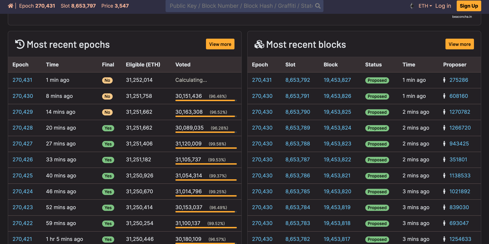

- [トランザクションのライフサイクル](#トランザクションのライフサイクル)
  - [EOAは、トランザクション(Message Call or Contract Creation)を各ノードに伝搬する](#eoaはトランザクションmessage-call-or-contract-creationを各ノードに伝搬する)
  - [各ノードは、受け取ったトランザクションを独立に検証する](#各ノードは受け取ったトランザクションを独立に検証する)
  - [各ノードは、問題が無いトランザクションのみを溜め、かつ他のノードに伝搬する](#各ノードは問題が無いトランザクションのみを溜めかつ他のノードに伝搬する)
  - [バリデータノードたちは、確率的にブロックの提案 or 投票ノードに選ばれる](#バリデータノードたちは確率的にブロックの提案-or-投票ノードに選ばれる)
    - [PoWからPoSへ](#powからposへ)
    - [Stakingとバリデータ、バリデータノード](#stakingとバリデータバリデータノード)
    - [ランダムな選択](#ランダムな選択)
    - [提案ノードの選択](#提案ノードの選択)
    - [投票ノードの選択](#投票ノードの選択)
  - [投票ノードたちは、正統と考えるチェーンの先端にあるブロックを宣言する](#投票ノードたちは正統と考えるチェーンの先端にあるブロックを宣言する)
  - [提案ノードは、任意のトランザクションおよび宣言をブロックに格納する](#提案ノードは任意のトランザクションおよび宣言をブロックに格納する)
    - [Ethereumブロックのデータ構造](#ethereumブロックのデータ構造)
      - [Execution payload headerのデータ構造](#execution-payload-headerのデータ構造)
    - [Block Gas Limitについて](#block-gas-limitについて)
    - [baseFeePerGasの決定ルールについて](#basefeepergasの決定ルールについて)
    - [State Root, Receipts Rootについて](#state-root-receipts-rootについて)
    - [データ構造を実際に確認してみましょう](#データ構造を実際に確認してみましょう)
  - [提案ノードは、ブロック内のトランザクションを実行する](#提案ノードはブロック内のトランザクションを実行する)
  - [提案ノードは、ブロックを既存のチェーンに含まれるいずれかのブロックに繋ぐ](#提案ノードはブロックを既存のチェーンに含まれるいずれかのブロックに繋ぐ)
  - [提案ノードは、完成したブロックを各ノードに伝搬する](#提案ノードは完成したブロックを各ノードに伝搬する)
  - [各ノードは、受け取ったブロックに問題が無いかを独立に検証する](#各ノードは受け取ったブロックに問題が無いかを独立に検証する)
  - [各ノードは、問題が無いブロックのみを自身のチェーンに反映する](#各ノードは問題が無いブロックのみを自身のチェーンに反映する)
  - [バリデータノードたちは、最も重いチェーンを「正しい」状態遷移の記録とする](#バリデータノードたちは最も重いチェーンを正しい状態遷移の記録とする)
    - [Gasperプロトコルについて](#gasperプロトコルについて)
    - [checkpoint, justified, finalizedの定義](#checkpoint-justified-finalizedの定義)
    - [LMD GHOSTについて](#lmd-ghostについて)
    - [Casper FFGについて](#casper-ffgについて)
    - [報酬メカニズム](#報酬メカニズム)
    - [罰則メカニズム　　](#罰則メカニズム)
    - [コンセンサスのまとめ　　       　　](#コンセンサスのまとめ-------)
- [まとめ](#まとめ)


# トランザクションのライフサイクル
 
ここまでEthereumの構成要素を確認してきましたが、これらはどのように連動しているのでしょうか。
あるトランザクションが作成されてから実行され、ブロックチェーンに格納されるまでのライフサイクルを軸に詳細を確認してましょう。

Introductionで示したとおり、トランザクションのライフサイクルは大きく以下のような流れになっている

```
EOAは、トランザクション(Message Call or Contract Creation)を各ノードに伝搬する
各ノードは、受け取ったトランザクションを独立に検証する
各ノードは、問題が無いトランザクションのみを溜め、かつ他のノードに伝搬する
バリデータノードたちは、確率的にブロックの提案 or 投票ノードに選ばれる
投票ノードたちは、正統と考えるチェーンの先端にあるブロックを宣言する
提案ノードは、任意のトランザクションおよび宣言をブロックに格納する
提案ノードは、ブロック内のトランザクションを実行する
提案ノードは、ブロックを既存のチェーンに含まれるいずれかのブロックに繋ぐ
提案ノードは、完成したブロックを各ノードに伝搬する
各ノードは、受け取ったブロックに問題が無いかを独立に検証する
各ノードは、問題が無いブロックのみを自身のチェーンに反映する
バリデータノードたちは、最も重いチェーンを「正しい」状態遷移の記録とする
```

## [EOAは、トランザクション(Message Call or Contract Creation)を各ノードに伝搬する](../P02_ethereum/3_transactionlife.md#EOAは、トランザクション(message-call-or-contract-creation)を各ノードに伝搬する)
以前のEthereumと同様である

## [各ノードは、受け取ったトランザクションを独立に検証する](../P02_ethereum/3_transactionlife.md#各ノードは、受け取ったトランザクションを独立に検証する)
以前のEthereumと同様である

## [各ノードは、問題が無いトランザクションのみを溜め、かつ他のノードに伝搬する](../P02_ethereum/3_transactionlife.md#各ノードは、問題が無いトランザクションのみを溜め、かつ他のノードに伝搬する)
以前のEthereumと同様である


## バリデータノードたちは、確率的にブロックの提案 or 投票ノードに選ばれる

### PoWからPoSへ

詳しくは後述しますが、スケーラビリティ問題に対応するため、Ethereumは2022年8月にブロック作成要件をPoWからPoSへ移行しました.これによって、Bitcoinと仕様が大きく異なり始めます。

EthereumのPoSは、おおまかには次の仕組みでブロック作成者を決定します。

まず、full (またはarchive) nodeは、自身が管理するEOAからdeposit contractと呼ばれるコントラクトアカウントに32ETH以上を預ける (stakeする) ことでバリデータノードになれます。

将来のブロック作成者はバリデータノードの中から定期的に選択されますが、このとき以前のブロックに投票するバリデータノードたちも選択されます。ここでの選択は確率的に行われますが、選択される確率は各バリデータノードのstake量で重み付けされています。

この仕組みによって、PoWのように、各ノードが`採掘作業を重複して行う必要`がなくなります。そのためネットワークを維持するためのエネルギー消費が抑えられて効率的でエコになります。

しかし、"PoW vs PoS" はブロックチェーンにおいて最も伝統的な論点の1つであり、現在も様々な観点 (e.g., どちらが公正なのか？ どちらが効率的なのか？ どちらが分散的なのか？ どちらが環境に優しいのか？) で研究・分析が引き続き行われています。


### Stakingとバリデータ、バリデータノード 

EOAは32ETHをdeposit contractに預けることで、アカウント用の鍵とは別にValidator Signing KeyとWithdrawal Keyの2種類 (それぞれ秘密・公開鍵から成る) が得られます。

<center>

</center>

この様にValidator用の鍵を別途用意するのは、次の3つの理由によります。
1. セキュリティ上、アカウント用の鍵とバリデータ用の鍵は分けておきたい
2. SaaS(Staking as a Service)などを運用する余地を残しておきたい(詳細後述)
3. 楕円曲線暗号よりも署名の集約に適した暗号形式を用いたい

2種類の鍵は、トランザクションを作成することは出来ません。一つのEOAが複数のバリデータ用の鍵を持つことも出来ます。この32ETH毎に作られる2種類の鍵を持つ単位を、ここでは便宜上「バリデータ」と呼び「バリデータノード」とは区別するものとします。

> 2024年1月において、バリデータの数は約900,000個

バリデータ用の鍵を別途作ることにより、次のような運用が可能になります。

1. 自身が管理するバリデータ鍵をノードに渡すことで、Stakingを委任出来る。この場合、自身でノードを建てずともStakingが行える (Staking as a Service; SaaS)
2. また、そもそもバリデータ自体を自分で用意せずにStakingを行うことも出来る。つまり、Bitcoinにおけるマイニングプールのように少額のETHを集約して共用のバリデータ (Staking Pool)を運用することが可能です。

Solo Staking, SaaS, Staking Poolの3つの運用方法について、それぞれの特徴を以下にまとめます。
  
|  | 自身で用意するもの | 自身で作成するもの | 自身で管理するもの | トラストへの依存 |
| ---- | ---- | ---- | ---- | ---- |
| Solo Staking | full (or archive) node, 32ETH以上のETH | バリデーターノード, バリデーター | バリデーターノード, バリデーター | 低
| Staking as a Service (SaaS) | 32ETH以上のETH | バリデーター |  | 中
| Staking Pool | 任意量のETH | |  | 高
  

### ランダムな選択

Ethereumのブロックチェーンは、12秒をslot、32slot (6.4分) をepochと呼び、slot, epoch単位でブロックの提案や合意形成、報酬などを管理しています。Bitcoinではslotは (block intervalとして) 約10分になるように設計されていました。Bitcoinにおけるdifficultyの概念はEthereumには存在しません。

<center>

</center>

### 提案ノードの選択

提案ノードの選択は、1つ前のepochのslot 0 時点で一気に行われます。このとき、バリデータのstake量が多いほど選ばれる確率が高くなりますが、32ETHを超えるともう上がらないようになっています。また、詳細は後述しますが、stakeされたETHはペナルティとして一部が没収される可能性があります。したがってバリデータのstake量は (事後的に) 32ETH未満になりえます。

多くのバリデータを管理するノードほど、ブロック提案の権利を得る確率が高まるため、ノードの視点からすれば32ETHが宝くじ1枚のような扱いになっています。


### 投票ノードの選択

提案ノードと同様に、epochの各slotに対応するブロック投票者も、1つ前のepochのslot 0 時点で一気に選択されます。1slotにnバリデータ (not バリデータノード) ずつ割り当てられます。このバリデータたちはcommiteeという単位でまとめられ、合意形成に必要な投票を担います。なぜなら、投票の集約はcommitee単位で並列化して行った方が効率的だからです。1slotあたりのcommitee数と1commiteeあたりのバリデータ数は、ネットワーク上の総バリデータ数に応じてepoch毎に変動します。最近のnは15,000~20,000あたりです。したがって1epochの間に全バリデータに投票機会があります。

同様に、多くのバリデータを管理するノードほど、ブロック投票の権利を得る確率が高まるため、ノードの視点からすれば32ETHが宝くじ1枚のような扱いになっています。

## 投票ノードたちは、正統と考えるチェーンの先端にあるブロックを宣言する

Commiteeに選ばれたバリデータ (実際にはそれを管理するノード) は、ブロックチェーンの構造に関する投票 (attestation) を行うことが出来ます。

- 割り当てられたslotのブロックは未作成なので、それ以前の内容に関して投票を行います
- ただし投票自体は、32slot先までの間ならば一応行えます 
- 具体的には次の二つを宣言します
  1. 現在どのブロックが先端にあるか？
  2. 現在どのブロックが最新のepochの最初のブロックか？の2つを宣言します

宣言の中身は以下のとおり

| 名称 | 役割 |
| ---- | ---- |
| slot | 割り当てられたslotの番号
| index | そのslotにおける何番目のcommiteeに所属しているか
| beacon_block_root | 先端だと思うブロックのヘッダーのハッシュ
| source | 最新のjustified (後述) されたと思うブロック
| target | 現在のepochで最初にあると思うブロック

上記がcommiteeごとに集約され同じslotのブロック提案者に渡されます。このとき、slot, indexが同じでも、残り3つの情報が異なる場合は別のグループに集約されます。投票が遅れた場合には、投票時のslotのブロック提案者に渡されます。

この集約の際には Validator Signing Key が使用されます。EOAの鍵 (楕円曲線暗号)とは異なる形式 (BLS署名) のため、署名の集約を行うことが出来ます。

## 提案ノードは、任意のトランザクションおよび宣言をブロックに格納する

### Ethereumブロックのデータ構造

The Merge以前のブロックはExecution Layerと呼ばれている。
<center>

</center>

直感的には、飛行機が飛びながら別のより大きな飛行機の中に格納されていくイメージ
だからThe Mergeと呼ばれている

#### Execution payload headerのデータ構造

### [Block Gas Limitについて](../P02_ethereum/3_transactionlife.md#block-gas-limitについて)
以前のEthereumと同様である
### [baseFeePerGasの決定ルールについて](../P02_ethereum/3_transactionlife.md#baseFeePerGasの決定ルールについて)
以前のEthereumと同様である
### [State Root, Receipts Rootについて](../P02_ethereum/3_transactionlife.md#state-root,-receipts-rootについて)
以前のEthereumと同様である

### データ構造を実際に確認してみましょう

ここまで確認してきたようなデータ構造は、[beaconcha.in](https://beaconcha.in/)などのエクスプローラーサイトを通じて直接確認することができます。
この資料で各要素の意味はおおまかに掴めたと思いますので、ぜひ実際の中身を確認してみてください。

<center>

</center>


## 提案ノードは、ブロック内のトランザクションを実行する

- Bitcoinと同様、親のブロックヘッダのハッシュを自身のブロックヘッダに格納することでチェーンを形成する 
- ただしThe Mergeを経て...
  - 参照する要素が2種類 (新ブロックヘッダ, execution payload header) に増えた
  - 冗長なので将来的には1つにまとまるかも...


## [提案ノードは、ブロックを既存のチェーンに含まれるいずれかのブロックに繋ぐ](../P02_ethereum/3_transactionlife.md#提案ノードは、ブロックを既存のチェーンに含まれるいずれかのブロックに繋ぐ)
以前のEthereumと同様である (担当者がマイナーノードから提案ノードに変わったという違いはある)

## [提案ノードは、完成したブロックを各ノードに伝搬する](../P02_ethereum/3_transactionlife.md#マイナーノードは、完成したブロックを各ノードに伝搬する)
以前のEthereumと同様である (担当者がマイナーノードから提案ノードに変わったという違いはある)

## [各ノードは、受け取ったブロックに問題が無いかを独立に検証する](../P02_ethereum/3_transactionlife.md#各ノードは、受け取ったブロックに問題が無いかを独立に検証する)
以前のEthereumと同様である

## [各ノードは、問題が無いブロックのみを自身のチェーンに反映する](../P02_ethereum/3_transactionlife.md#各ノードは、問題が無いブロックのみを自身のチェーンに反映する)
以前のEthereumと同様である

## バリデータノードたちは、最も重いチェーンを「正しい」状態遷移の記録とする
- PoSを採用しても、Ethereumのブロックチェーンは分岐する可能性がある
  - ネットワーク上でのブロックの伝搬に遅延が発生した場合
  - 悪意あるブロック提案者が同じslotにおいて2つ以上のブロックを流した場合
  - などなど...

- The Merge後のEthereumも「最も重いチェーン」を正統とするが、先述のGHOSTプロトコルとは異なるアルゴリズムを採用している
- 重いチェーンは **Gasperプロトコル (LMD GHOST + Casper FFG)** で定義されている
  - LMD GHOST: epoch内でブロックチェーンが分岐した場合の「重いチェーン」
  - Casper FFG: epochを跨いでブロックチェーンが分岐した場合の「重いチェーン」

- どちらもブロックに含まれる投票 (attestation)を用いて「重いチェーン」を決める
  - 復習: 以前のGHOSTプロトコルでは、子ブロックの数を数えていた

### Gasperプロトコルについて 

復習: 投票において各バリデータが宣言する情報

| 名称 | 役割 | 備考 |
| ---- | ---- | ---- |
| slot | 割り当てられたslotの番号 |
| index | そのslotにおける何番目のcommiteeに所属しているか |
| beacon_block_root | 先端だと思うブロックのヘッダーのハッシュ | LMD GHOSTに用いる
| source | 最新のjustified (後述) されたと思うブロック | Casper FFGに用いる
| target | 現在のepochで最初にあると思うブロック | Casper FFGに用いる

### checkpoint, justified, finalizedの定義
- Ethereumでは各epochの最初のブロックを **"checkpoint"** と呼ぶ
  - slotが空の場合は直近のブロック
- 投票のsource, targetは、このcheckpoint部分を宣言の対象とする
- このとき、全stake量の2/3以上の投票を得たtargetを **"justified"** とみなす
- 新たにjustifiedブロックが生まれた場合、その前にjustifiedされたブロック以前の全ブロックは **"finalized"** とみなす
  - こうなると基本的に覆らない
  - 覆すには、全stake量の1/3以上のetherをpenalty として失うことが必要となる ("economic finality")
- チェーンの分岐や空のslotが延々と続くなどの事態がなければ、checkpointは大体1.5epoch (9.6分) 後にfinalizedとなる


### LMD GHOSTについて
- epoch内で分岐した場合の「最も重いチェーン」は、各分岐の先端から遡って最も多くの投票 (beacon_block_root) を集めたチェーンとする
- このとき... ①投票は各バリデータのstake量に応じて重み付けされる (ただし32ETHが上限) ②投票数の計算は直近のjustifiedブロックからはじめる

### Casper FFGについて
- epochを跨いで分岐した場合の「最も重いチェーン」は、一番先にckeckpointがjustifiedになったチェーンとする
- 低い投票率や票の割れによってもし4epochの間にfinalizedが発生しなかった場合、投票していない or 少数派に投票しているバリデータのstakeを徐々に没収する (inactivity leak) ことで事後的にfinalizedにする仕様になっている 

### 報酬メカニズム
- ブロック提案者とブロック投票者に対してetherが報酬として新規発行される
  - Bitcoinには投票がないためブロック提案者 (マイニングノード) のみが対象でした
- 報酬 (および罰則) は、epochごとに計算・反映される
- 報酬額はバリデータ毎に異なるbase rewardを基本に計算される
  - base reward = 上限を32ETHとした自分のstake量 / (16*sqrt(総stake量))
  - つまり...自分のstake量が減ると後々貰える報酬は減る＆総stake量が増えても減る
  - Bitcoinの半減期的なイメージ
- base rewardを64として、各行為に対して以下の重み付けで報酬が発生する:

| 重み | 行為 | 備考 |
| ---- | ---- | ---- |
| 14 | Casper FFG 投票において「正しい」 source に投票した | 投票の方が重い
| 26 | そのslotにおける何番目のcommiteeに所属しているかCasper FFG 投票において「正しい」target に投票した | 投票の方が重い
| 14 | 先端だと思うブロックのヘッダーのハッシュLMD-GHOST 投票において「正しい」 beacon_block_root に投票した | 投票の方が重い
| 2 | comitteeに選ばれた際に、ブロックの検証作業を行った | 
| 8 | ブロック提案者に選ばれた際に、割り当てられたslotに新しいブロックを提案した | 

さらに追加報酬として、以下の要素が存在する:

**ブロック提案者**
- attestation reward・・・集約された宣言 (投票) 1つをブロックに含めるたびに 8/64 * base reward 貰える (現在のEthereumでは、ブロックには64~128個含めることが可能)
- slashing reward・・・バリデータの不正行為の証拠となるデータをブロックに含めるたびに 対象となったバリデータのstake量/512 貰える

**ブロック投票者**
- inclusion delay reward ・・・ 投票を行うたびに獲得出来る報酬。base reward分貰えるが、割り当てられたslotから遅れるたびに報酬額が半減していく (32slot進むと0)
  - 早く投票するように促している

### 罰則メカニズム　　   
**サボってしまった場合:**
- ブロック提案者もブロック投票者も、単に報酬機会を逃すだけ
- しかし先述のinactivity leakが発生した場合には、2/3の集票が成立するまで、投票しなかった or 少数派の選択肢に投票した  バリデータのstake量が減らされる

stake量の減少は、ブロックの提案・投票ノードに選ばれる確率が下がることを意味する。さらに、stakeが半分の16ETHを割った場合には自動的にバリデータの地位を喪失することになっている


**不完全な内容を提出してしまった場合:**
- ブロック提案者は単に報酬機会を逃すだけ
- ブロック投票者はbeacon_block_rootが空の場合は単に報酬機会を逃すだけ
- しかしsource, targetが空の場合は、報酬として得られた分のetherがstakeから減らされる

**明確に悪意ある行為をした場合:**
- バリデータはネットワークから強制排除 (slashing) され、stakeしたetherも全て失う
  - ブロック提案者が、同じslotに対して2つの異なるブロックを提案する
  - ブロック投票者が、同じtargetを持つ異なる投票を重複して行う (二重投票)
  - ブロック投票者が、過去の source -> target 投票を囲むような投票を行う
    - 過去に source -> target の投票で、32 -> 64 という投票があるとする
    - 次のepochで 0 -> 96 などの投票を行うとslashing対象となる
    - Finalizedされたチェーンの歴史を覆すにはこうした投票が必ず必要になる (はず...)

Slashingは、バリデータが他のバリデータの不正行為を発見→
バリデータが不正行為の証拠データを作成してブロック提案者に投げる→
ブロック提案者がブロックに含める
という流れで行われる (証拠データの作成には報酬は発生しない)。
不正行為ありとみなされたバリデータは、ただちにstakeから1ETHが没収され、それから36日に渡ってstakeが減少→退出となる


### コンセンサスのまとめ　　       　　
- Ethereumは「**最も重いチェーン**」を正統とする
- 重いチェーンは **Gasperプロトコル** (LMD GHOST + Casper FFG) で定義されている
- どちらもブロックに含まれる投票 (attestation)を用いて「重いチェーン」を決める
- 報酬と罰則は、**ブロック提案者とブロック投票者の両方**が対象となる
- 報酬と罰則は、各バリデータのstake量と全体のstake量に応じて変動する。
*Gasperプロトコルは4年以上議論されてきたものの、現在も安全性や攻撃耐性などについて議論がなされています

*Ethereumのシステム全体におけるetherの総供給量は、
コンセンサスの報酬によって増え、コンセンサスの罰則とトランザクションの手数料で減る、という構造になっています。(現在は緩やかなデフレ)


# まとめ
以下のトランザクションのライフサイクルに沿って、Ethereumの構成要素がどのように連動しているかの詳細を確認した　

```
EOAは、トランザクション(Message Call or Contract Creation)を各ノードに伝搬する
各ノードは、受け取ったトランザクションを独立に検証する
各ノードは、問題が無いトランザクションのみを溜め、かつ他のノードに伝搬する
バリデータノードたちは、確率的にブロックの提案 or 投票ノードに選ばれる
投票ノードたちは、正統と考えるチェーンの先端にあるブロックを宣言する
提案ノードは、任意のトランザクションおよび宣言をブロックに格納する
提案ノードは、ブロック内のトランザクションを実行する
提案ノードは、ブロックを既存のチェーンに含まれるいずれかのブロックに繋ぐ
提案ノードは、完成したブロックを各ノードに伝搬する
各ノードは、受け取ったブロックに問題が無いかを独立に検証する
各ノードは、問題が無いブロックのみを自身のチェーンに反映する
バリデータノードたちは、最も重いチェーンを「正しい」状態遷移の記録とする
```

詳細は構造はここまで。最後にEthereumのガバナンスと課題をみてみよう。