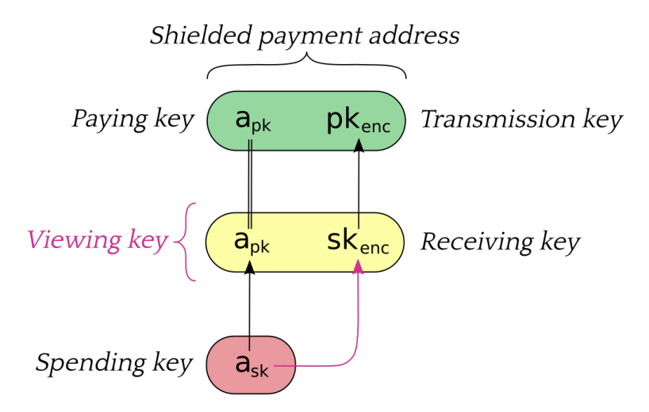

  **Zcash: Bitcoin送金にプライバシーを**

Zcashは、Bitcoin Protocolのプライバシー問題を解決するためのプロトコルであり、Electric Coin Co.によって2016年の10月にローンチされました。
Bitcoin送金におけるプライバシーを実現するためにBitcoin Protocolの様々な仕様を追加しています。
では具体的に、どこを / どのように / なぜそのように追加したのでしょうか？
この資料は、Zcashを理解する上で誰しもが抱くであろう上記の疑問を解消することを目指して書かれています。
尚、取り扱っているバージョンは[Sprout](https://github.com/zcash/zips/blob/main/protocol/sprout.pdf)になります。

`Writer: @ashWhiteHat`

- [Zcashとは何か？](#zcashとは何か)
    - [プライバシー送金が可能なBitcoin Protocolである](#匿名送金が可能なbitcoin-protocolである)
    - [2種類のプライバシー](#2種類のプライバシー)
    - [匿名送金の課題](#匿名送金の課題)
      - [ミキシング](#ミキシング)
      - [Zerocoin](#Zerocoin)
    - [Zcashの革新性](#Zcashの革新性)
- [プロトコル](#プロトコル)
  - [概要](#概要)
    - [送金額の秘匿化](#送金額の秘匿化)
    - [送金者の秘匿化](#送金者の秘匿化)
    - [その他の問題](#その他の問題)
      - [二重支払い問題](#二重支払い問題)
      - [トランザクションの正当性問題](#トランザクションの正当性問題)
  - [詳細](#詳細)
    - [ウォレット](#ウォレット)
      - [Shielded Payment Address](#shielded-payment-address)
      - [Transmission Key](#transmission-key)
    - [送金](#送金)
      - [送金処理](#送金処理)
    - [ブロックチェーン](#ブロックチェーン)
    - [ブロック](#ブロック)
      - [状態遷移の検証方法](#状態遷移の検証方法)
- [まとめ](#まとめ)
- [参照](#参照)

# Zcashとは何か？

## 匿名送金が可能なBitcoin Protocolである

匿名送金: Bitcoin Protocolの課題

AliceからBobへの送金を考える。  
Aliceが1 BTCをBobに送金した場合、送金額とAliceのアドレスとBobのアドレスの含まれたトランザクションに署名を行いブロックチェーンネットワークに共有する。  
この際に送金額や送金に関わるアドレスの情報は全世界に公開されることとなる。  
そのためアドレスと人物や特定の法人が紐付いている場合は、過去に行った取引の全てが第三者に明かされてしまう。  
Bitcoin Protocolにはこのようなプライバシーに関わる課題が存在した。

## 2種類のプライバシー

- ブロックチェーン業界におけるプライバシーには、一般的に`Confidential（機密）`と`Anonoymous（匿名）`の2つの種類が存在する
  - **Confidential**: 送金額が秘匿化されている
  - **Anonymous**: 送金額とトランザクションに関連するアカウントやその他のデータが秘匿化されている

**Confidential**のプライバシーを保証したプロジェクトは[Zether](https://eprint.iacr.org/2019/191.pdf)などが有名であり、準同型暗号を用いて送金額を秘匿化する場合が多い。  
**Anonymous**のプライバシーを保証したプロジェクトは[Monero](https://www.getmonero.org/)などが有名であり、リング署名やステルスアドレスを用いて送金に関わるアカウントを秘匿化する。  
Zcashでは、**Anonymous**のプライバシーを保証しており、ゼロ知識証明を用いることで送金額やトランザクションに関わるアカウントを秘匿化している。

## 匿名送金の課題

Bitcoin Protocolの匿名性に取り組んでいるプロジェクトはこれまでにも存在していた。  
しかし、集権性や機能性の課題があり広く普及するには至らなかった。

### **ミキシング**
- 信頼できる第三者を仮定することで送金の追跡を不可能にする
- この方法には以下のような欠点が存在する
  - ミキシングに必要な量のコインを集めるのに時間がかかる
  - ミキシングの提供者は送金を追跡できる
  - ミキシングの提供者がコインを盗む可能性がある

### **Zerocoin**
- ゼロ知識証明により集権サービスを必要としない匿名送金を実現した
- この方法には以下のような欠点が存在する
  - 証明サイズが45kBで検証に450msの時間がかかる
  - 固定額の送金しかできない
  - 直接送金する方法がない
  - 送金額や取引のメタデータは秘匿していない

## Zcashの革新性

- 従来の匿名送金では
1. 集権サービスを用いた匿名送金
2. 分散であるが少ない機能性で低いスケーラビリティの匿名送金
- の2つの方法しか存在しなかった

- Zcashでは、[匿名送金の課題](#匿名送金の課題)を分散性を保ちながら以下のように改善した
  - トランザクションサイズを1kB以下にする(97.7%の改善)
  - 検証時間を6ms以下にする(98.6%の改善)
  - あらゆる送金量での匿名送金を可能にする
  - 送金額とユーザーの保有するコインの価値を秘匿する
  - ユーザーの固定アドレスに直接送金される

# プロトコル

## 概要

- ZcashはBitcoin Protocolのトランザクションの方法を変更し、匿名送金を実現している
- 第一に**Confidential**プライバシーの実現のため[送金額を秘匿化](#送金額の秘匿化)する必要がある
- 第二に**Anonymous**プライバシーの実現のために[送金に関わるメタデータを秘匿化](#送金者の秘匿化)する必要がある
- 最後にこれらを暗号技術によって実現した際に問題となる[二重支払いや残高管理の問題を解決](#)する必要がある
- メタデータの秘匿化は、送金額や送金者の秘匿化の応用で達成できるため送金額と送金者の秘匿化に重点を置いて解説する。

### 送金額の秘匿化

**Confidential**プライバシーを実現するために送金額を秘匿化し、受取人のみにその情報を共有する必要がある。  
この章では、具体的にどのように送金額を秘匿化しているかを解説する。

- Zcashでは送金は`Note`と呼ばれる単位で管理される
- この`Note`に送金額の情報が含まれているため暗号化を行う必要がある
- 暗号化に用いられる鍵と受金者のアドレスが紐付いてしまうと**Anonymous**を達成できないため、送金の署名に用いられる鍵とは別にTransmission Keyが生成される（[ウォレット](#ウォレット)参照）

AliceからBobへの**Confidential**送金スキーマは以下のようになる
1. Bobは[Shielded Payment Address](#Shielded-Payment-Address)を生成し、[Transmission Key](#Transmission-Key)を公開する
2. Aliceは送金額をBobの[Transmission Key](#Transmission-Key)で暗号化し、ネットワークに共有する
3. Bobはネットワーク上の暗号化された`Note`を[Transmission Key](#Transmission-Key)に対応する秘密鍵で複合し、送金額を確認する

この送金スキーマによって送金額を秘匿化することができるが、AliceがBobへの送金の際にAliceの`Note`を特定する必要があり、その際に過去の送金の受取人の情報がネットワークに共有されてしまうという問題が存在する。  
この`Note`を使用する際の送金に関連するアドレスの秘匿化を[送金者の秘匿化](#送金者の秘匿化)で説明する。

### 送金者の秘匿化

[送金額の秘匿化](#送金額の秘匿化)の章では、送金の際に用いる`Note`から過去の送金の受取人の情報が漏れてしまうことが課題となっていた。  
この章では、具体的にどのように送金に関わるアドレスを秘匿化するかを解説する。

- Zcashでは`Note`の平文は公開されず、そのコミットメントと暗号文のみがネットワークに共有される
- `Note`のコミットメントはマークルツリーに格納され、[ブロック](#ブロック)に保存される
- ゼロ知識証明によってある時点での`Note`コミットメントツリーのルートを元に特定の`Note`がマークルツリーに格納されているかを証明できる
<!-- コミットメントとは？KZGコミットメント？それとも単なるハッシュ値でよい？
→ 下見るとSHA256らしい．
 -->
AliceからBobへの**Anonymous**送金スキーマは以下のようになる
1. Aliceは自身に対して送金された`Note`を確認する　
<!-- Bobはの誤記？ -->
2. Aliceは送金の際に使用される`Note`をそれ自体を明かすことなく過去の[ブロックチェーン](#ブロックチェーン)に含まれることをゼロ知識証明を用いて証明する
<!-- 送金元のOutputがUTXOであることを証明？ -->
3. AliceはBobにどの`Note`を用いたかを明らかにせずに送金を行う
4. [ブロックチェーン](#ブロックチェーン)ネットワークの検証者は証明を検証し、送金に用いられた`Note`が過去の[ブロック](#ブロック)に存在するかを検証する

この送金スキーマによってAliceは送金の際に使用する`Note`を特定することなくその存在のみを証明し、Bobに送金を行うことができる。  
そのため[ブロックチェーン](#ブロックチェーン)ネットワークに公開された情報からは送金に関わるアドレスを特定することはできない。  
しかし、送金に使用される際の`Note`が特定されていないため過去の送金に用いられていないという保証（二重支払い問題）ができない。  
また、送金額が秘匿化されているためマイナスの送金額を送金することや`Note`のコミットメントにデタラメな文字列を使用するというような課題が存在する。  
これらの秘匿化を行ったことによる課題を[その他の問題](#その他の問題)で説明する。

### その他の問題

#### 二重支払い問題

Zcashの送金スキーマでは、送金の際に用いられる`Note`が特定されないため、送金に用いられる`Note`が未使用であるかを[ブロックチェーン](#ブロックチェーン)ネットワークの検証者は判別することができない。  
この章では、具体的にどのように二重支払い問題を解決するかを解説する。

- Zcashでは`Note`の平文は公開されず、そのコミットメントのみがネットワークに共有される
- このコミットメントが使用済みであるかを判別するために`Nullifier`という文字列を用いる
- この`Nullifier`はコミットメントを計算する際に用いられ、コミットメントに一対一で対応する
- この`Nullifier`からコミットメントを特定することはできない

AliceからBobへの**Anonymous**送金スキーマの二重支払いは以下のよう防止される
1. Aliceは送金の際に使用される`Note`をそれ自体を明かすことなく過去の[ブロックチェーン](#ブロックチェーン)に含まれることをゼロ知識証明を用いて証明する
2. Aliceは送金の際に使用された`Note`のコミットメントを計算する際に用いられた`Nullifier`を[ブロックチェーン](#ブロックチェーン)ネットワークに公開する
3. [ブロックチェーン](#ブロックチェーン)ネットワークの検証者は過去に同じ`Nullifier`が用いられていないことを確認し、[ブロック](#ブロック)に保存する

この送金スキーマへの変更によって、送金に使用される`Note`のコミットメントを特定せずにそのコミットメントが使用済みかを検証者は判別することができる。

#### トランザクションの正当性問題

Zcashの送金スキーマでは、送金の生データである`Note`は公開されず、コミットメントと暗号化された値しか公開されないためBitcoin Protocolのように送金が正しく行われたかを[ブロックチェーン](#ブロックチェーン)ネットワークの検証者は検証することができない。  
この章では、具体的にどのようにトランザクションが正しく行われたか検証する方法を解説する。

- Zcashでは送金の際に`JoinSplit`と呼ばれるゼロ知識証明の証明を添付する
- `JoinSplit`は以下の入力を持ち、送金に関わる命題を証明する
    - パブリックインプット
        - 入力のNoteのマークルルート： $rt$
        - 入力のNoteのNullifier： $nf$
        - 出力のNoteのコミットメント： $cm$
    - プライベートインプット
        - 入力のNoteのマークルパス： $(path, pos)$
        - 入力のNote： $Note^{old}$
        - 入力のNoteに対応する秘密鍵： $a_{sk}$
        - 出力のNote： $Note^{new}$
    - 命題
        - 入力に用いられる $Note^{old}$が $rt$の $(path, pos)$に存在するか
        - 入力に用いられる $Note^{old}$の $nf$が正しく計算されているか
        - 入力に用いられる $Note^{old}$の公開鍵に対応する秘密鍵 $a_{sk}$を知っているか
        - 出力に用いられる $Note^{new}$の $cm$が正しく計算されているか

上記の証明をトランザクションに添付することで[ブロックチェーン](#ブロックチェーン)ネットワークの検証者は送金に用いられた値を知ることなく送金の内容が正しいかを検証することができる。
<!-- 
回路内で，Inputの総和＝Outputの総和のチェックもしている
さらに，入力Note，出力Noteは複数の場合あり．
 -->
#### 送金額の秘匿化問題

上記では、簡略化をしたが、Zcashのブロックチェーン上では、`chain value pool balance`というプールで未使用の`Note`の全体の額が管理されている。  
[JoinSplit Descriptions](#joinsplit-descriptions)の項目の $vpub\_old$と $vpub\_new$に送金額の生データが含まれている。  
これらの額を元に入力と出力の`Note`コミットメントが計算されたかも上述の[トランザクションの正当性問題](#トランザクションの正当性問題)で証明される。  
しかし、一回のトランザクションで使用される`Note`が1つの場合や、少数の場合は`Note`のコミットメントと送金額を紐付けやすくなってしまう。  
そこでZcashでは、トランザクションを送る際に以下のことを推奨している。

- 送金の入力に使用される`Note`コミットメントのNullifierと出力の`Note`コミットメントの順番をランダム化する
- 送金額に0を暗号化したダミーの`Note`をトランザクションに加えて送金額の生データとコミットメントの関連をわかりづらくする

## 詳細

- アーキテクチャーの中で用いられている要素技術の詳細と役割を解説する

### ウォレット

- 匿名送金を行う場合には、`Shielded Payment Address`と呼ばれる特殊なアドレスを作る必要がある
- その際に用いられる鍵は、送金を暗号化する鍵を含むため`Bitcoin`の構成とは異なっている

具体的な鍵構成は以下のようになっている。

<!-- 
Viewing key a_pkはどこ？
というか，a_pkはPaying keyのところにもあるから緑と黄色の左は同じものということか．

 -->
| 項目 | 役割 | 可視性 |
| ---- | ---- | ---- |
| **Shielded Payment Address** | 2つの公開鍵の`Paying Key`と`Transmission Key`から作られる。 |  パブリック |
| **Spending Key** | 資産移動の権限管理に用いる。Bitcoinにおける秘密鍵。 | プライベート |
| **Paying Key** | `Spending Key`に対応する受金アドレスの一部に用いられる。Bitcoinにおける公開鍵。 | パブリック |
| **Receiving Key**| `Note`の取得と複合に用いられる。 | プライベート |
| **Transmission Key**| `Receiving Key`に対応する鍵。送金の暗号化に用いられる。 | パブリック |

全ての鍵は、`Spending Key`から派生して生成される。

#### **Shielded Payment Address**
- 一つの`Shielded Payment Address`で、複数の送金を受け取ったとしてもブロックチェーン上の情報からは同じアドレスであることは識別できない
- 送金者同士が共謀した場合は、同一のアドレスであることを識別できる。そのためそれらを防止したい場合は、アドレスを使い分ける必要がある

#### **Transmission Key**
- 暗号文からはどの鍵で暗号されたかの識別をすることはできず、対応する`Receiving Key`の保持者にのみ複合が可能。

### 送金

- 送金はBitcoinのトランザクションを拡張した`Note`と呼ばれる形式によって管理される

`Note`では以下の項目が管理されている。

| 項目 | 内容 |
| ---- | ---- |
| $a_{pk}$ | 受取人の`Shielded Payment Address`の`Paying Key`。 |
| $v$ | 送金額。単位はzatoshi(1 ZEC = $10^8$ zatoshi) |
| $\rho$ | `Note`の二重支払い防止の`Nullifier`を計算するために用いられる値。|
| $rcm$ | `Note`のコミットメントのトラップドアの乱数。|
<!-- 
ρはPRF^{nfSprout}_{ask}への入力値らしい．
sprout.pdf P.10

rcmとはなんだろう？
 -->
#### **Noteコミットメントの計算**

- コミットメントの計算は`Note`の項目の要素をSHA256の関数を用いて行う

$$
NoteCommitment = SHA256(\fbox{1}\fbox{0}\fbox{1}\fbox{1}\fbox{0}\fbox{0}\fbox{0}\fbox{0}\fbox{256-bit $a_{pk}$}\fbox{64-bit v}\fbox{256-bit ρ}\fbox{256-bit rcm})
$$

#### **送金処理**

- `Shielded Payment`を実行した場合、`JoinSplit`と呼ばれる証明に関するデータがトランザクションに追加される

##### トランザクション構造

| 項目 | 内容 |
| ---- | ---- |
| $nJoinSplit$ | `JoinSplit Description`の数。 |
| $vJoinSplit$ | `JoinSplit Description`のデータ。 |
| $joinSplitPubKey$ | `joinSplitSig`の検証鍵。 |
| $joinSplitSig$ | トランザクションの冒頭への署名。|

##### JoinSplit Descriptions

| 項目 | 内容 |
| ---- | ---- |
| $vpub\_old$ | 匿名送金でTransparent Transaction Value Poolから取り除かれた送金額。 |
| $vpub\_new$ | 匿名送金でTransparent Transaction Value Poolに加えられた送金額。 |
| $anchor$ | このトランザクションで用いられる`Note`の含まれた`Note`コミットメントツリーのある時点でのルート。 |
| $nullifiers$ | トランザクションに用いられた`Note`のNullifier。|
| $commitments$ | トランザクションのアウトプットの`Note`のコミットメント。|
| $ephemeralKey$ | - |
| $randomSeed$ | それぞれのJoinSplit Descriptionに独立して選択された乱数。 |
| $vmacs$ | JoinSplit Descruptionの $a_{pk}$から計算されたMACコード |
| $zkproof$ | JoinSplitのゼロ知識証明。 |
| $encCiphertexts$ | トランザクションのアウトプットの`Note`を暗号化したもの。 |

- `Note`が送金された時にはコミットメントのみが公開され、ブロックチェーン上の`Note Commitment Tree`に格納される
- 直接`Note`を公開しないことにより送金額と受取人の情報を保護している
- `Note`を送金する際はコミットメントがブロックチェーン上に存在することをゼロ知識証明によって証明する

- 二重支払い防止のために用いられる文字列
- 送金時に入力として用いられたNoteのNullifierが公開される
<!-- 
ephemeralKeyは送金元がNoteを暗号化するときに使った公開鍵．
送金先は自身の秘密鍵とephemeralKeyを用いて暗号化Noteを復号化できる，と理解．

 -->
### ブロックチェーン

- ある時点で検証者は、ブロックチェーンの候補となるブロックを把握しており、それらのブロックはジェネシスブロックをルートとし、ブロックヘッダーから親ブロックを参照する形で木構造に連なっている。
- リーフからルートへの経路はコンセンサスルールによって正当な歴史として選択された一つ以上のブロックによって構成される
- ブロックチェーンのブロックはジェネシスブロックが0から始まる一つずつ増える高さを持っている
- ルートまでの経路のノードの作業を合計し、最も作業量が多いブロックチェーンを正しい歴史とする

### ブロック

- 各ブロックには一つ以上のトランザクションが含まれる
- ジェネシスブロックの初期の状態に対してユーザーがトランザクションを実行することで状態遷移が発生する
- 状態はマークルツリーのリーフとしてNoteのコミットメントを保存し、Noteコミットメントツリーとして管理する（以後、ツリー）
- トランザクションは、現在のツリーを入力としそのトランザクションのNoteコミットメントをツリーに保存し、ルートを再計算して出力とする
- NoteからNoteコミットメントが正しく計算されたことをトランザクションに付属している証明によって検証する
- トランザクションに用いられたNullifierは公開され、過去のブロックに存在しないことを確認されたのちブロックチェーンに取り込まれる
<!-- Noteコミットメントツリーは，ブロックチェーン全体で1つ．つまりブロックが追加されるごとにどんどんリーフは増えていく．  -->
#### 状態遷移の検証方法

それぞれのバリデータが以下の検証を行うことで状態遷移の一貫性を保証する
- ジェネシスブロックのツリーが空の状態であること
- ブロックの最初のトランザクションの入力が直前のブロックの最後のツリーであること
- ブロック内のトランザクションの後のトランザクションの入力が直前のトランザクションの出力のツリーであること
- ブロックの最後のツリーが最後のトランザクションの出力であること

# まとめ

Zcashは送金額と送金に関わるアドレスが秘匿されている匿名送金をサポートしている。  
Zcashのプライバシーは、送金の際に使用された`Note`をそれ自体を明かさずにそのコミットメントが公開されていることを証明することで実現されている。  
この`Note`はトランザクションと関連づけることはできないため公開情報から送金に関わる情報を知ることはできない。

# 参照

- [Learn Zcash](https://z.cash/learn/who-created-zcash/)
- [A Privacy-Protecting Digital Currency Built On Strong Science.](https://www.binance.com/ja/research/projects/zcash)
- [匿名暗号資産（Monero/Zcash/Grin）ブロックチェーンの匿名性に関する考察](https://cir.nii.ac.jp/crid/1050292572094389888)
- [Zcash Protocol Specification Version 2021.1.19 [Sprout]](https://github.com/zcash/zips/blob/main/protocol/sprout.pdf)
