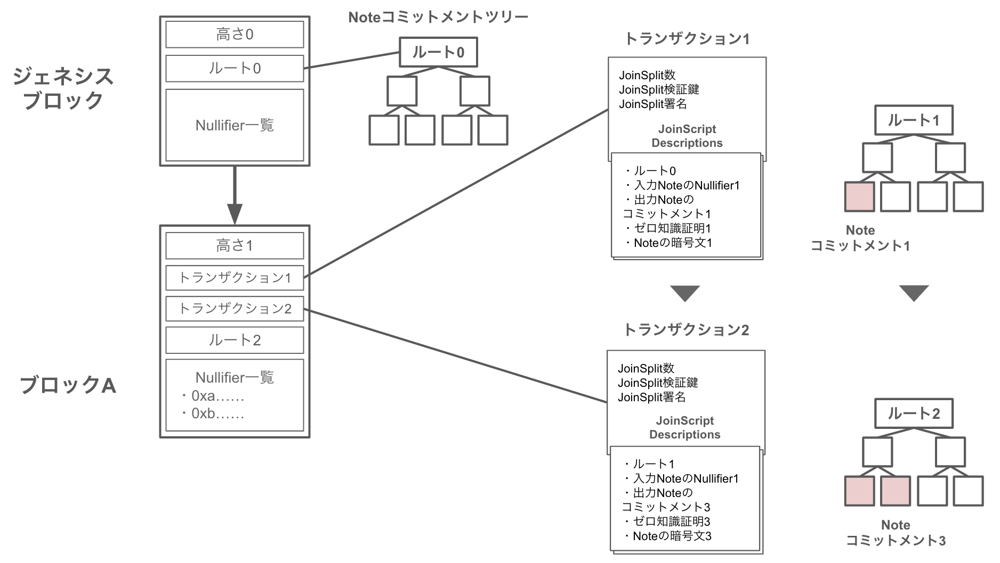

  **Zcash: Bitcoin送金にプライバシーを**

Zcashは、Bitcoin Protocolのプライバシー問題を解決するためのプロトコルであり、Electric Coin Co.によって2016年の10月にローンチされました。
Bitcoin送金におけるプライバシーを実現するためにBitcoin Protocolの様々な仕様を追加しています。
では具体的に、どこを / どのように / なぜそのように追加したのでしょうか？
この資料は、Zcashを理解する上で誰しもが抱くであろう上記の疑問を解消することを目指して書かれています。
尚、取り扱っているバージョンは[Sprout](https://github.com/zcash/zips/blob/main/protocol/sprout.pdf)になります。

`Writer: @ashWhiteHat`

`Donated by: `

- [Zcashとは何か？](#zcashとは何か)
    - [プライバシー送金が可能なBitcoin Protocolである](#プライバシー送金が可能なBitcoin Protocolである)
- [プライバシーについて](#プライバシーについて)
- [アーキテクチャー](#アーキテクチャー)
- [要素技術](#要素技術)
- [まとめ](#まとめ)

# Zcashとは何か？

## 匿名送金が可能なBitcoin Protocolである

匿名送金: Bitcoin Protocolの課題

## 2種類のプライバシー

- ブロックチェーン業界におけるプライバシーには、一般的に`Confidential（機密）`と`Anonoymous（匿名）`の2つの種類が存在する

**Confidential**
- 送金額が秘匿化されている

**Anonymous**
- 送金額が秘匿化されている
- 送金に関連するアカウントやその他のデータが秘匿化されている

# Zcashの革新性

## 匿名送金の課題

- Bitcoin Protocolの匿名性に取り組んでいるプロジェクトはこれまでにも存在していた

**ミキシング**
- 信頼できる第三者を仮定することで送金の追跡を不可能にする
- この方法には以下のような欠点が存在する
  - ミキシングに必要な量のコインを集めるのに時間がかかる
  - ミキシングの提供者は送金を追跡できる
  - ミキシングの提供者がコインを盗む可能性がある

**Zerocoin**
- ゼロ知識証明により集権サービスを必要としない匿名送金を実現した
- この方法には以下のような欠点が存在する
  - 証明サイズが45kBで検証に450msの時間がかかる
  - 固定額の送金しかできない
  - 直接送金する方法がない
  - 送金額や取引のメタデータは秘匿していない

## Zcashの貢献

- 従来の匿名送金では
1. 集権サービスを用いた匿名送金
2. 分散であるが少ない機能性で低いスケーラビリティの匿名送金
- の2つの方法しか存在しなかった

- Zcashでは、[匿名送金の課題](#匿名送金の課題)を分散性を保ちながら以下のように改善した
  - トランザクションサイズを1kB以下にする(97.7%の改善)
  - 検証時間を6ms以下にする(98.6%の改善)
  - あらゆる送金量での匿名送金を可能にする
  - 送金額とユーザーの保有するコインの価値を秘匿する
  - ユーザーの固定アドレスに直接送金される

# プロトコル

## 概要

- ZcashはBitcoin ProtocolのUTXOの管理方法を変更し、匿名送金を実現している。
- 匿名送金を実現するために秘匿化の必要があるデータは、主に送金額と送金者であり、加えてガス代などのメタデータとなる。
- メタデータの秘匿化は、送金額や送金者の秘匿化の応用で達成できるため送金額と送金者の秘匿化に重点を置いて解説する。
- また、送金情報が秘匿化されている上での残高の管理の方式の概要を解説する。

### 送金額の秘匿化

- 送金額の秘匿化方法は、送金にまつわる情報のコミットメントのみを公開し、送金を行うことである。
- このコミットメントからは送金にまつわる情報を逆算することはできないため送金額は誰にも知られることがない。
- コミットメントの元となる送金情報の正しさはゼロ知識証明によって証明を行う。
- これによりコミットされた送金情報は正当なものであることをそれを明かさずに証明できる。

- また、このコミットメントを計算する際にNullifierという文字列を含める。
- このNullifierは二重支払いの防止に用いられ、Nullifierが公開されたコミットメントは使用済みとみなされる。

- Zcashの仕様書内では、`Note`が送金情報に当たるもので`Note Commitment`は、`Note`をコミットしたものである。
- `JoinSplit`が送金情報の正当性を証明するゼロ知識証明であり、残高やNullifierが正しく計算されたことを証明する。

### 送金者の秘匿化

- 送金者の秘匿化方法は、送金者が使用したUTXOを識別できないようにすることである。
- Zcashのプライバシーは、送金の際に、送金者が用いたUXTO自体を特定せずにそのUXTOのコミットメントが送金時点で公開されていたことを証明することで実現されている。

### 残高の管理

- 送金情報は全て秘匿されているためネットワークに共有されている情報からは誰がいくらの残高を保持しているか判別できない。
- そのため残高を確認するには秘密鍵を用いてブロックチェーン上の自身への送金を取得し、送金情報のデータを複合する必要がある。

### まとめ

変更されている箇所は以下の通り
- UTXOを生データで管理するのではなくそのコミットメントを管理する
- UTXOの送金の際のトランザクションの情報をゼロ知識証明で隠蔽
- UTXOの二重支払いの防止にNullifierという文字列を用いている

# 詳細仕様

- アーキテクチャーの中で用いられている要素技術の詳細と役割を解説する

## ウォレット

- 匿名送金を行う場合には、`Shielded Payment Address`と呼ばれる特殊なアドレスを作る必要がある
- その際に用いられる鍵は、送金を暗号化する鍵を含むため`Bitcoin`の構成とは異なっている

具体的な鍵構成は以下のようになっている。

| 項目 | 役割 | 可視性 |
| ---- | ---- | ---- |
| **Shielded Payment Address** | 2つの公開鍵の`Paying Key`と`Transmission Key`から作られる。 |  パブリック |
| **Spending Key** | 資産移動の権限管理に用いる。Bitcoinにおける秘密鍵。 | プライベート |
| **Paying Key** | `Spending Key`に対応する受金アドレスの一部に用いられる。Bitcoinにおける公開鍵。 | パブリック |
| **Receiving Key**| UTXOの取得と複合に用いられる。 | プライベート |
| **Transmission Key**| `Receiving Key`に対応する鍵。送金の暗号化に用いられる。 | パブリック |

全ての鍵は、`Spending Key`から派生して生成される。

**Shielded Payment Address**
- 一つの`Shielded Payment Address`で、複数の送金を受け取ったとしてもブロックチェーン上の情報からは同じアドレスであることは識別できない
- 送金者同士が共謀した場合は、同一のアドレスであることを識別できる。そのためそれらを防止したい場合は、アドレスを使い分ける必要がある

**Transmission Key**
- 暗号文からはどの鍵で暗号されたかの識別をすることはできず、対応する`Receiving Key`の保持者にのみ複合が可能。

## 送金

- 送金はBitcoinのUTXOを拡張した`Note`と呼ばれる形式によって管理される

`Note`では以下の項目が管理されている。

| 項目 | 内容 |
| ---- | ---- |
| $a_{pk}$ | 受取人の`Shielded Payment Address`の`Paying Key`。 |
| $v$ | 送金額。単位はzatoshi(1 ZEC = $10^8$ zatoshi) |
| $ρ$ | `Note`の二重支払い防止の`Nullifier`を計算するために用いられる値。|
| $rcm$ | `Note`のコミットメンt。|

**送金処理**
- `Note`が送金された時にはコミットメントのみが公開され、ブロックチェーン上の`Note Commitment Tree`に格納される。
- 直接`Note`を公開しないことにより送金額と受取人の情報を保護している。
- `Note`を送金する際はコミットメントがブロックチェーン上に存在することをゼロ知識証明によって証明する。

- 二重支払い防止のために用いられる文字列
- 送金時に入力として用いられたNoteのNullifierが公開される

## ブロックチェーン

- ある時点で検証者は、ブロックチェーンの候補となるブロックを把握しており、それらのブロックはジェネシスブロックをルートとし、ブロックヘッダーから親ブロックを参照する形で木構造に連なっている。
- リーフからルートへの経路はコンセンサスルールによって正当な歴史として選択された一つ以上のブロックによって構成される
- ブロックチェーンのブロックはジェネシスブロックが0から始まる一つずつ増える高さを持っている
- ルートまでの経路のノードの作業を合計し、最も作業量が多いブロックチェーンを正しい歴史とする

## ブロック

- 各ブロックには一つ以上のトランザクションが含まれる
- ジェネシスブロックの初期の状態に対してユーザーがトランザクションを実行することで状態遷移が発生する
- 状態はマークルツリーのリーフとしてNoteのコミットメントを保存し、Noteコミットメントツリーとして管理する（以後、ツリー）
- トランザクションは、現在のツリーを入力としそのトランザクションのNoteコミットメントをツリーに保存し、ルートを再計算して出力とする
- NoteからNoteコミットメントが正しく計算されたことをトランザクションに付属している証明によって検証する
- トランザクションに用いられたNullifierは公開され、過去のブロックに存在しないことを確認されたのちブロックチェーンに取り込まれる

### 状態遷移の検証方法

それぞれのバリデータが以下の検証を行うことで状態遷移の一貫性を保証する
- ジェネシスブロックのツリーが空の状態であること
- ブロックの最初のトランザクションの入力が直前のブロックの最後のツリーであること
- ブロック内のトランザクションの後のトランザクションの入力が直前のトランザクションの出力のツリーであること
- ブロックの最後のツリーが最後のトランザクションの出力であること

### Noteコミットメントの証明

### 二重支払いの防止

## コミットメントツリー

## Nullifier

## ブロック生成報酬

## Coinbase トランザクション

# まとめ

# 参照

- [Learn Zcash](https://z.cash/learn/who-created-zcash/)
- [A Privacy-Protecting Digital Currency Built On Strong Science.](https://www.binance.com/ja/research/projects/zcash)
- [匿名暗号資産（Monero/Zcash/Grin）ブロックチェーンの匿名性に関する考察](https://cir.nii.ac.jp/crid/1050292572094389888)
- [Zcash Protocol Specification Version 2021.1.19 [Sprout]](https://github.com/zcash/zips/blob/main/protocol/sprout.pdf)
