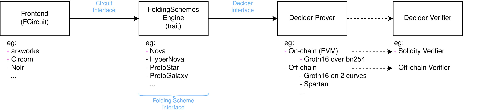

# Circomを使って再帰証明を体験する

Circomを使った応用編として、Recursiveなゼロ知識証明（再帰証明）の回路を書いて行きたいと思います。
今回は1例として、CircomでIncremental verifiable computationを実現するFolding Schemeの回路の実装手順について紹介します。

例としてこれらのプロジェクトは、Folding Schemeを効果的に使用した使用例になります。

- Zator: https://github.com/lyronctk/zator

    Novaを用いて512層のニューラルネットワーク推論を効率的に検証するライブラリ

- Sonobe-btc: https://github.com/dmpierre/sonobe-btc

    SonobeライブラリのNovaを用いてBTCのPoWを10万ブロックの遷移を検証し、zkSNARK IVC ProofをEVMで検証するトラストレスライトクライアント

- Nexus zkVM: https://github.com/nexus-xyz/nexus-zkvm

    Supernovaなどを利用した汎用のzkVM
  
# Sonobeの概要

今回使用するFolding-Shcemeを使用するのは、0xPARCとPSE(Privacy + Scaling Explorations)の共同作業によって実装されたSonobeというライブラリです。Sonobeでは、将来的に様々Arithmetizationとそのライブラリ(arkworks, Circom, Halo2, Noir)とFolding Scheme(Nova, HyperNova, Protogralaxy)をサポートし、それらをモジュール式で使えるライブラリです。現在は、ゼロ知識証明の回路をRustのarkworksか、circomで定義することができ、Folding-schemeとしてはNovaを使用することができます。また、Folding Scheme自体の証明であるIVC ProofからzkSNARKのProofを生成し、そのProofをEVMで検証することが可能です。


出典: https://privacy-scaling-explorations.github.io/sonobe-docs/folding-and-sonobe.html

Sonobeを用いた開発手順は以下の通りです。
1. arkworksやCircomなどで、ユーザが定義するゼロ知識証明の回路であるFCircuitを定義する
2. 使用するFolding-Schemesを選ぶ
3. IVC ProofからSNARK ProofするDeciderの証明アルゴリズムを選ぶ
4. DeciderのVerifierを生成する


FCircuitというのは、IVCで各ステップで実行されるユーザーが定義する関数Fに対応する回路のことです。
また、ステップ3が行なっていることは、IVCのProofは簡潔(succinct)でない、NARKであるため、Decider ProverでIVCのProofをSNARKでラップするする必要があります。

Augmented Circuitは、FCircuitとFoldingのVerifierである、Non-Interactive Folding Verifier $NIFS.V$を統合したCircuitになります。このAugemented CircuitがNovaだとRelaxed R1CSで表され、Relaxed R1CSのインスタンスwitnessペアがfoldingの各ステップで折り畳まれることによって、高効率な再帰性を持っています。

Relaxed R1CSが成立する理由と、Folding Schemeのプロトコルの解説はこちらで行なっています。

Nova-by-hand: https://github.com/privacy-scaling-explorations/nova-by-hand/blob/main/part_2.md


# Sonobeを使う時のCircomの書き方
Sonobeを使う時のCircomの記述方法として、特にIVCのステートとIVCの各ステップで外部から入力値の定義だけ気をつける必要があります。
Circomの回路の入出力の命名は以下のように定義される必要がありますが、中身のロジックはこれまでと同様に自由に決めることができます。
`ivc_input`は初期ステートを定義する配列であり、`ivc_output`はステップ後の出力ステートを定義する配列であり、`ivc_input`と`ivc_output`は同じサイズでなければいけません。また、`external_inputs` 配列はIVCの各ステップにおいて入力される配列です。

```
template FCircuit(ivc_state_len, aux_inputs_len) {
    signal input ivc_input[ivc_state_len]; // IVC state
    signal input external_inputs[aux_inputs_len]; // not state, 

    signal output ivc_output[ivc_state_len]; // next IVC state
    
    // [...]
}
component main {public [ivc_input]} = Example();

```

## 例1

IVCの各ステップで$\text{ivc\_input}[0]^3 + \text{ivc\_input}[0] + 5$を繰り返し行なっていく回路です。

```
pragma circom 2.0.3;

template Example () {
    signal input ivc_input[1];
    signal output ivc_output[1];   
    signal temp;
    
    temp <== ivc_input[0] * ivc_input[0];
    ivc_output[0] <== temp * ivc_input[0] + ivc_input[0] + 5;
}

component main {public [ivc_input]} = Example();
```

## 例2

IVCの各ステップで$\text{ivc\_input}[0]^3 + \text{ivc\_input}[0]*\text{external\_input}[0] + \text{external\_input}[1]$を繰り返し行なっていく回路です。

```
pragma circom 2.0.3;

include "./circuits/is_zero.circom";

template WithExternalInputs () {
    signal input ivc_input[1];
    signal input external_inputs[2];
    signal output ivc_output[1];

    component check_input = IsZero();
    check_input.in <== ivc_input[0];
    check_input.out === 0;

    signal temp1;
    signal temp2;
    
    temp1 <== ivc_input[0] * ivc_input[0];
    temp2 <== ivc_input[0] * external_inputs[0];
    ivc_output[0] <== temp1 * ivc_input[0] + temp2 + external_inputs[1];
}

component main {public [ivc_input]} = WithExternalInputs();
```

# Sonobeを実行するRustのコード
例2のCircom回路を動かすSonobe/exampleのcircom_full_flow.rsにを例に挙げています。

`z_0`で初めのステートを定義します。

```
let z_0 = vec![Fr::from(3_u32)];
```

IVCのイテレーションの数の要素を持つ`external_inputs`を定義します。
```
let external_inputs = vec![
    vec![Fr::from(6u32), Fr::from(7u32)],
    vec![Fr::from(8u32), Fr::from(9u32)],
    vec![Fr::from(10u32), Fr::from(11u32)],
    .....
];
```
Circomをコンパイルして出力されたR1CSファイルとwitnessを計算されるために用いるwasmファイルのパスを定義します。
```
let r1cs_path = PathBuf::from(
    "./folding-schemes/src/frontend/circom/test_folder/with_external_inputs.r1cs",
);
let wasm_path = PathBuf::from(
    "./folding-schemes/src/frontend/circom/test_folder/with_external_inputs_js/with_external_inputs.wasm",
);
```

f_circuit_paramsの3番目の変数は`ivc_input`と`ivc_ouput`配列の要素数、4番目の変数は`external_inputs`配列の要素数を割り当てます。

```
let f_circuit_params = (r1cs_path, wasm_path, 1, 2);
let f_circuit = CircomFCircuit::<Fr>::new(f_circuit_params).unwrap();
```

folding schemeのスキームとDeciderのスキームと各種必要なパラメータも定義します。

```
pub type N = Nova<G1, GVar, G2, GVar2, CircomFCircuit<Fr>, KZG<'static, Bn254>, Pedersen<G2>>;
pub type D = DeciderEth<
    G1,
    GVar,
    G2,
    GVar2,
    CircomFCircuit<Fr>,
    KZG<'static, Bn254>,
    Pedersen<G2>,
    Groth16<Bn254>,
    N,
>;

let poseidon_config = poseidon_canonical_config::<Fr>();
let mut rng = rand::rngs::OsRng;

// prepare the Nova prover & verifier params
let nova_preprocess_params = PreprocessorParam::new(poseidon_config, f_circuit.clone());
let nova_params = N::preprocess(&mut rng, &nova_preprocess_params).unwrap();

// initialize the folding scheme engine, in our case we use Nova
let mut nova = N::init(nova_params.clone(), f_circuit.clone(), z_0).unwrap();

// prepare the Decider prover & verifier params
let (decider_pp, decider_vp) = D::preprocess(&mut rng, &nova_params, nova.clone()).unwrap();
```

実際にFoldingが行われる部分です。

```
for (i, external_inputs_at_step) in external_inputs.iter().enumerate() {
    let start = Instant::now();
    nova.prove_step(rng, external_inputs_at_step.clone())
        .unwrap();
    println!("Nova::prove_step {}: {:?}", i, start.elapsed());
    println!("state : {:?}", nova.state());
}
```

IVC ProofをDeciderでラップして、SNARK Proofを生成して検証します。

```
let start = Instant::now();
let proof = D::prove(rng, decider_pp, nova.clone()).unwrap();
println!("generated Decider proof: {:?}", start.elapsed());

let verified = D::verify(
    decider_vp.clone(),
    nova.i,
    nova.z_0.clone(),
    nova.z_i.clone(),
    &nova.U_i,
    &nova.u_i,
    &proof,
)
.unwrap();
assert!(verified);
println!("Decider proof verification: {}", verified);
```

SNARK Proofを生成した後にそれをEVMで検証するコードが続きます。

# 手順
0. 事前準備
   
   a. Rustのダウンロード

   b. solcのダウンロード

1.  Sonobeをローカルリポジトリにgit cloneする
2.  Circomをコンパイルする  
    ```
    circom ./folding-schemes/src/frontend/circom/test_folder/with_external_inputs.circom --r1cs --sym --wasm --prime bn128 --output ./folding-schemes/src/frontend/circom/test_folder/
    ```
3. 実行
    ```
    cargo run --example circom_full_flow
    ```