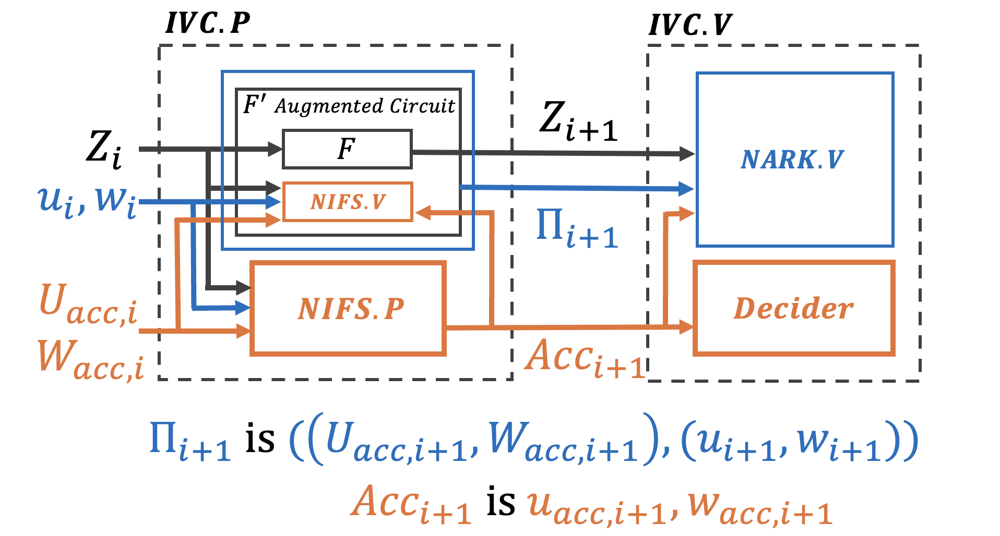

# Circomを使って再帰証明を体験する

Circomを使った応用編として、再帰証明の回路を書いて行きたいと思います。
今回は、CircomでFolding Schemeの回路の実装手順について紹介します。

今回使用するFolding-Shcemeを使用するのは、0xPARCとPSEの共同作業によって実装されたSonobeというライブラリです。Sonobeでは、将来的に様々Arithmetization(arkworks, Circom, Halo2, Noir)とFolding Scheme(Nova, HyperNova, Protogralaxy)が、モジュール式で使えるライブラリです。現在は、回路はRustのarkworksか、circomで回路を定義することができ、Folding-schemeとしてはNovaを使用することができます。

これらのプロジェクトは、必ずしもCircomやSonobeを利用したわけではありませんが、Folding Schemeを効果的に使用した使用例になります。

- Zator: https://github.com/lyronctk/zator

    Novaを用いて512層のニューラルネットワーク推論を効率的に検証するライブラリです。

- Sonobe-btc: https://github.com/dmpierre/sonobe-btc

    SonobeライブラリのNovaを用いてBTCのPoWを10万ブロックの遷移を検証し、zkSNARK IVC ProofをEVMで検証するトラストレスライトクライアント

- Nexus zkVM: https://github.com/nexus-xyz/nexus-zkvm

    Supernovaなどを利用した汎用のzkVM
  
# Sonobeの概要


Sonobeの開発手順は以下の通りです。
1. arkworksやCircomなどで、FCircuitを定義する
2. 使用するFolding-Schemesを選ぶ
3. IVC ProofからSNARK ProofするDeciderの証明アルゴリズムを選ぶ
4. DeciderのVerifierを生成する



FCircuitというのは、IVCで各ステップで実行されるユーザーが定義する関数Fに対応する回路のことです。
また、ステップ3が行なっていることは、IVCのProofは簡潔でないNARKであるため、Decider ProverでIVCのProofをSNARKでラップするする必要があります。

Augmented Circuitは、FCircuitとFoldingのVerifierである、Non-Interactive Folding Verifier $NIFS.V$を統合したCircuitになります。このAugemented CircuitがNovaだとRelaxed R1CSで表され、Relaxed R1CSのインスタンスwitnessペアがfoldingの各ステップで折り畳まれることによって、高効率な再帰性を持っています。

Relaxed R1CSが成立する理由と、Folding Schemeのプロトコルの解説はこちらで行なっています。

Nova-by-hand: https://github.com/privacy-scaling-explorations/nova-by-hand/blob/main/part_2.md


# Sonobeを使う時のCircomの書き方
Sonobeを使う時のCircomの記述方法として、特にIVCのステートとIVCの各ステップで外部から入力値の定義だけ気をつける必要があります。
Circomの回路の入出力は以下のように定義される必要がありますが、中身のロジックはこれまでと同様に自由に決めることができます。
ivc_inputは初期ステートを定義する配列であり、ivc_outputはステップ後の出力ステートを定義する配列であり、ivc_inputとivc_outputは同じサイズでなければいけません。また、external_inputs 配列はIVCの各ステップにおいて入力される配列です。

```
template FCircuit(ivc_state_len, aux_inputs_len) {
    signal input ivc_input[ivc_state_len]; // IVC state
    signal input external_inputs[aux_inputs_len]; // not state, 

    signal output ivc_output[ivc_state_len]; // next IVC state
    
    // [...]
}
component main {public [ivc_input]} = Example();

```

## 例1
```
template Example () {
    signal input ivc_input[1];
    signal output ivc_output[1];   
    signal temp;
    
    temp <== ivc_input[0] * ivc_input[0];
    ivc_output[0] <== temp * ivc_input[0] + ivc_input[0] + 5;
}

component main {public [ivc_input]} = Example();
```

## 例2
```
template WithExternalInputs () {
    signal input ivc_input[1];
    signal input external_inputs[2];
    signal output ivc_output[1];

    component check_input = IsZero();
    check_input.in <== ivc_input[0];
    check_input.out === 0;

    signal temp1;
    signal temp2;
    
    temp1 <== ivc_input[0] * ivc_input[0];
    temp2 <== ivc_input[0] * external_inputs[0];
    ivc_output[0] <== temp1 * ivc_input[0] + temp2 + external_inputs[1];
}

component main {public [ivc_input]} = WithExternalInputs();
```

# 手順
0. 事前準備
   
   a. Rustのダウンロード

   b. solcのダウンロード

1.  Sonobeをローカルリポジトリにgit cloneする
2.  Circomをコンパイルする  
    ```
    circom ./folding-schemes/src/frontend/circom/test_folder/with_external_inputs.circom --r1cs --sym --wasm --prime bn128 --output ./folding-schemes/src/frontend/circom/test_folder/
    ```
3. 実行
    ```
    cargo run --example circom_full_flow
    ```