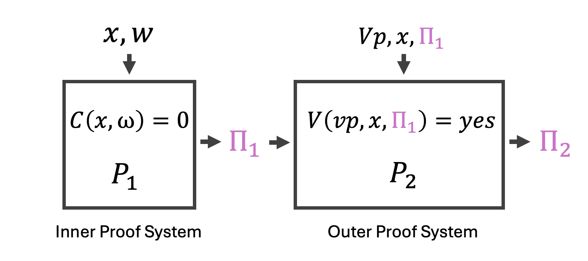
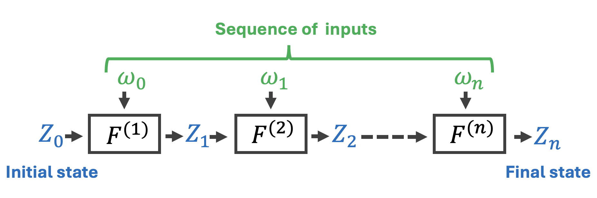
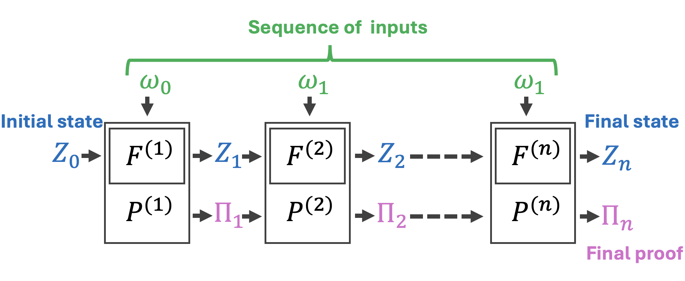
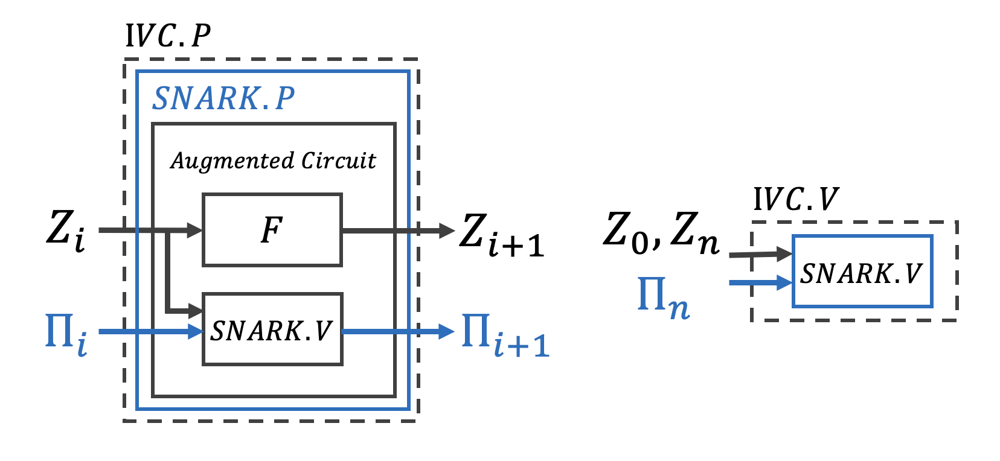
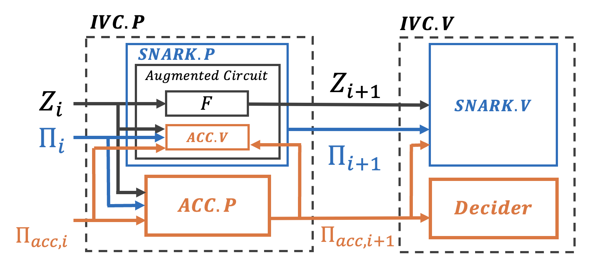
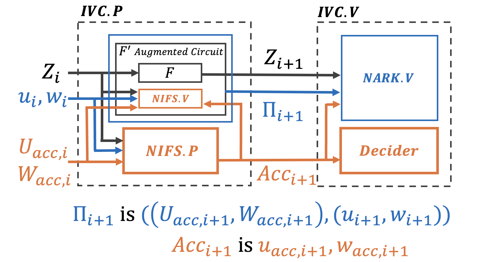

# Recursive Proof
ここでは、Recursive Proofという再帰的にゼロ知識証明ができるスキームの解説と進化について解説していきます。

`Writer: @yugocabrio`

# 2段階の再帰SNARK

まずこれは、内部および外部の証明システムからなる再帰的な二段階SNARKの図です。例えば、初めに証明効率を高めるために高速な$P_1$というスキームを用いた後に、EVMで証明を検証するためにEVMに適した$P_2$という証明スキームを組み合わせたいとします。

内部証明システム:
- public input: $x$
- witness: $w$

内部証明システムでは、SNARK Prover $P_1$が、witness$w$が計算式$C(x, w) = 0$を満たすことを証明し、はじめの証明である$\Pi_1$を生成します。

外部証明システム:

- public input: 検証パラメータ$vp$と$x$
- witness: $\Pi_1$

外部証明システムでは、異なるSNARK Prover$P_2$が内部証明システムから生成された証明$\Pi_1$が有効であることを証明します。これは、外部証明システムの回路にVerifier$V$が内部証明システムの検証パラメータ$vp$、$x$と$\Pi_1$を受け取りそれが有効かどうか（$V(vp, x, \Pi_1)=yes$）を検証し、$\Pi_1$が有効であることを示す場合、新しい証明$\Pi_2$を生成します。

そして、例えば、EVMで外部証明システムの証明$\Pi_2$を検証して、それが有効であった場合、内部証明システム$\Pi_1$も有効であることを間接的に証明することができます。

これがZKPにおける再帰SNARKの概念です。次に紹介するのが、Incremental Verifiable Computation(IVC)型の再帰SNARKについてです。IVCは、計算プロセスを小さな検証可能なステップに分割します。各ステップごとにその正確さを検証し、前のステップが正しく行われたことを前提として次のステップを進めていきます。これにより、全体の計算が正確に行われていることを保証します。

# Incremental Verifiable Computation
## Incremental Computation

まず、Incremental Computationについて解説します。これは大規模で複雑な計算を細かくステップに分割します。このアプローチでは、固定された関数 $F$ を初期ステート $Z_0$ に対して、入力のシーケンス $ω_1, ω_2, ..., ω_n$ とともに繰り返し処理していきます。このプロセスは一連の中間ステート $Z_1, Z_2, ..., Z_i$ を経て、最終のステート $Z_n$ に至ります。Incremental Computationの主な利点は、複雑な計算を段階的に処理できることで、新しい入力や変更に基づいて計算を管理しやすいことです。

## Incremental Verifiable Computation

Incremental Computationにverifiabilityが加わるとどうなるでしょうか？Incremental Verifiable Computation(IVC)は、Incremental Computationにverification layerを付け加えたものです。これは単に各ステップ $i$ ごとにステート $Z_i$ を計算するだけでなく、同時にそれまでのステップまでの計算が正しいことを示す証明 $\Pi_i$ も生成します。

この時の証明 $\Pi_i$ は　Proverの持っているwitness $(Z_{i-1}, ω_i, \Pi_{i-1})$から、現在のステート$Z_i$が正しいこと: $F^{(i)}(Z_{i-1}, ω_i)= Z_i$と、前のステートの証明$\Pi_{i-1}$が実際の計算前のステートと比較して有効であること: $V(vp, (i-1, Z_0, Z_{i-1}), \Pi_{i-1})= yes$の2つを示しています。

そして最終的な証明$\Pi_n$は、Proverが最終的なステートである$Z_n$となる、${ω_0,...,ω_n}$を知っていることを意味します。

# Naive SNARK-Based IVC

それでは、IVCをSNARKで実現できないか考えていきましょう。

この図は、単純なSNARKベースのIVCを示しています。各ステップ $i$ で、IVCのステート $Z_i$ は関数 $F$ によって処理されて、新しいステート $Z_{i+1}$ を生成し、また、証明 $\Pi_i$ がSNARK Verifier $SNARK.V$ によって検証されます。この検証は、前のステート $Z_i$ から次のステート $Z_{i+1}$ への遷移の正しさを保証することを目的としています。

$F$ と $SNARK.V$ の両方を統合したAugmented Circuitがあり、ここで $SNARK.P$ は次の証明 $\Pi_{i+1}$ の生成を担当します。

最終の検証ステップでは、SNARK検証者 $SNARK.V$ は初期のステート $Z_0$、最終のステート $Z_n$、証明 $\Pi_n$、および検証鍵 $vk$ を使用して、全シーケンスの整合性をチェックします。

## Naive SNARK-Based IVCの問題点

もしNaive SNARKが一般的なペアリングベースのアプローチを採用する場合、この方法は、証明者が関数 $F$ の証明に加えて証明しなければならない追加のコストである、recursion オーバーヘッドを大幅に増加させ、全体的な証明時間を延長します。ペアリングベースのアプローチでは、内部検証者 $SNARK.V$ がペアリングを用いて各証明を検証するため、高いコストが発生します。ここで特に問題となるのは、$SNARK.V$ の検証時間がAugmented Circuitの実行時間を超えてしまう場合です。IVCのAugmented Circuit内のverifierは、Augmented Circuitの実行時間に対してサブリニアでなければなりません。そうでなければ、$SNARK.P$ の時間は各ステップごとに増加し、全体の処理効率が著しく低下します。

また、0xParcによって行われた作業であるzkPairingとcircom-pairingは、Circom回路でのペアリングを検証するための実験的実装とベンチマークについて説明しています。たとえば、0xParcによるzkPairingやcircom-pairingの作業では、Circom回路でペアリングを検証するための実験的実装とベンチマークが行われています。彼らのベンチマークによれば、Optimized Ateペアリングを使用した時の証明時間は52秒、検証時間は1秒です。この検証時間がAugmented Circuitの実行時間を上回る場合、Niave SNARKベースのIVCの各ステップでの時間消費とオーバーヘッドをもたらすことになります。

- zkPairing: https://0xparc.org/blog/zk-pairing-1

また、それ以前に直感的に、そもそも単純なSNARKベースのIVCの観点からは、これは各ステップに少なくとも52秒の証明時間と1秒の証明検証時間がかかることは、IVCのステップ数が100や1000に増えると、これは大幅な時間がかかることになります。したがって、このアプローチはIVCを実装するための最も効率的な方法ではありません。

# zkSTRAK&FRI

次に、ZKPスキームが多項式コミットメントとペアリングの代わりにFRIコミットメントを採用した場合の結果はどうなるでしょうか？このようなスキームは、FRIコミットメントを利用しており、zkSTARKsまたはFRIファミリーと言われます。zkSTARKsは、トラステッドセットアップが不要であり、量子耐性があることで知られています。これは、マークルツリーコミットメントでハッシュ関数を使用しているためです。

zkSTARKがIVCに適している点として、zkSTARK証明の検証の時間がサブリニアである点です。そのため、IVCの各ステップでAugumented Circuitの中に、前のzkSTARKの証明を検証する$STARK.V$を組み込むことができます。前の証明を完全に検証するので、full-recursionと呼ばれます。

また、再帰的証明の容易にする他のテクニックとしては、たとえば、Plonky2では、ハッシュ関数を用いて構築されたマークル証明による計算負荷が大きいにもかかわらず、Plonkのカスタムゲートが再帰的証明の効率的な実行を可能にしています。

しかし、欠点としては、FRIのマークル証明による証明サイズが大きいという問題やEVMで証明を検証するのにコストがかかるという問題があります。

- STARK 101: https://starkware.co/stark-101

# Accumulation

最近、Halo/Halo2というZKPライブラリ、証明スキームが積極的に使用されていますが、これはAccumulationテクニックが使用されています。Haloでは、検証のコストのかかる部分がAccumulatorと呼ばれるものに委ねられるため、IVCの各ステップでSNARKを検証するのではなく、最後に一度だけSNARK証明を検証するだけで済みます。

具体的には、Accumulatorは2つのIPA（Inner Product Argumentというコミットメントの証明を取り、それらを1つのIPA証明にします。この圧縮された証明は、元の2つの証明と同じ有効性を維持し、各ステップで蓄積されていきます。

各ステップ $i$ で、計算は関数 $F$ を通じて前のステート $Z_i$ から新しいステート $Z_{i+1}$ を生成します。同時に、Accumulator $ACC$ は、$Z_i, \Pi_i$ および $\Pi_{acc, i}$ を基に証明関数 $ACC.P$ を使用して、ステートを $\Pi_{acc,i}$ から $\Pi_{acc,i+1}$ に更新します。この新しいアキュムレータのステート $\Pi_{acc,i+1}$ は、検証関数 $ACC.V$ を通じて検証されます。

拡張回路は $F$ と $ACC.V$ を統合して、これらの操作の正確性を保証します。SNARK証明者 $SNARK.P$ は証明 $\Pi_{i+1}$ を生成し、入力と出力が拡張回路に適合し、$Z_i$ から $Z_{i+1}$ への有効な遷移および対応するAccumulatorのステートの遷移を示します。

最終プロセスでは、SNARK検証者 $SNARK.V$ が最終のステート $Z_n$、証明 $\Pi_n$、およびAccumulator $\Pi_{acc,n}$ を使用して最終検証を実行します。さらに、$Decider$ が最終Accumulator $\Pi_{acc,n}$ に適用され、成功すればこれまでの有効性が確認されます。

この時、IVCの各ステップで実行される$ACC.V$はサブリニアで済ませ、最後だけ、$SNARK.V$で高コストな線形時間の検証を1度だけ済ませることで効率化が図られました。

しかし、内積アーギュメント（IPA）などのコミットメントを単一のものに圧縮するHalo2のアキュムレーションアプローチは、いくつかの非効率性に効果的に対処しているものの、IVCの各ステップでSNARK証明を生成する必要があります。

- ZK7: Latest developments in Halo2 by Ying Tong Lai: https://youtu.be/V1RgGn1GtqM?si=L53C6zbrHSBwUbeI

# Folding
従来のaccumulationと異なり、Foldingスキームは、Arithmetizationの二つのインスタンスを折り畳むだけです。Novaでは、二つのR1CSインスタンスを一つに折り畳むことができます。

この画像で、$u$ と $w$ はR1CSのインスタンスとwitnessペアを表しています。IVCのステップ内で、SNARK証明を生成して検証する必要がなくなることを意味しています。2つのインスタンスwitnessペアを折り畳むというのは、基本的に線形結合をすることを意味するのですが、$NIFS.P$でその線形結合を行い、$NIFS.V$で線形結合の検証を行うことができます。

# まとめ
本記事では、再帰的SNARK、IVC、FRIベース　full-recursion、Accumulation、およびfoldingについて解説しました。再帰的SNARKは内部と外部の証明システムを用いて、複数レベルにわたる検証を実現し、計算の正確性を保証します。
IVCは、計算プロセスを小さなステップに分割し、各ステップでの計算が正確に完了していることを確認することで、全体の正確さを保証します。
FRIコミットメントを利用したzkSTARKsは検証時間がサブリニアである特性から、full-recursionが可能です。また、Accumulationスキームでは、IVCの各ステップでSNARK証明を生成し、また、IPA証明をバッチ化(蓄積させ)て、線形時間というコストの高いSNARKの検証をIVCの最後のステップに遅延させる方式でした。
Folding方式では、特定の算術化インスタンスとwitnessのペアを折りたたみ（線形結合）することで、IVCの各ステップでSNARKの証明や検証をする必要性を完全に除外しました。

# 参考
- Advances in the Efficiency of Succinct Proofs - Ying Tong: https://youtu.be/KSGE6n66W1M?si=ehcwmgaeylp_OvBo
- ZKP MOOC Lecture 10: Recursive SNARKs: https://youtu.be/0LW-qeVe6QI?si=POMy2tBqyj6cx8Dv
- ZK7: Latest developments in Halo2 by Ying Tong Lai: https://youtu.be/V1RgGn1GtqM?si=L53C6zbrHSBwUbeI
- Nova: Recursive Zero-Knowledge Arguments from Folding Schemes - Srinath Setty: https://youtu.be/mY-LWXKsBLc?si=iInNdyGsh_IJ37c3